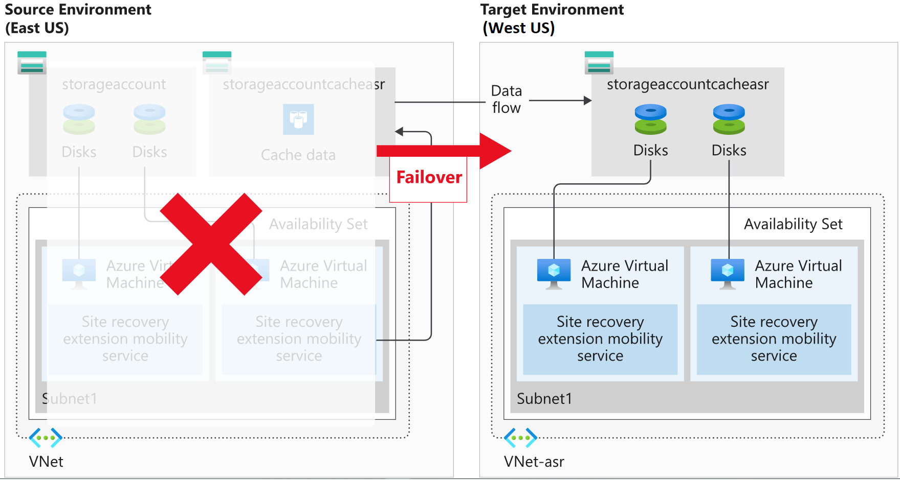

Azure Site Recovery replicates your virtual machine workloads between Azure regions. You can also use Site Recovery to migrate VMs from other environments, such as on-premises infrastructure, to Azure.  You'll see that Site Recovery does much more than just backing up and restoring infrastructure.

Let's assume your organization recently suffered an outage caused by a hurricane. Here, we'll learn about the Site Recovery features that help handle future interruptions. We'll also identify the Site Recovery features required to protect your Azure VMs by enabling failing over to a secondary Azure region.

## Site Recovery features

Site Recovery manages the orchestration of disaster recovery in Azure. It's designed to replicate workloads from a primary site or region to a secondary site. If the primary site has an issue, Site Recovery can replicate the protected VMs to another Azure region.

Site Recovery manages the replication of Azure VMs between regions or the replication of on-premises VMs to Azure and back again. Because it's built natively into Azure, Site Recovery can run seamless tests (disaster recovery drills) without affecting production workloads.

### Azure virtual machine protection

Site Recovery protects your VM instances in Azure automatically. Site Recovery mirrors the source VM configuration and creates required or associated resource groups, storage accounts, virtual networks, and availability sets to a secondary Azure region. The resources created are appended with a Site Recovery suffix.

### Snapshots and recovery points

Site Recovery has customizable replication policies that allow you to define the retention history of recovery points and the frequency of snapshots. You create a recovery point from a snapshot of a VM's disk. The two types of snapshots available are **App-consistent** and **Crash-consistent**.

- **App-consistent** recovery captures the same data as crash-consistent but also includes all in-memory data and in-process transactions. Including the in-memory data means that Site Recovery can restore a VM and any running apps without any data loss. The default frequency for capturing snapshots is every 60 minutes.

- **Crash-consistent** recovery represents the data on disk at the time the snapshot is taken. The default frequency for capturing snapshots is every five minutes.

All recovery points are kept for 24 hours by default, although you can extend this period to 72 hours.

### Replication to a secondary region

When you enable replication for an Azure VM, the Site Recovery mobility service is installed as an extension on the VM. The installed extension registers the VM with Site Recovery. Continuous replication of the VM then begins, with any writes to the disk immediately transferred to a local storage account. Site Recovery uses this account, replicating the cache to a storage account in the destination environment.

Site Recovery copies data stored in the cache and syncs it with either the target storage account or replicated managed disks. After the data is processed, crash-consistent recovery points are created. If app-consistent recovery points are enabled, they'll be generated on a schedule as set in the Site Recovery replication policy.

Site Recovery can use accelerated networking for Azure VMs, reducing jitter and CPU usage.

### Disaster recovery drills

Site Recovery enables you to do disaster recovery drills after all the prerequisite configuration tasks are complete. Running a DR drill enables you to validate the replication strategy for your environment without losing data, having downtime, or compromising your production environment. Drills don't affect your production environment and are a way to test that you have correctly configured everything.

### Flexible failover and failback

Site Recovery failover and failback can be quickly started using the Azure portal. When running a failover, you select a recovery point, then let Site Recovery take care of the failover. Failback is simply a reverse of this process. When a failover is successfully committed, it's available to failback.
