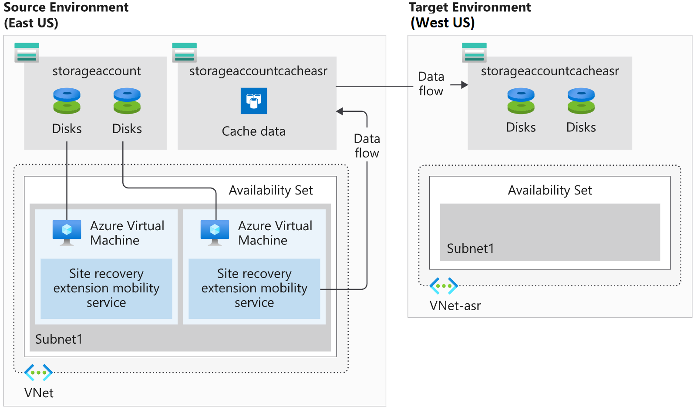

In the previous unit, we explored the capabilities of Azure Site Recovery. Our next step is to prepare for disaster recovery in our Azure environment.

Using our organization's business continuity and disaster recovery (BCDR) plan, we can run through the Site Recovery configurations and set a preparation plan in motion that fits with our organization's BCDR goals. Let's assume we're using the East US Azure region for our existing solution, and we've decided to use the West US region for replication.

Here, we'll explore how to take advantage of the automated features in Site Recovery to prepare for a disaster recovery scenario.

## Environment setup

We need to set up our environment for our later exercises. As this setup takes a few minutes to complete, we'll start the process now, and then we can work through some of the theory while the configuration completes in the background.

> [!NOTE]
> If you want to complete the following setup, but you don't have an Azure subscription, or prefer not to use your account, you will need to create a [free account](https://azure.microsoft.com/free/?azure-portal=true) before you begin.

Let's assume, we have two VMs configured in the organization. We'll configure the following services in the West US region to simulate the configured VMs.

- A virtual network
- Two VMs
- A storage account

We'll also configure a resource group in East US. We'll later configure Site Recovery to use the East US region as our target environment.

Our first step is to create our exercise environment. We'll run a script that creates our company's infrastructure in Azure.  After the script completes, we'll have a virtual network, two VMs, and a storage account that we'll use for our Recovery Services vault.

1. Sign in to the [Azure portal](https://portal.azure.com) with your credentials, and start a Cloud Shell session.

1. Make sure you're running a Bash session in Cloud Shell.

1. Copy the Azure Resource Manager JSON templates to create your company's infrastructure.

    ```bash
    curl https://raw.githubusercontent.com/MicrosoftDocs/mslearn-protect-infrastructure-with-azure-site-recovery/master/deploy.json > deploy.json
    ```

1. Run the following command to create resource groups and the company's infrastructure.

    ```bash
    az group create --name east-coast-rg --location eastus2
    az group create --name west-coast-rg --location westus2

    az deployment group create \
        --name asrDeployment \
        --template-file deploy.json \
        --parameters storageAccounts_asrcache_name=asrcache$RANDOM \
        --resource-group west-coast-rg
    ```

Configuring the environment can take up to five minutes to complete. We're now ready to continue with the rest of this unit while the deployment completes.

## Disaster recovery preparation with Azure Site Recovery

Site Recovery will manage and orchestrate our DR process for Azure VMs or on-premises machines. However, to enable it, there are several components we need to configure. We'll need to:

- Add a Recovery Services vault
- Organize target resources
- Configure outbound network connectivity
- Set up replication on existing VMs



### What is a Recovery Services vault?

A Recovery Services vault enables Site Recovery to complete disaster recovery replication. These vaults use storage accounts to store data backups, VM configuration settings, and workloads. To meet Site Recovery requirements, provision a recovery services vault using the portal or the Azure CLI.

### What are the target resources?

Target resources are all the Azure services that are created after your existing resources replicate. In this scenario, the West US region is the region where all your target resources get created. There are a few considerations to keep in mind when selecting the target resources region:

- The target resources for Site Recovery replication have to be in a different Azure region.
- The storage account that stores the backed-up data must also be in a different region than the resources being protected.
- The target region creates VMs, and has enough resources to match the size of the existing VMs.

### Configure outbound network connectivity and URLs

Site Recovery requires outbound connectivity on the VMs that you want to replicate.

The required network connectivity is set up for you automatically when using VMs created in Azure. However, when you migrate on-premises VMs to Azure, you may need to update your network connectivity.

Site Recovery doesn't support controlling network connectivity via an authentication proxy. If your organization is using a URL-based firewall proxy to restrict outbound connectivity, you'll need to add access to several URLs.

| URL | Description |
| --- | --- |
| login.microsoftonline.com | For the Azure Site Recovery URLs to authenticate. |
| *.blob.core.windows.net | To write VM data to the source storage account cache. |
| *.hypervrecoverymanager.windowsazure.com | For Site Recovery to communicate with the VM. |
| *.servicebus.windows.net | For Site Recovery monitoring and diagnostic data from the VM. |

If you prefer to control the connectivity using IP addresses instead, you'll need to add the IP address ranges for:

- Azure datacenters
- Site Recovery endpoints

### Update Azure VM root certificates

Every Azure VM you want to replicate has to register with Site Recovery. For a VM to register, Site Recovery requires the latest root certificates installed on the VM. On a Windows VM, you'll need to make sure to install all the latest Windows updates. The process for updating root certificates on Linux VMs varies from distribution to distribution. You'll need to follow the guidance published by the distributor.

### Configure Account permissions

By default, Site Recovery uses role-based access control (RBAC) in Azure. RBAC enables fine-grained access control and enables you to use several built-in Site Recovery roles:

| Role | Description |
|---|---|
| **Site Recovery Contributor** | A contributor has full permissions for Site Recovery operations in a Recovery Services vault, suitable for disaster recovery admins.|
| **Site Recovery Operator** | An operator has permissions to run and administer Site Recovery failover and failback operations, suitable for disaster recovery operators.|
| **Site Recovery Reader** | A reader has permissions to view Site Recovery operations, suitable for IT monitoring executives.|

To enable replication on a VM, a user must have permission to create a VM in both the virtual network and resource group.

### What is Azure Mobility Service?

Azure Mobility Service needs to be installed on every VM that you replicate. This client is available for Windows and Linux VMs, and will be installed and configured automatically by Site Recovery. If the automatic installation fails, you can install the service manually.

The mobility service works in partnership with Site Recovery to keep an up-to-date cache of the VMs' data. The cache is replicated to the target environment's storage account. The replicated data will be used if Site Recovery fails over the environment.
