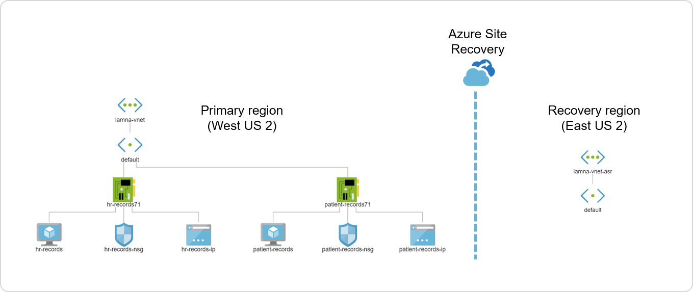
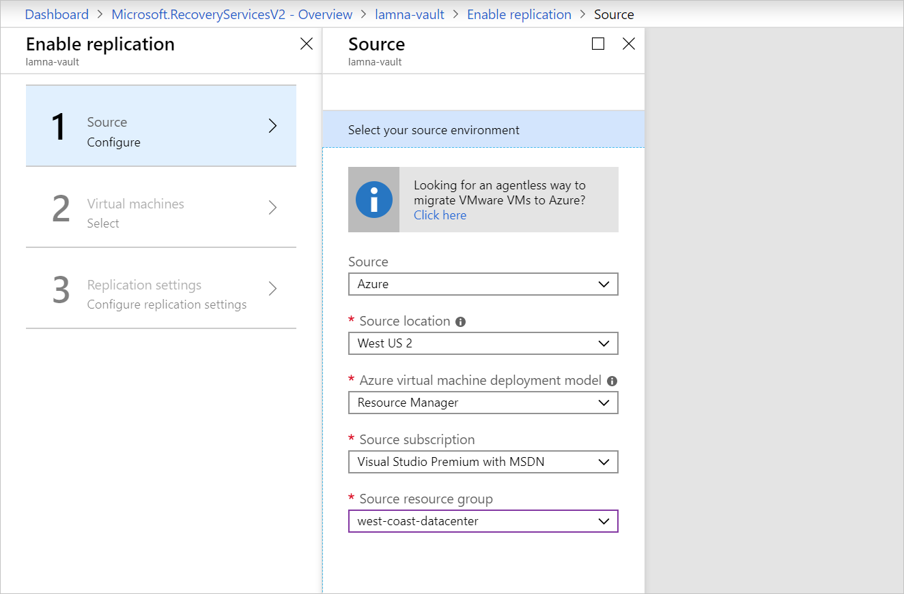
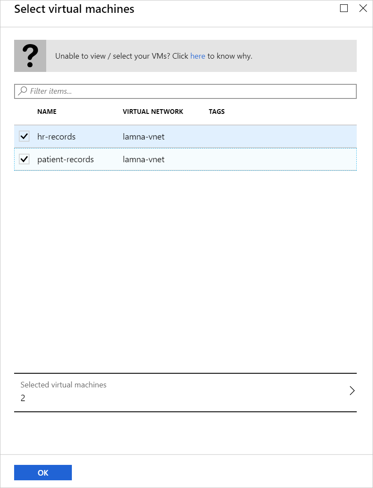
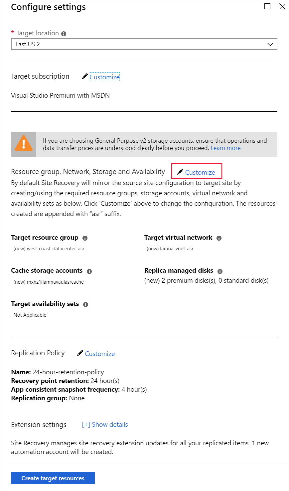
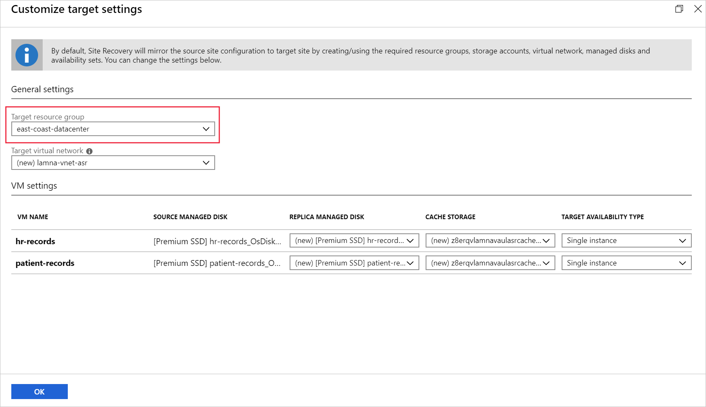
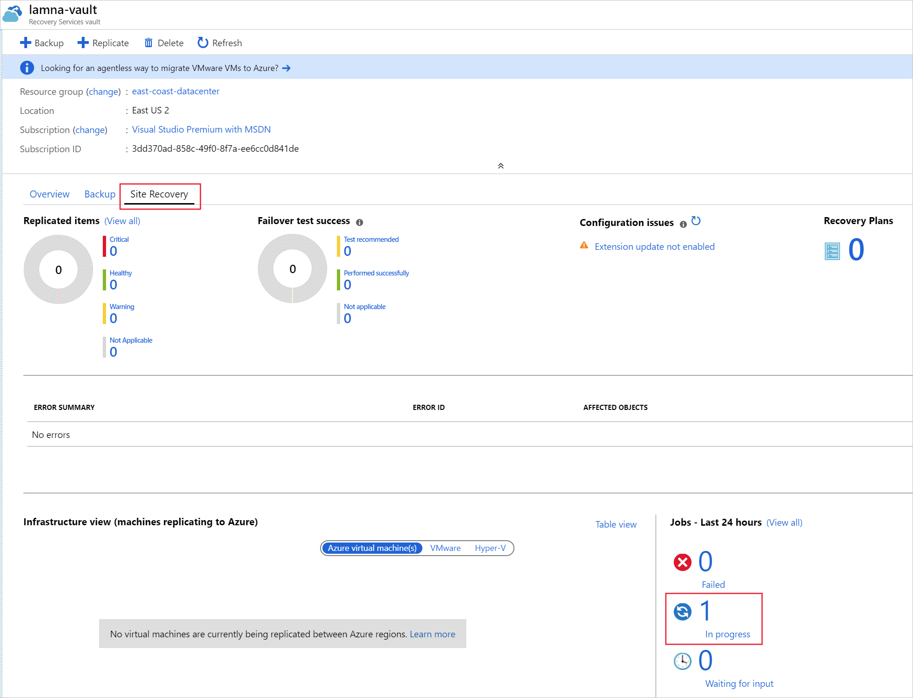

Azure Site Recovery will automate the setup of recovery from one region to another. The set up process will install the Mobility Service on to the VMs, create the required infrastructure in the recovery region, and give you a way to montior the progress.

The Lamna Healthcare Company currently has two virtual machines running the companies patient and employee systems. These system are running in the West US region. You've been asked to protect the infrastructure by enabling it to be recovered to the East US region. Using Azure Site Recovery you'll enable a Recovery Services vault to replicate the current workloads.

In this exercise, you'll complete the setup of Azure Site Recovery using the portal.

> [!NOTE]
> This exercise is optional. If you don't have an Azure account, you can read through the instructions so you understand how to use backup virtual machines with Azure Backup.
> If you want to complete this exercise, but you don't have an Azure subscription, or prefer not to use your own account, you will need to create a [free account](https://azure.microsoft.com/free/?azure-portal=true) before you begin.

## Create a Recovery Services Vault

1. Sign into the [Azure portal](https://portal.azure.com) with your own credentials.
1. Select **+ Create a resource** option on the top left hand side of the portal.
1. Under the **Azure Marketplace**, select **IT & Management Tools**, then select **Backup and Site Recovery**.
1. For the **Resource Group** select **east-coast-datacenter**.
1. For the **Vault name**, type **lamna-vault**.
1. Set the **Region** to **East US 2**.
1. Select. **Review + create**, and then on the Summary page, select **Create**.
1. Once deployed view the resource.

## Enable replication

1. In the Recovery Services vault pane, select **+ Replicate**.

    

1. In the pane that opens, select **Azure** as your source.
1. In the source location select the original datacentre location, select **West US 2**.
1. In the **Source resource group**, select **west-coast-datacenter**.
1. Select **OK** at the bottom of the pane.

    

1. On the Select virtual machines pane, select both virtual machines.
1. Select OK.

    

1. Select Customize.

    

1. In the **Target resource group**, change it to **east-coast-datacenter**, then select **OK**.
1. Select **Create target resources**.

    > [!NOTE]
    > Don't close the pane and wait for the target resources to be created.

    

1. Once the resources have been created you can select **Enable replication**.

    > [!NOTE]
    > This step can take up to 15 minutes. Continue to the next steps to see how to monitor progress.

## Monitor replication progress

1. On the left of the portal, select All resources.
1. In the list of resources select the **Recovery Services vault** named **lamna-vault**.

    

1. On the Overview pane, first select **Site Recovery** to view the Site Recovery dashboard.
1. In the jobs list select the **In progress** link to view how the replication setup is progressing.

    

1. You can select any of the listed jobs to view more details.

    

1. There are two jobs that will take the most time to complete. If you select either of the **Enable replicaiton** jobs, you'll see that the **Installing Mobility Service and preparing target** step can take between five to ten minutes to finish.
