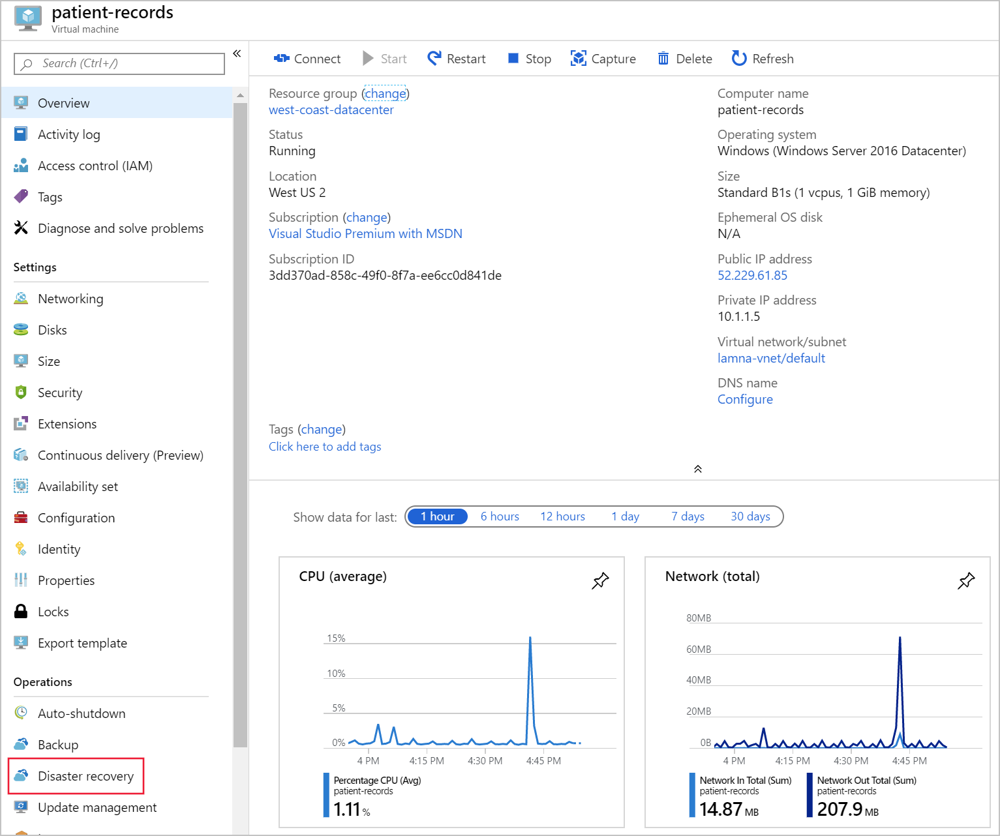
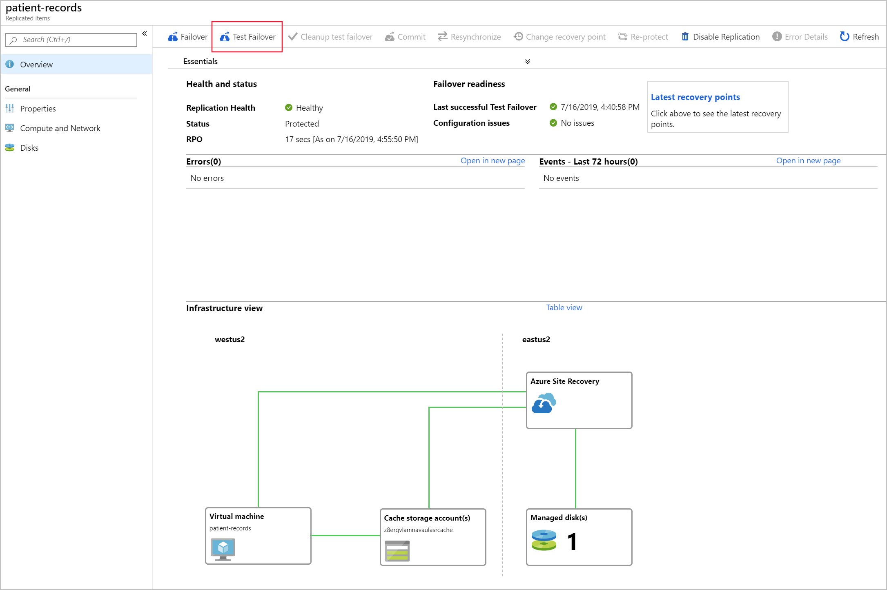

Disaster recovery (DR) drills test your organization's ability to recover from an outage, without impacting any production service.

With Azure Site Recovery setup, and your infrastructure protected, you should run a disaster recovery drill. Azure Site Recovery supports doing these drills in a safe manner that won't impact your production environment. You'll run some quality assurance on the configuration to ensure your DR solution is working correctly.

In this unit, you'll learn about Azure Site Recovery disaster drills. What you need to consider, and how to run test process to check your environment has been correctly configured.

## What is a disaster recovery drill

A DR drill is a way to check you've configured you solution properly. The drill should give you, and your company, confidence if a disaster hits. Typically your organization will set a recovery time objective (RTO) which is a timeframe for recovering infrastructure in a disaster or outage scenario. Alongside the RTO, your company will have defined a recovery point objective (RPO). The RPO defines the point in time the infrastructure should be recovered from. In other words how stale the data can become.

Azure Site Recovery not only supports running a disaster recovery drill via automated test failovers. It actively prompts you to run them on the Site Recovery dashboard.

## Why should you run a DR drill

A DR drill is important to ensure the solution setup meets the BCDR requirements, not only this but also to ensure the replication works properly. This combined with RTO and RPO needs to be tested thoroughly to ensure replication and failover happen in the specified timeframe. 

For example, if your RTO is set to 1 hour and your RPO set to 30 minutes, as in business operations can continue for 1 hour without major impact and systems back up every 30 minutes, that's 30 minutes of lost time with a recovery of 1 hour.

Imagine your actual recovery time is 2 hours, but your backup only completes every hour, that's an extra 30 minutes of data loss and additional hour of serious business harm, which could potentially have large financial consequences for your organization.

## Test failover of individual machines

A test failover allows you to simulate a disaster, and see its effects. When you start the test you to choose a recovery point. The choice is either the last processed, the latest app-consistent point, or a custom recovery point. The failover tests can be started from the Site Recovery dashboard, or directly from the disaster recovery menu on a specific VM.

The steps are as follows:

1. Create an isolated virtual network, so that your production infrastructure isn't affected.
1. On the target VMs' overview, select **Disaster recovery**.

    

1. This will open a new **Replicated items** pane.
1. Select **Test Failover** at the top of the pane.
1. This will run a test failover of the VM, and allow you to track its progress through the Site Recovery jobs page.
1. Once complete, the failed over VM will appear in the portal under Virtual Machines, in the recovery region. You can then check the VM is running, is sized and connected correctly, and is mirroring the source VM but in a different Azure region.
1. After you're happy everything has worked as expected, the replicated VM can be deleted by selecting **Cleanup test failover**. You are given the option to add notes about your testing at this point.

## Flexible failover of multiple machines

Azure Site Recovery gives you the felxibitly to run a full DR test scenario for all your virtual machines. You can create Recovery Plans that include one or more of your VMs. Failovers are runnable as many times as you like, and allow for a flexible policy to test different combinations of infrastructure. Just like testing the single VMs, the same test cleanup is available for everything included in the recovery plan.

## Difference between a drill and production failover

Running a real production failover in Azure Site Recovery is similar as it is for a test drill. There are some exceptions the first being that **Failover** is selected, instead of Test failover. You can choose to shut down the source VM before starting the failover, so that no data is lost during the switch. Azure Site Recovery doesn't clean up the source environment once the failover is complete.

When the failover is completed, validate the VM is working as expected. Azure Site Recovery gives you the ability to change the recovery point at this stage. If you're happy the failover works, you'll **Commit** the failover. Azure Site Recovery will then delete all source VM recovery points and finish the failover. The new VM in the secondary region will then need to be reprotected.
