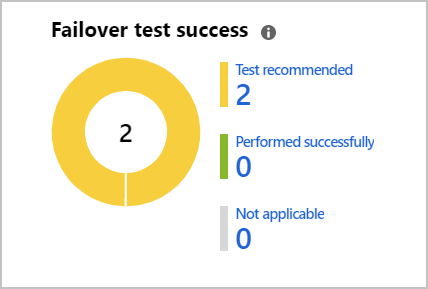
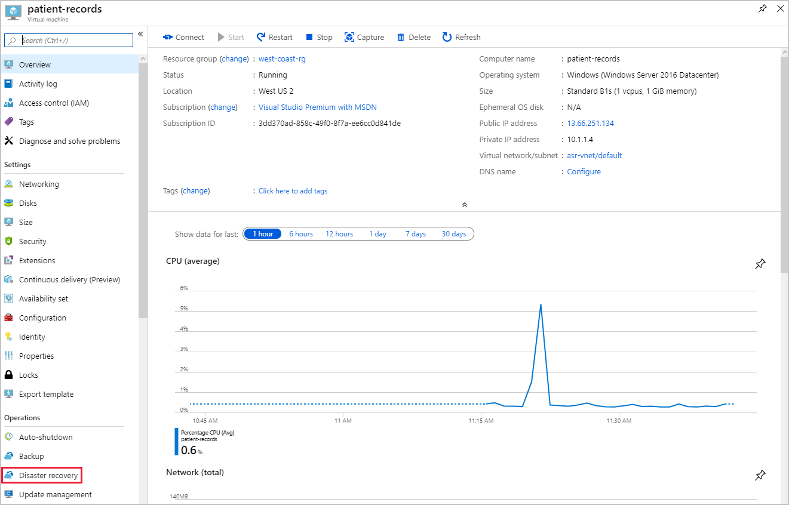
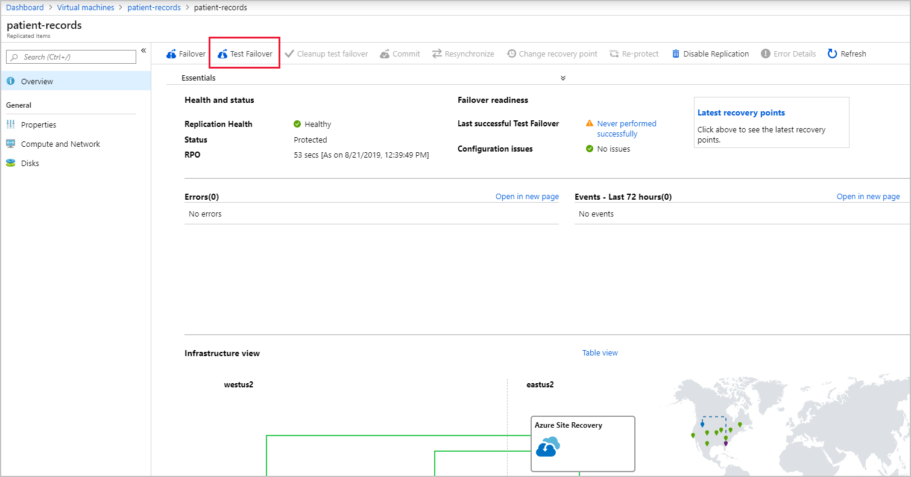
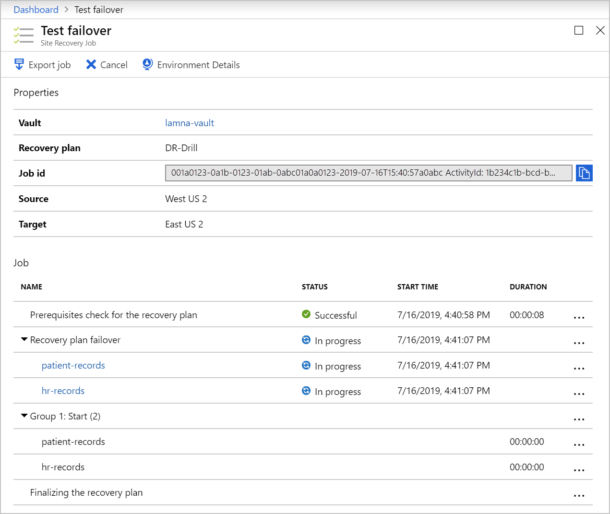

We use Disaster recovery (DR) drills test our organization's ability to recover from an outage, without impacting any production service.

We finished setting up Azure Site Recovery, and now need to test our infrastructure replication. The way we test our configuration is to run a disaster recovery drill. Azure Site Recovery allows us to do these drills in a safe manner that won't impact our production environment. We'll run some quality assurance on the configuration to ensure our DR solution is working.

Here, we'll learn about Azure Site Recovery disaster drills. What we need to consider, and how to run a test to check the configuration is correct.

## What is a disaster recovery drill?

A disaster recovery (DR) drill is a way to check if we configured our solution correctly. The drill should give us, and our company, confidence that our data and services are available even if a disaster hits. Typically organizations set a recovery time objective (RTO) that indicates how long it takes to recover infrastructure. Alongside the RTO, our company should define a recovery point objective (RPO). The RPO defines the amount of data loss that is acceptable as a function of time. For example, if our company's RPO is a day, we'll need to create at least a backup of all our data each day. We'll also need to make sure it takes less than a day to restore this backup.

To ensure that we run our DR tests, Azure Site Recovery actively prompts us to run them on the Site Recovery dashboard.

## Why should you run a DR drill?

A DR drill is vital to ensure the solution implemented meets the business continuity and disaster recovery (BCDR) requirements, and to check the replication works appropriately. Our DR drill, combined with RTO and RPO, needs to be tested thoroughly to ensure replication, failover, and recovery happen in the required timeframe.

For example, assume our RTO is an hour, and RPO is six hours. Our systems backed up every hour, that's an hour of lost data plus the additional hour to recover our systems.

Imagine our actual recovery time is five hours. Our systems are now close to being over six hours out of date, which means we'll be in breach of the BCDR RPO objective. Testing the actual time it takes to recover from failures can give us confidence that our systems follow our BCDR plans.

## Test failover of individual machines

A test failover allows you to simulate a disaster and see its effects. Failover tests can be started from the Site Recovery dashboard, or directly from the disaster recovery menu on a specific VM. We'll start by choosing a recovery point. We can choose from either the last processed, the latest app-consistent point, or a custom recovery point.

The steps are as follows:

1. We'll create an isolated virtual network so that our production infrastructure isn't affected.

    

1. On the target VMs' overview, select **Disaster recovery**.

1. This option opens a new **Replicated items** pane.

    

1. Select **Test Failover** at the top of the pane.

1. This option will run a test failover of the VM, and allow us to track its progress through the Site Recovery jobs page.

1. Once complete, the failed over VM appears in the portal under Virtual Machines, in the recovery region. We can then check the VM is running, is sized and connected correctly, and is mirroring the source VM but in a different Azure region.

1. After we've validated everything has worked as expected, the replicated VM is deleted by selecting **Cleanup test failover**. It's a good idea to add notes about the test outcome at this point.

## Flexible failover of multiple machines

Azure Site Recovery gives us the flexibility to run a full DR test scenario for all our virtual machines. We can create recovery plans that include one or more of our VMs. Failovers are runnable as many times as we like, and allow for a flexible policy to test different combinations of infrastructure.

Just like testing the single VMs, the same test cleanup is available for everything included in the recovery plan.

## Difference between a drill and production failover

Running a production failover in Azure Site Recovery is similar to that of a test drill. There are some exceptions, the first being that **Failover** is selected, instead of Test failover. We can choose to shut down the source VM before starting the failover so that no data is lost during the switch. Azure Site Recovery doesn't clean up the source environment once the failover is complete.

When the failover completes, validate the VM is working as expected. Azure Site Recovery gives us the ability to change the recovery point at this stage. If we're happy the failover works, we'll **Commit** the failover. Azure Site Recovery deletes all the source VM recovery points and finishes the failover. With our replicated infrastructure and data in the secondary region, we need to keep in mind that the new VM in the secondary region also needs protection.
