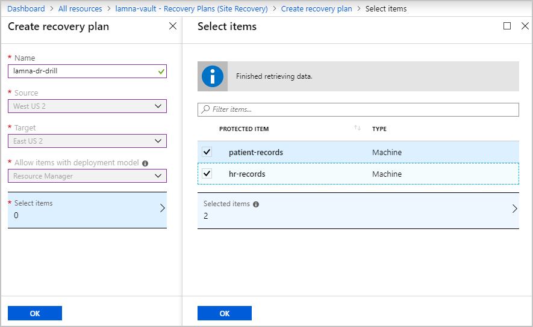
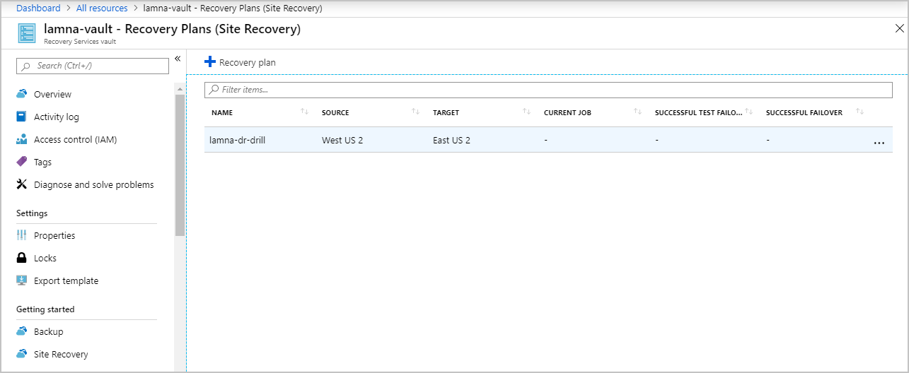
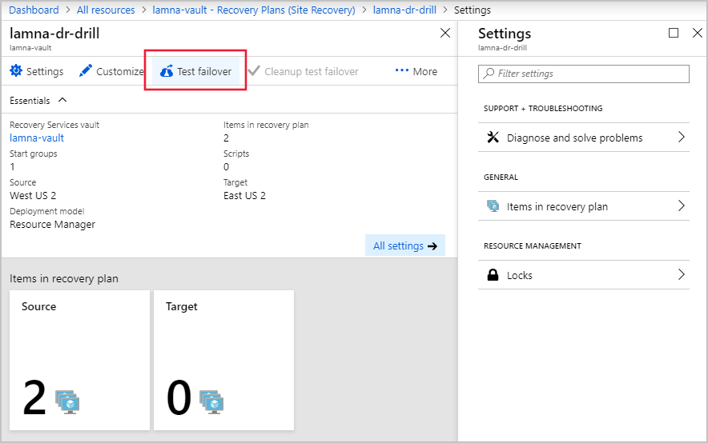
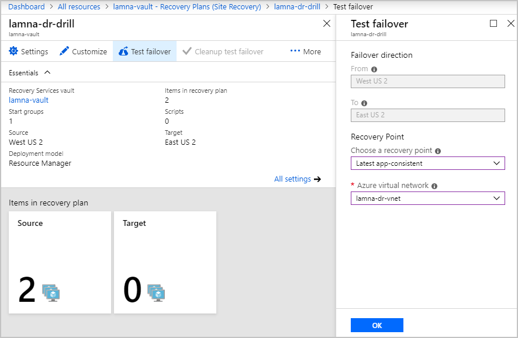
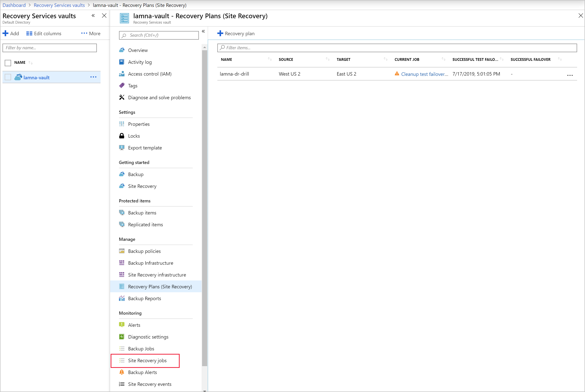
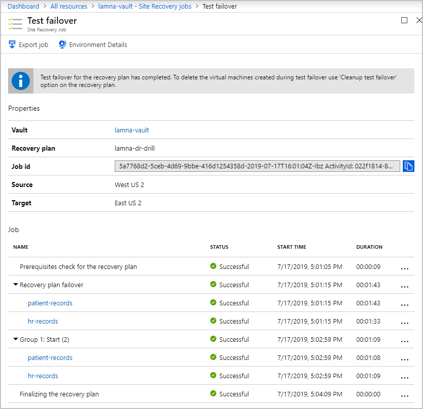
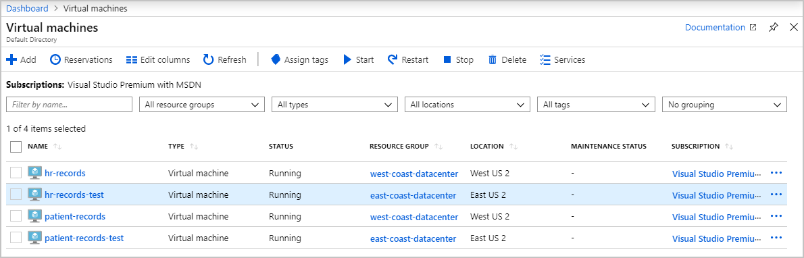
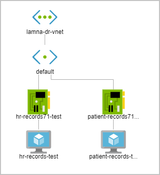

Azure Site Recovery is flexible enough to support many different recovery scenarios. You can choose to failover individual machines, or your entire infrastructure with recovery plans. The flexibility allows you to simulate different disasters, like loosing only part of your infrastruter. Multiple recovery plans can be defined to allow for all the different kinds of disaster drill you want to run.

With Azure Site Recovery in place, the head of Ops has asked you to test how long it takes to failover all your infrastructure. You've investigated the different options, and decided to create a Recovery Plan so that you can failover all the VMs in one go. With the plan in place, you'll run a test failover, and monitor its progress.

In this exercise, you'll complete the steps needed to run a disaster recovery drill using a recovery plan on the portal.

## Create a Recovery Plan

1. Sign into the [Azure portal](https://portal.azure.com) with your own credentials.
1. On the left of the portal, select **All resources**.
1. From the list of resources, select the Recovery Services vault, **lamna-vault**.
1. Under **Manage**, select **Recovery Plans (Site Recovery)**.
1. Select **+ Recovery Plan**.
1. On the Create recovery plan pane, in Name, enter **lamna-dr-drill**.
1. For **Source**, select **West US 2**.
1. For **Target**, select **East US 2**.
1. For **Allow items with deployment model**, select **Resource Manager**.

    

1. After clicking on **Select items**, choose your companies two VMs, then select **OK**.
1. Select **OK** at the bottom of the pane.

## Run a test failover using a recovery plan

1. View the details of the recovery plan you created above by selecting **lamna-dr-drill**.

    

1. On the recovery plan details pane, at the top, select **Test failover**.

    

1. Select **West US 2** for the **From** region.
1. select **East US 2** for the **To** region.
1. For **Recovery Point**, select **Latest app-consistent**.
1. For **Azure virtual network**, select **lamna-dr-vnet**.
1. Select **OK** to begin the failover.

## Monitor failover progress

1. In the navigation slug at the top of the pane, select **lamna-vault - Recovery Plans (Site Recovery)**.

    

1. Under Monitoring, select **Site Recovery jobs**.
1. Select **Test failover** to view the status of the jobs.

    

1. You can use the information on this page to report back to the Ops manager that an Azure failover for your company's current infrastructure will take less than three minutes to complete. These jobs are running in parallel, so it isn't a simple sum of all of them to work out the total the time taken.

1. Once all the jobs have finished successfully, on the far left select **Virtual machines**.

    

1. Select one of the new test VMs, then on the left under **Settings**, select **Networking**, then select **Topology**.

    

> [!NOTE]
> Both the patient-records and hr-records VMs have been failed over by Azure Site Recovery. The machines are running in their own disaster recovery virtual network.

## Fixing issues with a failover

Even though Azure Site Recovery is automated, errors can still happen. Below is a list of the three most common issues you may see. For a full list of issues and how to troubleshoot them see the link in the summary unit.

### Azure resource quota issues

Azure Site Recover needs to create resources in different regions. If your subscription isn't able to do this, the replication will fail. This error will also happen if your subscription doesn't have the right quota limits to create VMs that match the size of the source VMs.

The fix is to contact Azure billing support and ask them to enable creating the correct size VMs in the needed target region.

### One or more disk(s) are available for protection

This error happens if you've been able to set up Azure Site Recovery for your VMs, but after the setup, you have added or initialized additional disks.

To fix this error you can either add replication for the newly added disks, or you can choose to ignore the disk warning.

### Trusted root certificates

The latest root certificates need to be installed to allow Azure Site Recovery to securely communicate and authenticate VMs for replication. You could see this error if your VMs don't have the latest updates applied. Update Both Windows and Linux VMs before Azure Site Recovery can enable replication.

The fix is different for each OS. Windows is as simple as ensuring automatic Windows update is switched on, and updates have been applied. For each Linux distro, you'll need to follow the guidance provided by its distributor.