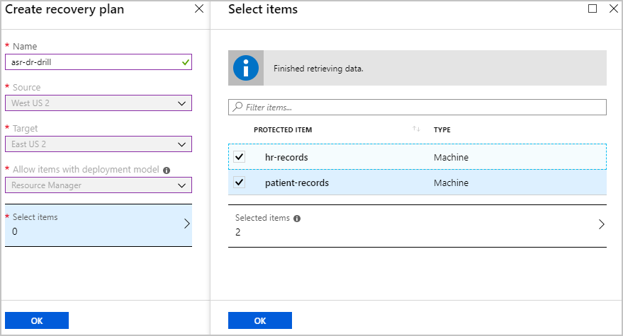
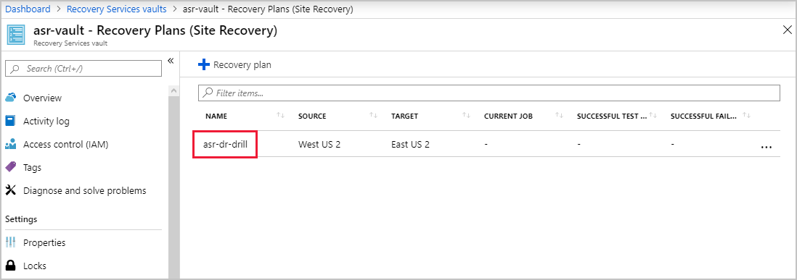
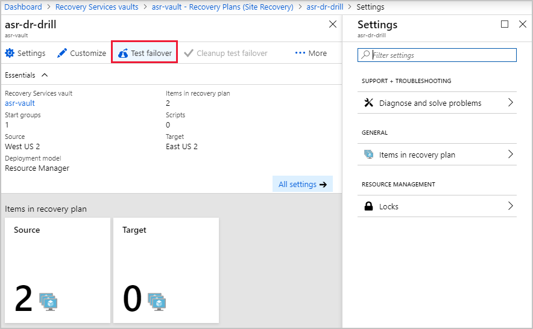
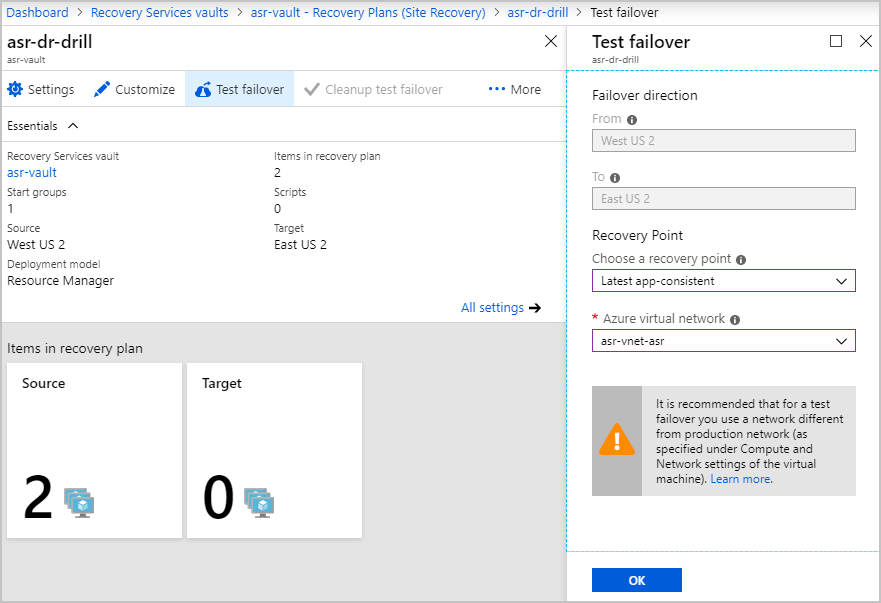
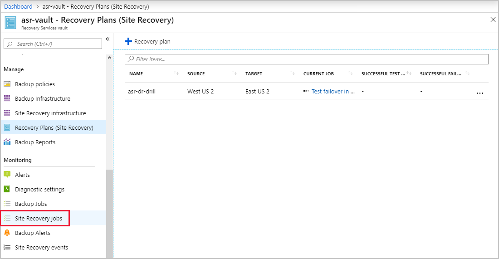
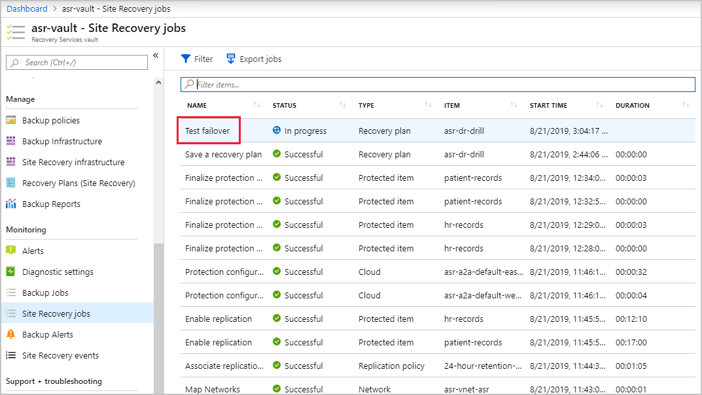
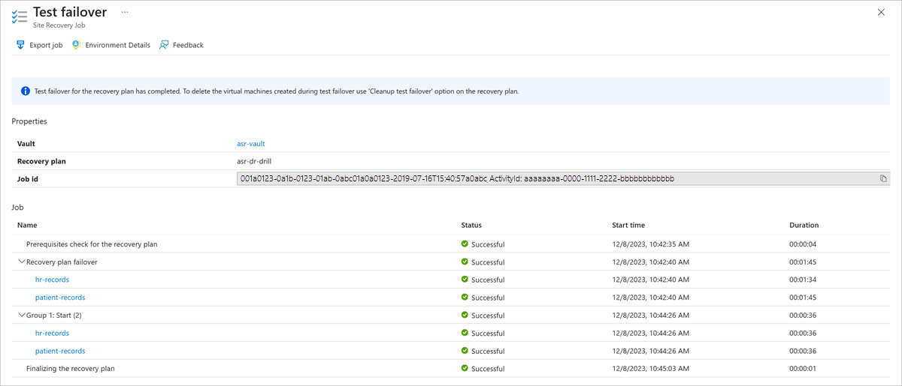
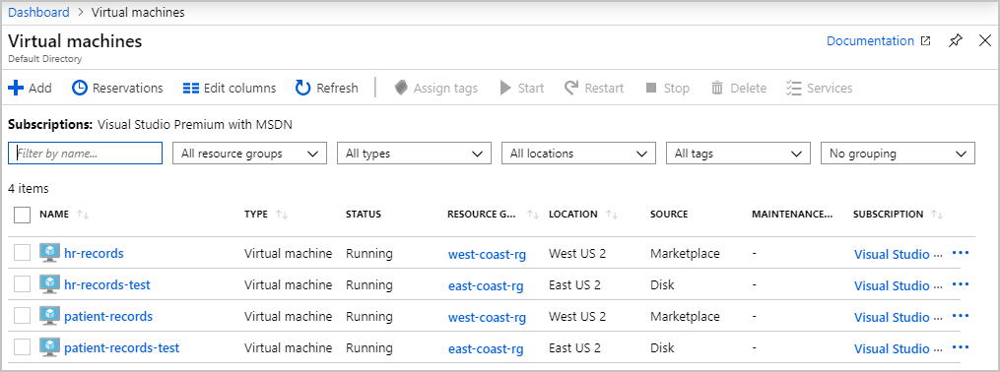
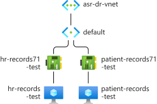
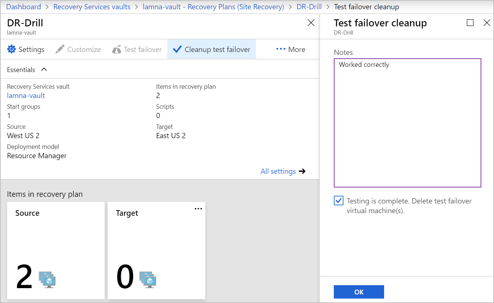

Azure Site Recovery is flexible enough to support many different recovery scenarios. You can choose to failover individual machines or our entire infrastructure with recovery plans. The flexibility enables you to simulate various disasters, like losing only part of your infrastructure. Multiple recovery plans can be defined to allow for all the different kinds of disaster drills you want to run.

With Site Recovery in place, the head of Ops has asked you to test how long it takes to fail over all your infrastructure. You've investigated the different options, and decided to create a recovery plan so that you can fail over all the VMs. With the plan in place, you'll run a test failover, and monitor its progress.

In this exercise, you'll complete the steps needed to run a disaster recovery drill using a recovery plan on the portal.

## Create a recovery plan

1. Sign into the [Azure portal](https://portal.azure.com) with your credentials.

1. On the left of the portal, select **All resources**.

1. From the list of resources, select the Recovery Services vault, **asr-vault**.

1. Under **Manage**, select **Recovery Plans (Site Recovery)**.

1. Select **+ Recovery Plan**. The **Create recovery plan** window appears.

    | Setting | Value |
    |---|---|
    | **Name** | asr-dr-drill |
    | **Source** | West US 2 |
    | **Target** | East US 2 |
    | **Allow items with deployment model** | Resource Manager from the dropdown. |

    

1. Select **Select items**, and select your company's two VMs, and then select **OK**.

1. At the bottom of the pane, select **Create**.

    > [!NOTE]
    > It can happen that the configuration fails. If the configuration fails, delete the plan and create a new plan.

## Run a test failover using a recovery plan

1. View the details of the recovery plan you previously created by selecting **asr-dr-drill**.

    

1. On the recovery plan details pane, at the top, select **Test failover**.

    

    > [!IMPORTANT]
    > The network configuration failover support for each VM can take several minutes to auto configure as each VM also needs to complete an initial synchronization. Running a failover test may not be available immediately.

    | Setting | Value |
    |---|---|
    | **From** | West US 2 |
    | **To** | East US 2 |
    | **Recovery Point** | In **Choose a recovery point** field, select **Latest app-consistent**; in **Azure virtual network** field, select **asr-vnet-asr**. |

1. To begin the failover, select **OK**.

    

## Monitor failover progress

1. In the navigation icon at the top of the pane, select **asr-vault - Recovery Plans (Site Recovery)**. Under **Monitoring**, select **Site Recovery jobs**.

    

1. From the list, select **Test failover**.

    

1. The **Test failover** page appears and you view the status of the jobs.

    

    You'll use the information on this page to report back to the Ops manager that an Azure failover for your company's current infrastructure will take less than three minutes to complete. These jobs are running in parallel, (rather than a simple sum of all of jobs), to work out the total of time taken.

1. After all the jobs have completed successfully, on the far left, select **Virtual machines**.

    

1. Select one of the new test VMs. On the left under **Settings**, select **Networking**, and then select **Topology**.

    

    > [!NOTE]
    > Both the patient-records and hr-records VMs have been failed over by Site Recovery. The VMs are running in their own disaster recovery virtual network.

1. After you're satisfied with the test results, make sure to capture any notes about the test outcome. You'll now switch back to your **asr-dr-drill** site recovery plan, and select the **Cleanup test failover** option to delete the replicated VMs.

    

1. To complete the cleanup process, select the **Testing is complete** checkbox, and then select **OK**. This step can take up to three minutes to complete.
