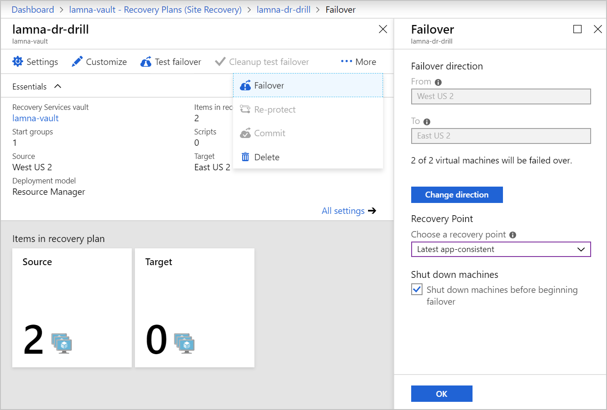
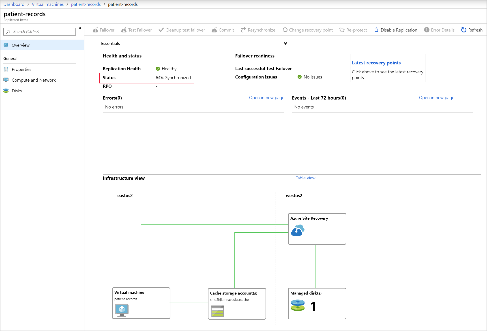

Azure Site Recovery enables your organization to have flexibility, either manually failing over to a secondary Azure region or failing back to a source VM. The simplest way to manage this process is manually on the Azure portal. You do have other options to enable automation if your company wants to automate triggering a failover. These options include technologies like scripting via PowerShell or setting up runbooks in Azure Automation to orchestrate failovers.

Follow these steps to run through a full failover of a protected VM to a secondary region in your subscription. After the failover has completed successfully, you'll then fail back that VM.

In this unit, you'll explore failover and failback, how to reprotect a failed over VM, and monitor the status of the reprotection.

## What is failover?

A failover occurs when a decision is made to execute a DR plan for your organization. The existing production environment, protected by Site Recovery, is replicated to a different region. The target environment becomes the de facto production environment, and becomes the environment on which your organization's production services run. After the target region is active, the source environment should no longer be used. You'll enforce this condition by leaving the source VMs stopped.

There's another advantage to shutting down the source VMs. Using a shut-down VM results in minimal data loss, as Site Recovery waits until all the data is written to disk before triggering the failover. To use this data and have the lowest possible RPO, we select the **Latest (lowest RPO)** recovery point.

## What is reprotection, and why is it important?

When a VM is failed over, the replication Site Recovery performs is no longer active. You have to re-enable the protection to start protecting the failed-over VM. Because you already have the infrastructure in a different region, you can start replication back to the source region. Reprotection enables Site Recovery to start replicating your new target environment back to the source environment where it started.

You can use the flexibility of failing over single VMs or failing over using a recovery plan to reprotect your failed-over infrastructure. You can reprotect each VM individually, or you can reprotect multiple VMs using a recovery plan.

Reprotecting takes anywhere between 45 minutes to 2 hours, depending on the size and type of VM. Unlike the other Site Recovery processes that you can monitor by watching the job progress, you must view reprotection progress at the VM level. This requirement is because the synchronization phase isn't listed as a site recovery job.

This image shows the status of the protected item, with the percentage synchronized highlighted.

## What is failback?

Failback is the reverse of a failover. It's where a completed failover to a secondary region has been committed, and is now the production environment. Reprotection has completed for the failed-over environment, and the source environment is now its replica. In a failback scenario, Site Recovery will fail over back to the source VMs.

The process to complete a failback is the same as a failover, even down to reusing the recovery plan. Selecting failover on your recovery plan has **from** set to the target region, and the **to** set to the source region.

## Manage failovers

Site Recovery can run failovers on demand. Test failovers are isolated, meaning they don't impact production services. This flexibility allows you to run a failover without interrupting that system's users. The flexibility works the other way too, allowing failback on-demand either as part of a planned test or as part of a fully invoked DR process.

The recovery plans in Site Recovery also allow for customizing and sequencing failover and failback. The plans allow you to group machines and workloads.

Flexibility can also apply to how you trigger the failover process. Manual failovers are easy to do via the Azure portal. PowerShell scripting or using runbooks in Azure Automation also provide automation options.

### Fix issues with a failover

Even though Site Recovery is automated, errors can still happen. The following list shows the three most common issues observed. For a full list of issues and how to troubleshoot them, see the link in the **Summary** unit.

#### Azure resource quota issues

Site Recovery must create resources in different regions. If our subscription isn't able to do this, the replication fails. This error also occurs if our subscription doesn't have the right quota limits to create VMs that match the size of the source VMs.

You can correct this by contacting Azure billing support and requesting that they create the correct size VMs in the needed target region.

#### One or more disk(s) are available for protection

This error occurs if you've finished setting up Site Recovery for your VMs. Subsequently, you've added or initialized, additional disks.

To fix this error, you can add replication for the newly added disks, or you can choose to ignore the disk warning.

#### Trusted root certificates

Check that the latest root certificates are installed to allow Site Recovery to communicate and authenticate VMs for replication securely. You can see this error if your VMs don't have the latest updates applied. Before Site Recovery can enable replication, you must update both Windows and Linux VMs.

The correction is different for each operating system. Windows is as simple as ensuring automatic Windows update is switched on and updates are applied. For each Linux distribution, you'll need to follow the guidance provided by the distributor.
