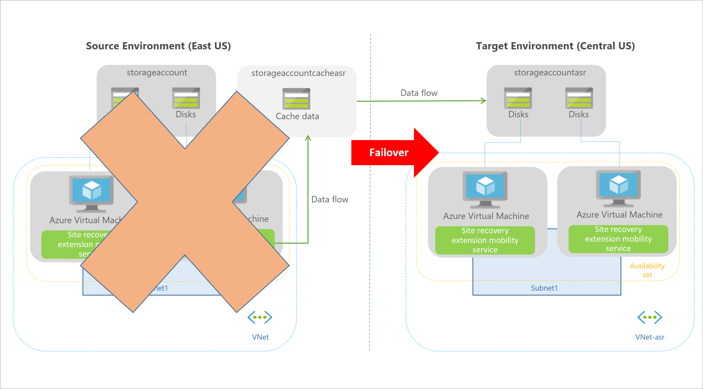

Azure Site Recovery enables your organization to have flexibility, either manually failing over to a secondary Azure region, or to failback to a source machine. This is a manual process. There are options to enable automation if you're company wants to automate triggering a failover. These options include technoligies like scritping via powershell, or setting up runbooks in Azure Automation to orchestrate failovers. 

You would now like to run through a full failover of a protected VM to a secondary region in your subscription, once this has completed successfully. You'd like to then failback that machine.

In this unit, you'll explore failover and failback, how to reprotect the secondary VM, and monitoring the status of your Site Recovery jobs.

## What is failover

Failover happens when a decision is made to execute a DR plan for your organization. The existing production environment, protected by Azure Site Recovery, is replicated to a different region. The target environment, in effect becomes the defacto production environment, taking the place as the environment your organizations production services run on. At that point the source environment should no longer be used.

To enable the replication to happen with minimal data loss, Azure Site Recovery allows you to shutdown the machine before triggering the failover. Using the recovery point means the copy of the source manchine is using 

Once the machines have 

## What is reprotection and why is it important

When a VM is failed over, the protection provided by Azure Site Recovery does not get replicated. To regain the protection and re-start the replication, you have to re-enable the protection for each VM. Luckily you already have infrastructure, in a different region, that can be replicated to. Your original source environment. Reprotection enables Azure Site Protection to replicate the target back to the source environment.

The felxibility of failing over single VMs, or failover using a recovery plan, can be used to re-protect your infrastructure. So, each VM can be re-protected individually, or you can choose to re-protect at the recovery plan level.

> [!NOTE]
> Reprotecting takes anywhere between 45 minutes to 2 hours dependant on the size and type of VM. Unlike the other Site Recovery processes that can be montiored by watching the progress of the jobs, reprotection progress has to be viewed at the VM level.

## What is failback

Failback is the reverse of a failover. This process is where a failover has completed to a secondary region, it has ben comitted, and is now become the production environment. Reprotection has completed for the failed over environment, and subsequently the source environment is now its replica. In a failback scenario, Azure Site Recovery will perform a failover back to the source VMs.

The process to complete a failback scenario are exactly the same as a failover.

## Flexible failovers

Azure Site Recovery can run failovers on demand, the test failover isolation means no production service is impacted. This flexibility allows for a failover to be run during a planned outage of a live service, meaning that users of the system wouldn't notice any interruption, as they would automatically be switched over to using the replicated environment. The flexibility works the other way too, allowing failback on demand either as part of a planned test or as part of a fully invoked DR scenario.

The recovery plans in Azure Site Recovery also allow for the customization and sequencing of failover and failback of virtual machines and the applications that run on them.

Flexibility also applies to how you trigger the failover process. Manual failovers are easy to preform manually via the Azure portal. 

## Monitoring Azure Site Recovery

The Azure Site Recovery dashboard can be used to monitor recovery operations which includes test DR drills. The dashboard is accessed from with the Recovery Services Vault by clicking **Overview**, tabs are then visible to monitor both Site Recovery and Backup operations.

The dashboard allows replicated items and test failovers to be monitored which a distinct state category for both:

- **Backup or Site Recovery**: To alter between the backup and site recovery dashboards.
- **Replicated items**: Displays a health status split into Healthy, Warning or Critical.
- **Failover test success**: Displays a status to show whether tests are Recommended, have been Performed successfully or that a test is Not applicable.
- **Configuration issues**: Displays a status for Azure Site Recovery configurations and pre-requisites of Missing configurations, Missing resources, Subscription quota or Software Updates.
