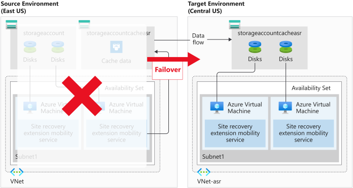

Azure Site Recovery enables your organization to have flexibility. Either manually failing over to a secondary Azure region, or falling back to a source virtual machine. The simplest way to manage this process is manually on the Azure portal. You do have other options to enable automation if your company wants to automate triggering a failover. These options include technologies like scripting via PowerShell, or setting up runbooks in Azure Automation to orchestrate failovers.

You would now like to run through a full failover of a protected VM to a secondary region in your subscription. Once the failover has completed successfully, you'll then failback that virtual machine.

In this unit, you'll explore failover and failback, how to reprotect a failed over VM, and monitor the status of the reprotection.

## What is failover?

A failover happens when a decision is made to execute a DR plan for our organization. The existing production environment, protected by Azure Site Recovery, is replicated to a different region. The target environment becomes the de facto production environment and becomes the environment our organization's production services run on. Once the target region is active, and the source environment should no longer be used. We enforce this by leaving the source VMs stopped.

There's another advantage to shutting down the source VMs. Using a shutdown VM results in minimal data loss, as Azure Site Recovery waits until all the data is written to disk before triggering the failover. To use this data and have the lowest possible RPO, we select the **Latest (lowest RPO)** recovery point.

## What is reprotection, and why is it important?

When a VM is failed over, the replication performed by Azure Site Recovery is no longer happening. We have to re-enable the protection to start protecting the failed over VM. As we already have the infrastructure in a different region, we can start replication back to the source region. Reprotection enables Azure Site Recovery to start replicating our new target environment back to the source environment where it started.

The flexibility of failing over single VMs, or failover using a recovery plan, can be used to reprotect our failed over infrastructure. We can reprotect each VM individually, or we can reprotect multiple VMs using a recovery plan.

Reprotecting takes anywhere between 45 minutes to 2 hours, dependent on the size and type of VM. Unlike the other Site Recovery processes that can be monitored by watching the progress of the jobs, reprotection progress has to be viewed at the VM level. This requirement is because the synchronization phase isn't listed as a site recovery job.

The above image shows the status of the protected item, with the percentage synchronized highlighted.

## What is failback?

Failback is the reverse of a failover. It's where a completed failover to a secondary region has been committed and is now the production environment. Reprotection has completed for the failed over environment, and the source environment is now its replica. In a failback scenario, Azure Site Recovery will fail over back to the source VMs.

The process to complete a failback is the same as a failover, even down to reusing the recovery plan. Selecting failover on your recovery plan has **from** set to the target region and the **to** set to the source region.

## Managing failovers

Azure Site Recovery can run failovers on demand. Test failovers are isolated, meaning they don't impact production services. This flexibility allows us to run a failover without interrupting the users of that system. The flexibility works the other way too, allowing failback on-demand either as part of a planned test or as part of a fully invoked DR process.

The recovery plans in Azure Site Recovery also allow for the customization and sequencing of failover and failback. The plans allow you to group machines and workloads.

Flexibility can also apply to how you trigger the failover process. Manual failovers are easy to do via the Azure portal. PowerShell scripting or using runbooks in Azure Automation gives you automation options.

### Fixing issues with a failover

Even though Azure Site Recovery is automated, errors can still happen. Below is a list of the three most common issues we may see. For a full list of issues and how to troubleshoot them see the link in the summary unit.

#### Azure resource quota issues

Azure Site Recover needs to create resources in different regions. If our subscription isn't able to do this, the replication fails. This error also happens if our subscription doesn't have the right quota limits to create VMs that match the size of the source VMs.

The fix is to contact Azure billing support and ask them to enable creating the correct size VMs in the needed target region.

#### One or more disk(s) are available for protection

This error happens if you've finished setting up Azure Site Recovery for your VMs. Then you've added or initialized, additional disks.

To fix this error, you can add replication for the newly added disks, or you can choose to ignore the disk warning.

#### Trusted root certificates

Check that the latest root certificates are installed to allow Azure Site Recovery to communicate and authenticate VMs for replication securely. You could see this error if your VMs don't have the latest updates applied. Update Both Windows and Linux VMs before Azure Site Recovery can enable replication.

The fix is different for each OS. Windows is as simple as ensuring automatic Windows update is switched on, and updates are applied. For each Linux distribution, you'll need to follow the guidance provided by the distributor.
