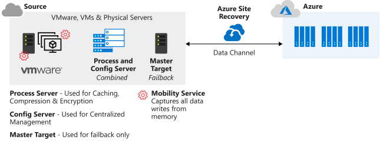

Azure Site Recovery is more than just a tool to help you recover from system outages. Azure Site Recovery replicates workloads between a primary and secondary site. Site Recovery also can be used to migrate VMs from on-premises infrastructure to Azure.

Your first task to protect your workloads from an earthquake, for example, is to review the company's current business continuity and disaster recovery (BCDR) plan. You need to identify the different recovery objectives and scope for the systems that need protection.

In this unit, you investigate how Azure Site Recovery can help achieve these goals, and make failover and recovery of resources possible if a disaster occurs.

## Business continuity and disaster recovery

Loss of service can cause disruption to your staff and users. Every second that systems are unavailable can result in lost revenue for your company. Your company also might face financial penalties for breaking agreements for the availability of services you provide.

BCDR plans are formal documents that companies draw up to cover the scope and actions that should be taken when a disaster or large-scale outage happens. Each outage is assessed on its own merit. For example, a BCDR plan comes into action when a whole datacenter loses power.

In this example scenario, an earthquake occurred and damaged communications lines, making the datacenter useless and in need of repair. A disaster of this size might bring down services for days, not hours, so a full BCDR plan must be invoked to get the services back online.

As part of your BCDR plan, identify the recovery time objectives (RTOs) and recovery point objectives (RPOs) for your applications. Together, these two objectives help to identify the maximum hours that your business can be without specified services, and what the data recovery process should be. Let's look closer at each one.

### Recovery time objective

An RTO is a measure of the maximum amount of time your business can survive after a disaster until normal service must be restored in order to avoid unacceptable consequences associated with a break in continuity. Let's assume your RTO is 12 hours, which means that operations can continue for 12 hours without the business's core services functioning. If the downtime is any longer, your business would be seriously harmed.

### Recovery point objective

An RPO is a measure of the maximum amount of data loss that's acceptable after a disaster. A business may typically decide to do a backup every 24 hours, 12 hours, or even in real time. If a disaster occurs, there's always some data loss.

For example, if your backup occurred at midnight every 24 hours, and a disaster happened at 9:00 AM, then nine hours of data would be lost. If your company's RPO was 12 hours, it would be okay because only nine hours passed. If the RPO was four hours, there would be a problem and damage would occur to the business.

## What is Azure Site Recovery?

Azure Site Recovery can contribute to your BCDR plan because it can replicate workloads from a primary site to a secondary site. If an issue occurs at the primary site, Site Recovery can be automatically invoked to replicate the protected virtual machines to another location. The failover could be from on-premises to Azure, or it could be from one Azure region to another.

Some notable features of Azure Site Recovery are:

- **Central management**: Replication can be set up and managed, and failover and failback can be invoked all from within the Azure portal.
- **On-premises virtual machine replication**: On-premises virtual machines can be replicated to Azure or to a secondary on-premises datacenter, if necessary.
- **Azure virtual machine replication**: Azure virtual machines can be replicated from one region to another.
- **App consistency during failover**: By using recovery points and application-consistent snapshots, virtual machines are always kept in a consistent state during replication.
- **Flexible failover**: Failovers can be run on demand as a test or triggered during an actual disaster. Tests can be run to simulate a disaster recovery scenario without interruption to your live service.
- **Network integration**: Site Recovery can manage network management during a replication and disaster recovery scenario. Reserved IP addresses and load balancers are included so that the virtual machines can work in the new location.

## Set up Azure Site Recovery

Several components must be set up to enable Azure Site Recovery:

- **Networking**: A valid Azure virtual network is required for the replicated virtual machines to use.
- **Recovery Services vault**: A vault in your Azure subscription stores the migrated VMs when a failover is run. The vault also contains the replication policy and the source and target locations for replication and failover.
- **Credentials**: The credentials you use for Azure must have the **Virtual Machine Contributor** and **Site Recovery Contributor** roles to allow permission to modify both the VM and the storage that Site Recovery is connected to.
- **Configuration server**: An on-premises VMware server fulfills several roles during the failover and replication process. It's obtained from the Azure portal as an open virtual machine appliance (OVA) for easy deployment. The configuration server includes a:
  - **Process server**: This server acts as a gateway for the replication traffic. It caches, compresses, and encrypts the traffic before sending it over the WAN to Azure. The process server also installs the mobility service onto all the physical and virtual machines targeted for failover and replication.
  - **Master target server**: This machine handles the replication process during a failback from Azure.

> [!IMPORTANT]
> To fail back from Azure to an on-premises environment, VMware vCenter with a configuration server must be available even if you're only replicating physical machines to Azure. You can't fail back to physical servers.

## Replication process

After the prerequisite tasks are set up, replication of the machines can begin. They're replicated according to the replication policy in place. During the initial stages of the first copy, the server data is replicated to Azure Storage. After the initial replication finishes, a second replication occurs. This time, the delta changes to the virtual machine are replicated to Azure.

## Test and monitor a failover

After your environment is set up for disaster recovery, test it to make sure it's configured correctly, and that everything works as you expect. Test the configuration by doing a disaster recovery drill on an isolated VM. It's a best practice to use an isolated network for the test so that live services aren't disrupted.

The first task when you attempt a recovery drill is to verify your test virtual machine properties in the **Protected Items** section of the Azure portal. The latest recovery points are viewed from the **Replicated Item** pane. In the **Compute & Network** section, the virtual machine name, resource group, target size, availability set, and disk settings can be adjusted, if needed.

Recovery drills can be started from the **Settings** > **Replicated Items** section of the Azure portal. Select the target virtual machine, and then select the **Test Failover** menu item for the latest processed recovery point. Select the Azure network in the same menu. To start the recovery job, select **OK** on the network selection screen.

The status of the recovery job and the replicated virtual machine is accessed via the **Overview** section of the Recovery Services vault. Replicated items have a status of:

- **Healthy**: Replication is operating normally.
- **Warning**: There's an issue that could impact replication.
- **Critical**: A critical replication error was detected.

If all goes well, the replicated VM status is set to *Performed successfully*. If a test hasn't been done, the status is set to *Test recommended*. The VM is also set to *Test recommended* if it's been more than six months since the last test.
