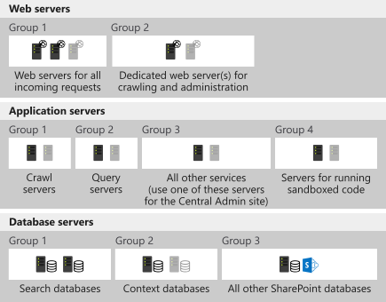

After you set up Azure Site Recovery, you can use protection at the lower application level with application-aware replication. Application-level protection is in addition to restoring at the machine level.

After you confirm the company's business continuity and disaster recovery (BCDR) plan with key stakeholders, you now want to investigate the workloads that Azure Site Recovery supports to ensure it fits with your organization's BCDR goals.

In this unit, you explore the application-level protection you can take advantage of to protect your company's different workloads.

## Azure Site Recovery supported workloads

Site Recovery can replicate any app that runs on a supported machine:

- **Azure VM**: Replication is available for any workload that runs on a supported Azure virtual machine.
- **Hyper-V VM**: Protection is available for any workload that runs on a Hyper-V virtual machine.
- **Physical servers**: Protection is available for Windows and Linux operating systems.
- **VMware VM**: Protection is available for any workload that runs in a VMware virtual machine.

Site Recovery provides application-aware replication for many types of workloads or applications that run on top of the server operating system. Application replication is supported for many different workloads. Taking advantage of the integration with specific workloads has many benefits during normal replication, and also during failover. Some of the features offered include:

- **Near synchronous replication**: Data is written to the primary storage and the replica almost simultaneously to allow for low recovery times.
- **App-consistent snapshots**: Snapshots taken for recovery purposes can view information in memory and pending I/O operations, which allows for quick recovery times. The application is ready to go after switching to the replica VM.
- **Integration with SQL Always On**: Always On is an enterprise-level alternative to normal database mirroring techniques.
- **Flexible recovery plans**: The ability to recover an entire application stack with a single click. Both manual and scripted actions can be incorporated into the overall plan.
  - **Network management**: The automated ability to simplify the reservation of IP addresses, configure load balancers, and integrate with Azure Traffic Manager.
  - **Automation library**: Production-ready scripts that can be downloaded and integrated with the recovery plan to provide a fully automated recovery, if needed.

### Active Directory and DNS

Active Directory and DNS can be configured for an automated failover. Typically, they're completed first in the scope of the overall recovery plan. In this way, the Active Directory instance and DNS name resolution are available for when the other applications are failed over. You can have Active Directory up and running in a few minutes. Site Recovery protects the virtual machine that hosts your domain controller and DNS.

### SQL Server

Site Recovery can be used alongside SQL-specific high-availability technologies, such as Always On availability groups. Standalone servers or clusters are supported for replication to Azure or a secondary site. Site Recovery can also scale peak loads by *bursting* them onto larger VMs in Azure. Test failovers and compliance checks can be run on demand, or can be scheduled, without affecting the live environment.

### SharePoint

Protecting SharePoint with Site Recovery allows for all the servers that make up the solution to be failed over at the same time. In the previous example, a high-demand server farm can include web, app, and database server groups. The constant replication to Azure allows any updates deployed to the live environment to be automatically deployed to the replica to allow for patch consistency during a failover.

### Dynamics AX

Protecting Dynamics AX involves a similar approach as the one you would take to protect SharePoint because Dynamics consists of web, app, and database tiers. The replica environment could also be used for test and development purposes.

### Remote desktop services

You can replicate managed or unmanaged pooled virtual desktops, remote applications, and sessions to a secondary site or Azure.

### Exchange

Small deployments of Exchange, such as those deployments with a single server, can be replicated. For larger deployments, Site Recovery integrates with Exchange database availability groups. This high-availability feature of Exchange 2010 can host up to 16 mailbox servers, and automates recovery at the database level.

### SAP

SAP NetWeaver and non-NetWeaver production application components can be replicated. The replicated environment can be used as a test bed for project upgrades and testing.

### IIS

Protecting IIS allows for full automation of the recovery plan if you need to fail over to the replicated environment. Protection for IIS servers can be easily enabled, and IP addressing can be properly configured by mapping the primary and recovery networks prior to fail over. Scripts can be used during failover to update application dependencies and bindings. This approach enables a one-click failover for multiple web applications on the web servers and eliminates the scope for confusion if a disaster occurs.

### Citrix XenApp and XenDesktop

Full protection is available for Citrix by using Site Recovery. You can protect all aspects of your Citrix solution, Active Directory, DNS, SQL Server, and Citrix-specific servers, such as the StoreFront server. They all can be part of the same recovery plan. After replication is in place, you can use the replicated environment as a test platform.
