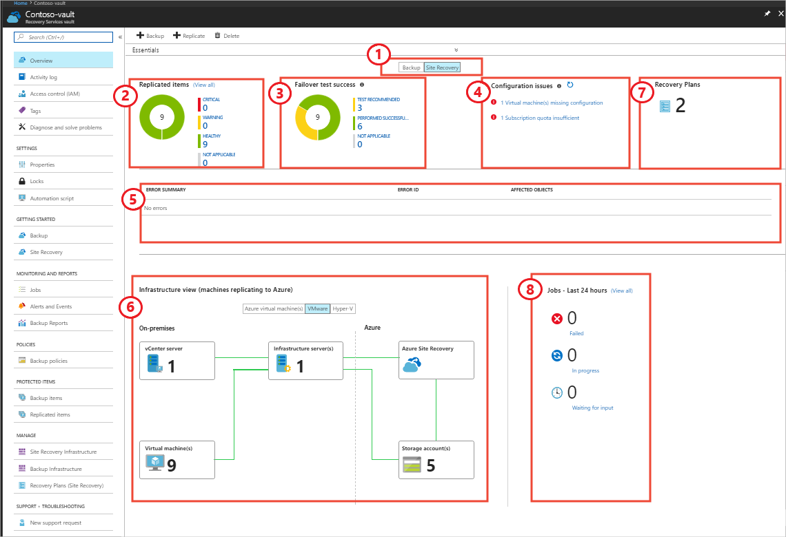

Disaster recovery drills enable you to test your company's ability to recover from a disaster without affecting production services.

After you produce a business continuity and disaster recovery (BCDR) plan, you're prompted to explore the options for how the system can be tested without interrupting live service. You want to learn more about recovery drills, and how they can verify that your Azure Site Recovery solution is set up and works correctly.

In this unit, you gain an understanding of recovery time and recovery point objectives. You can then see how to use a recovery drill to test that Site Recovery was configured correctly to meet these objectives.

## Disaster recovery drill

With Site Recovery, you can do a full disaster recovery test without affecting your existing live environment. Recovery plans are created within Site Recovery to allow the automation of recovery tasks and to model an app around its dependencies. Such as, as the need for Active Directory or DNS to function. BCDR plans also allow you to test your disaster recovery.

After a BCDR plan is created in the Azure portal, it can be executed for test purposes. Follow these steps:

1. In the **Site Recovery** section of the Azure portal, select **Recovery Plans** > your recovery plan name > **Test Failover**.

1. Select the recovery point from the options presented. Options include **Latest processed**, which is the latest recovery point that was processed by Site Recovery.

1. Select the Azure virtual network on which the virtual machine should be created. Use an isolated network from the live environment to prevent any impact to production environments.

1. Track progress in the **Jobs** tab and also in the **Site Recovery** dashboard.

## Monitor a test recovery

Use the Site Recovery dashboard to monitor recovery operations, which include recovery drills started under test circumstances. The dashboard is accessed from within the Recovery Services vault by selecting **Overview**. Tabs are then visible to monitor both Site Recovery and backup operations.

In the dashboard, you can monitor replicated items and test failovers. Each replicated item under both categories is placed into a particular state for easy viewing of a healthy item compared to one with issues. See the following image.

**(1) Backup or Site Recovery**: Switch between the **Backup** or the **Site Recovery** dashboards. In this example, you're on the **Site Recovery** tab.

**(2) Replicated items** - **Healthy**: Replication is running normally with no warnings. **Warning** means that one or more issues were identified that could affect replication. **Critical** means that one or more critical replication errors were identified.

**(3) Failover test success** - **Test recommended**: Specific machines haven't had a failover since Site Recovery protection was enabled. **Performed successfully** means that one or more machines replicated successfully. **Not applicable** means that machines aren't currently eligible for a test failover.

**(4) Configuration issues** - **Missing configurations**: A necessary setting is missing. **Missing resources** means that a specified resource can't be found or isn't available. An example is a deleted resource such as a virtual network. **Subscription quota** shows the amount of resource available for your subscription and whether there's enough to do a failover. **Software updates** shows the availability of new software updates and information about out-of-date software.

**(5) Error summary**: Review a summary of errors here for easy access so that you can quickly identify any issues in your environment.

**(6) Infrastructure view**: See a visualization of your replication infrastructure and a display of health.

**(7) Recovery Plans**: View recovery plans for your infrastructure.

**(8) Jobs - Last 24 hours**: See the status of any jobs that are in progress, waiting, or that failed.
