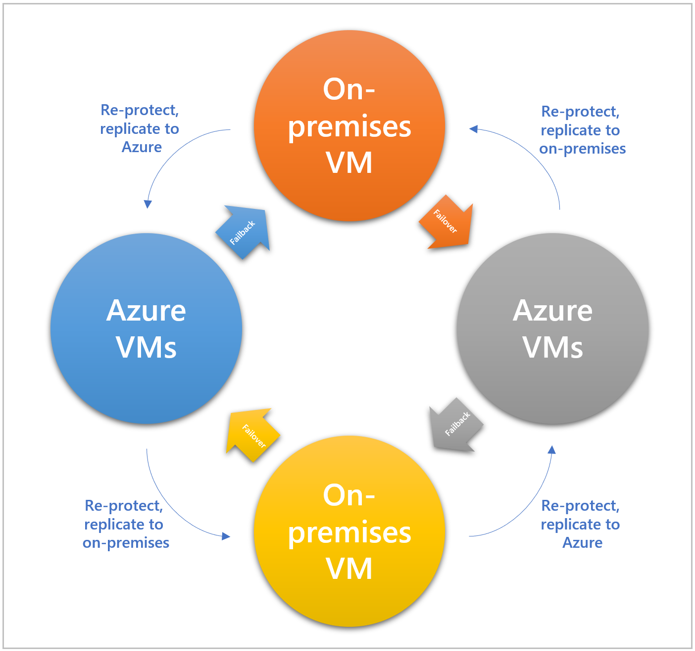

Azure Site Recovery gives you the flexibility to failover to Azure if a disaster occurs, and failback to on-premises machines when the event is over.

You now wish to do a full failover for the rest of the protected environment to Azure, after successfully running a failover drill on a single test virtual machine. You'll then do the failback once failover has completed successfully.

In this unit, you'll explore the differences between failover and failback, how you get a failback policy created automatically once you've set up a replication policy to Azure.

## Failover and failback

A failover is the process that takes place when the decision is made to invoke the disaster recovery plan for the business. Failover happens when the current live environment, that is protected using Azure Site Recovery, is moved over to the replica environment. This target replica environment then, for all practical purposes, takes the place of the live environment and becomes the primary infrastructure.

Failing back is the reverse of the above where the previous live environment (now the replica environment, as a failover has taken place) takes back its original role, becoming the live environment again. After the failover has happened in the first instance, a re-protection phase needs to happen where you bring back in to sync the original environment with the new live environment. This process allows the failover and failback to happen without any data loss. The re-protection phase will likely be a lengthy process, as the old live environment needs to be re-established as working correctly after the disaster.  

The four stages of a failover and failback actions are:

- **Failover to Azure** - If the on-premises primary site goes down then the decision to failover to Azure (or your secondary site) is made, creating virtual machines from the primary replicated data.
- **Re-protect Azure virtual machines** - Once the failover has occurred the Azure virtual machines must be re-protected so that they can replicate changes back to the on-premises environment once the disaster has been averted. Virtual machines are powered off to ensure data consistency.
- **Failback to on-premises** - When the on-premises site is back up and running it's possible to fail over back to that environment. It will then be the live environment again. Note that you cannot fail back to physical servers. All systems will need to fail back to virtual machines.
- **Re-protect on-premises virtual machines**: - Re-protection of the on-premises virtual machines takes place so they start replicating to Azure after the failback has happened successfully.

## Failback policies

When you create an on-premises replication policy to copy your on-premises machines to Azure, an associated failback policy is automatically created for you. The policy has some fixed attributes that can't be changed, these are:

    - Can only replicate back to your on-premises configuration server
    - RPO is set at 15 minutes
    - Recover Point retention is set to 24 hours
    - App-consistent snapshots are set to every hour

Running the failback stops the Azure VMs and once the replication has finished, start your on-premises VM to take over the workloads. There will be disruption to the service, so ensure you schedule the failback at a time that won't impact your business.

## Recovery plans

Recovery plans within Site Recovery allow for the customization and sequencing of failover and failback of virtual machines and the applications that run on them. Machines are grouped together, and recovery actions can be automated with the use of scripts during the failover or failback. You can also add additional manual steps for actions if you need to. Testing the recovery plan before a disaster happens, means that if disaster strikes, you can be more confident you'll have a positive outcome. You'll need to get infrastructure back-up and running again at the secondary location quickly to meet the companies RTO.

## Flexible failovers

With the ability to be flexible with failovers, Azure Site Recovery can run failovers on demand for test purposes. Isolating these tests mean they won't interrupt live services. This flexibility also allows for a failover to be run during a planned outage of the live service. Meaning that users of the system wouldn't notice any interruptions from the outage, as they would automatically be switched over to using the replicated environment. The flexibility works the other way too, allowing failback on demand either as part of a planned test or as part of a fully invoked DR scenario.
