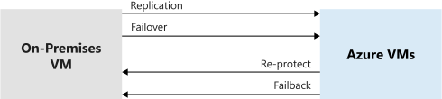

Azure Site Recovery gives you the flexibility to fail over to Azure if a disaster occurs, and fail back to on-premises machines after the event is over.

You now want to do a full failover for the rest of the protected environment to Azure. You do a full failover after you successfully run a failover drill on a single test virtual machine. You'll then do the failback after the failover has completed successfully.

In this unit, you explore the differences between failover and failback. You'll also learn how you get a failback policy created automatically after you set up a replication policy to Azure.

## Failover and failback

A failover is the process that takes place when the decision is made to invoke the BCDR plan for the business. Failover happens when the current live environment that's protected by using Site Recovery is moved over to the replica environment. This target replica environment takes the place of the live environment, and becomes the primary infrastructure.

A failback is the reverse of a failover. The previous live environment (which is now the replica environment because a failover took place) takes back its original role and becomes the live environment again. After the failover has happened in the first instance, a reprotection phase needs to occur. In this phase, you bring the original environment back into sync with the new live environment. This process enables the failover and failback to happen without any data loss. The reprotection phase is likely to be a lengthy process because you need to establish that the old live environment works correctly after the disaster.

The four stages of failover and failback actions are:

- **Fail over to Azure**: If the on-premises primary site goes down, the decision to fail over to Azure (or your secondary site) is made, which creates virtual machines from the primary replicated data.
- **Reprotect Azure virtual machines**: After the failover occurs, the Azure virtual machines must be reprotected so that they can replicate changes back to the on-premises environment after the disaster is averted. Virtual machines are powered off to ensure data consistency.
- **Fail back to on-premises**: When the on-premises site is back up and running, it's possible to fail over back to that environment. It then becomes the live environment again. You can't fail back to physical servers. All systems must fail back to virtual machines.
- **Reprotect on-premises virtual machines**: Reprotection of the on-premises virtual machines takes place so that they start replicating to Azure after the failback has happened successfully.

## Failback policies

When you create an on-premises replication policy to copy your on-premises machines to Azure, an associated failback policy is automatically created for you. The policy has some fixed attributes that can't be changed. These attributes are:

- Can only replicate back to your on-premises configuration server.
- The recovery point objective is set at 15 minutes.
- The recovery point retention is set to 24 hours.
- App-consistent snapshots are set to every hour.

Running the failback stops the Azure VMs. After the replication has finished, start your on-premises VM to take over the workloads. Service is disrupted, so schedule the failback at a time that doesn't affect your business.

## Business Continuity and Disaster Recovery plans

BCDR plans within Site Recovery allow for the customization and sequencing of failover and failback of virtual machines and the applications that run on them. Machines are grouped together, and recovery actions can be automated with the use of scripts during the failover or failback. You can also add more manual steps for actions if you need to. If you test the BCDR plan before a disaster happens, you can be more confident of a positive outcome. You need to get your infrastructure up and running again at the secondary location quickly to meet the company's recovery time objective.

## Flexible failovers

With the ability to be flexible with failovers, Site Recovery can run failovers on demand for test purposes. Isolating these tests means that live services aren't interrupted. This flexibility also allows for a failover to be run during a planned outage of the live service. The outage doesn't interrupt users of the system because they're automatically switched over to the replicated environment. The flexibility works the other way too. Failback on demand can be either as part of a planned test or as part of a fully invoked disaster recovery scenario.
