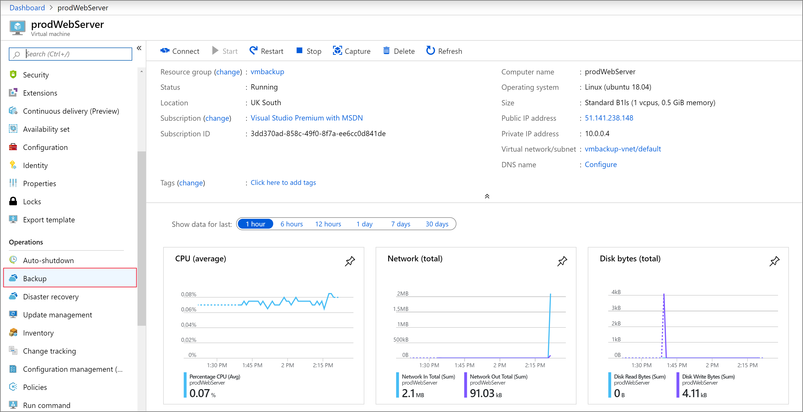
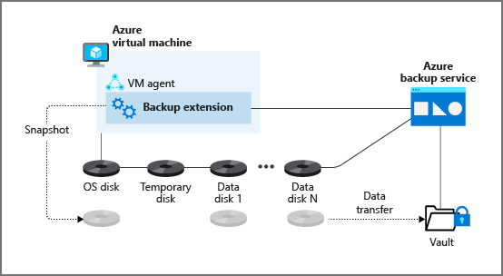

You want to ensure that the backup and restore jobs you put in place offer a way to recover your company's servers. With this requirement in mind, you want to investigate the best way to implement backup for your virtual machines (VMs).

VMs that are hosted on Azure can take advantage of Azure Backup. You can easily back up and restore machines without installing extra software.

In this unit, you'll explore all the methods of backing up Azure VMs provided by Azure Backup and make a decision on which to implement.

**Azure VMs** are backed up by taking snapshots of the underlying disks at user-defined intervals and transferring those snapshots to the Recovery Services vault as per the customer-defined policy.

## Recovery Services vault

Azure Backup uses a Recovery Services vault to manage and store the backup data. A vault is a storage-management entity, which provides a simple experience to carry out and monitor backup and restore operations. With Azure Backup, you don't need to worry about deploying or managing storage accounts. In fact, all you need to specify is the vault you want to back up the VM to. The backup data is transferred to the Azure Backup storage accounts (in a separate fault domain) in the background. The vault also acts as an RBAC boundary to allow secure access to the data.

## Snapshots

A snapshot is a point-in-time backup of all disks on the VM. For Azure VMs, Azure Backup uses different extensions for each supporting operating system:

| Extension | OS | Description |
|---|---|---|
| VMSnapshot | Windows | The extension works with Volume Shadow Copy Service (VSS) to take a copy of the data on disk and in memory. |
| VMSnapshotLinux | Linux | The snapshot is a copy of the disk. |

Depending on how the snapshot is taken and what it includes, you can achieve different levels of consistency:

- **Application consistent**
  - The snapshot captures the VM as a whole. It uses VSS writers to capture the content of the machine memory and any pending I/O operations.
  - For Linux machines, you need to write custom pre or post scripts per app to capture the application state.
  - You can get complete consistency for the VM and all running applications.
- **File system consistent**
  - If VSS fails on Windows, or the pre and post scripts fail on Linux, Azure Backup still creates a file-system-consistent snapshot.
  - During a recovery, no corruption occurs within the machine. But installed applications need to do their own cleanup during startup to become consistent.
- **Crash consistent**
  - This level of consistency typically occurs if the VM is shut down at the time of the backup.
  - No I/O operations or memory contents are captured during this type of backup. This method doesn't guarantee data consistency for the OS or app.

## Backup policy

You can define the backup frequency and retention duration for your backups. Currently, the VM backup can be triggered daily or weekly, and can be stored for multiple years. The backup policy supports two access tiers: snapshot tier and the vault tier. By using the Enhanced policy, you can trigger hourly backups.

**Selective disk backup**:  Azure Backup provides **Selective Disk backup and restore** capability using **Enhanced policy**. By using this capability, you can selectively back up a subset of the data disks that are attached to your VM, and then restore a subset of the disks that are available in a recovery point, both from instant restore and vault tier. It helps you manage critical data in a subset of the VM disks and use database backup solutions when you want to back up only their OS disk to reduce cost.

**Snapshot tier**: All the snapshots are stored locally for a maximum period of five days. This is referred to as the snapshot tier. For all types of operation recoveries, we recommended that you restore from the snapshots because it's faster to do so. This capability is called **instant restore**.

**Vault tier**: All snapshots are additionally transferred to the vault for more security and longer retention. At this point, the recovery point type changes to "snapshot and vault."

## Backup process for an Azure virtual machine

Here's how Azure Backup completes a backup for Azure VMs:

1. For Azure VMs that are selected for backup, Azure Backup starts a backup job according to the backup frequency you specify in the backup policy.

2. During the first backup, a backup extension is installed on the VM, if the VM is running:

   - For Windows VMs, the VMSnapshot extension is installed.
   - For Linux VMs, the VMSnapshotLinux extension is installed.

3. After the snapshot is taken, it's stored locally as well transferred to the vault.

   - The backup is optimized by backing up each VM disk in parallel.
   - For each disk that's being backed up, Azure Backup reads the blocks on the disk and identifies and transfers only the data blocks that changed (the delta) since the previous backup.
   - Snapshot data might not be immediately copied to the vault. It might take several hours at peak times. Total backup time for a VM is less than 24 hours for daily backup policies.

You can additionally enable [vault encryption with customer-managed keys (CMK)](/azure/backup/encryption-at-rest-with-cmk#configuring-a-vault-to-encrypt-using-customer-managed-keys?azure-portal=true). By using **Enhanced soft delete** for a Recovery Services vault, you can protect backups from deletion. You can also keep Enhanced soft delete *always on* to prevent turning it off, thus protecting your backups from accidental deletion or from malware attacks.
