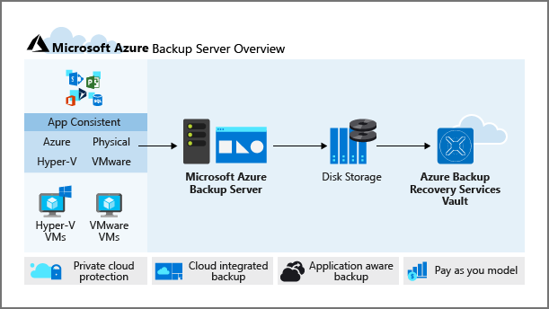
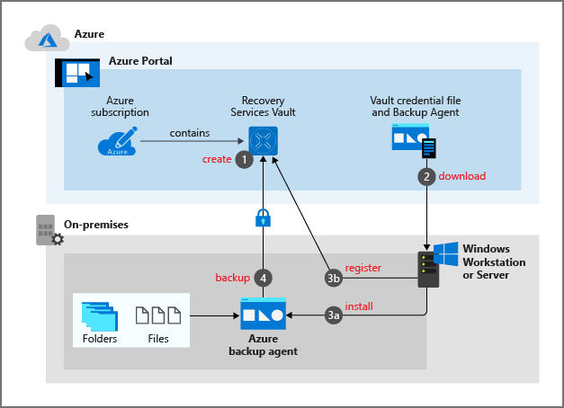

You want to ensure the backup and restore jobs you put in place offer a way to recover your company's servers. With this requirement in mind, you want to investigate the best way to implement back up for your virtual machines. Virtual machines that are hosted on Azure can take advantage of Azure Backup. You can easily back up and restore machines without installing additional software.

In this unit, you'll explore all the methods of backing up Azure virtual machines provided by Azure Backup and make a decision on which to implement.

## Snapshots

A snapshot is a point-in-time backup of all disks on the virtual machine. For Azure virtual machines, Azure Backup uses different extensions for each supporting operating system:

| Extension | OS | Description |
|---|---|---|
| *VMSnapshot* | Windows | Works with Volume Shadow Copy service (VSS) to take a copy of the data on disk and in memory. |
| *VMSnapshotLinux* | Linux | The snapshot is a copy of the disk. |

Depending on how the snapshot is taken and what it includes, different levels of consistency will be achieved:

- **Application-consistent consistency**
  - The snapshot captures the virtual machine as a whole, using VSS writers to capture the content of the machine memory and any pending I/O operations
  - For Linux machines, you'll need to write custom pre or post scripts per app to capture the application state
  - Provides complete consistency for the virtual machine itself and all running applications
- **File-system consistent consistency**
  - If VSS fails on Windows, or the pre and post-scripts fail on Linux, Azure Backup will still create a file-system consistent snapshot
  - During a recovery, no corruption occurs within the machine, but installed applications need to do their own cleanup during start up to become consistent
- **Crash-consistent consistency**
  - Occurs typically if the virtual machine in question is shut down at the time of the backup
  - No I/O operations or memory contents will be captured during this type of backup, this method doesn't guarantee data consistency of the OS or app

## Recovery Services vault

A Recovery Services vault is the service used to manage and store the backup data in Azure. Typically a vault consists of data copies, configuration information for virtual machines, server, and workstation workloads. Recovery Services vaults can also be used to hold backup data for infrastructure-as-a-service (IaaS) virtual machines. The vault provides a single place to manage your backups, and is accessible in context to the resource it is protecting. For example, with the vault you can:

- Monitor Azure virtual machines backups. Hybrid scenarios are also supported, so on-premises machines protected with Azure Backup can also be monitored.
- Manage backup jobs and their properties.
- Access management control is available within the vault, which allows fine-tuned permissions for administrators.
- Quickly restore files or folders within virtual machines instead of recovering the whole machine.
- All data located in a Recovery Services vault is secured while at rest.

## Cost considerations

There's a cost for every virtual machine backed up, and it starts as soon as the first backup is completed. The pricing is based on the size of the backed-up data, because the cost is based on the size of the allocated disk space. For SQL Server backups, cost is based on the size of the database backup file.

## Backup agents

Azure Backup makes use of agents to support a variety of backup scenarios. The agents can be installed directly on physical or virtual machines, or be part of a dedicated backup server. The agent you choose will differ slightly depending on whether you need to backup an entire virtual machine, files and folders, or running apps.

### Azure Backup virtual machine extension

The Azure Backup extension is the default backup choice, because it's the most simple and straight forward method to quickly back up an Azure virtual machine. No other action is needed by the administrator other than to configure the backup job. During the first backup, a *VMSnapshot* (for Windows) or *VMSnapshotLinux* (for Linux) extension is installed. These extensions take snapshots of the virtual machine's entire disk, which means they don't enable file or folder level restores. The snapshots are created and stored in an Azure Recovery services vault.

If your company's virtual machines are in Azure, and you don't require file level restores, your company should use the Azure Backup extension.

### Microsoft Azure Backup Server protection agent

The Microsoft Azure Backup Server (MABS) agent installed on an Azure or on-premises virtual machine allows that machine to back up to a Microsoft Azure Backup server. The MABS agent can back up and restore SQL and other application services. Workloads like Exchange and SharePoint can also be supported by using the *AzureBackupWindowsWorkload* extension. Machines and workloads are backed up to a Microsoft Azure Backup Server, although this doesn't move these backups to an Azure Recovery Services vault; if you need to move your backups to an Azure Recovery Services vault, you'll need to install the MARS agent.

### Microsoft Azure Recovery Services agent

The Microsoft Azure Recovery Services (MARS) agent is used by Azure Backup to back up Windows files, folders, and system state data to a Recovery Services vault. The agent is installed manually on the machines that you are backing up. The MARS agent enhances the levels of backup if installed alongside the Azure Backup extension on an Azure virtual machine. MARS enables on-premises Windows machines to back up directly to an Azure Recovery Services vault.

When used in conjunction with an Azure Backup Server, the MARS agent will copy the snapshots from the server into a vault.

## Back up Process for an Azure virtual machine

1. The first stage of the backup job is installing the extension automatically; the *VMSnapshot* extension for Windows machines, and the *VMSnapshotLinux* for Linux virtual machines.
   - In a Windows environment, Azure Backup uses the Volume Shadow Copy Service (VSS) to take app consistent snapshots of the virtual machine used for the backup procedure.
   - In a Linux environment, Azure Backup takes file consistent snapshots that are used for the backup procedure.

1. The snapshot is transferred to your Recovery vault within Azure.
    - Each disk for the selected virtual machine is backed up in parallel for optimization purposes.
    - After the first full backup, Azure Backup will identify the blocks of data that have changed and only backup up that information rather than the whole virtual machine a second time.

1. Snapshots can take up to 24 hours to transfer to the Recovery Services vault within Azure. When the transfer completes, the service will remove the snapshot and create a recovery point for the machine.

## Security

Azure Backup offers the ability to back up virtual machines encrypted with Azure Disk Encryption. Azure Storage also encrypts your backed-up data at rest using Storage Service Encryption (SSE), and your data is automatically decrypted when retrieved.

- **Azure Disk Encryption (ADE)**:
  - Encrypts your operating system, data disks, and integrates with **BitLocker encryption keys (BEKs)**, which are safeguarded in a Key Vault as secrets. Integration with **Azure Key Vault encryption keys (KEKs)** is also supported.
  - During the backup procedure, both BEKs and KEKs are backed up and encrypted; users with appropriate permissions can then restore the Keys and Secrets if needed, and also recover an encrypted virtual machine
- **Storage Service Encryption**:
  - Encrypts your backups when at rest after it has been copied to the vault. When a restore operation is called for the backed-up data, it is automatically decrypted and ready for use.
