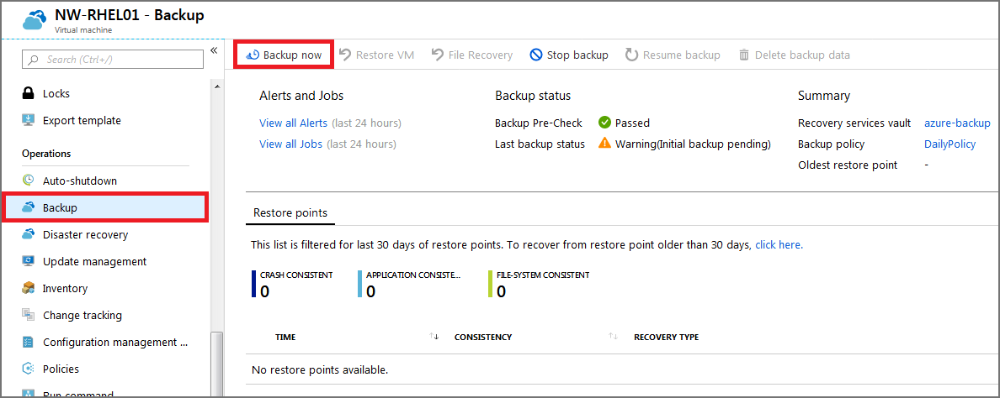

Your company is running a combination of Windows and Linux workloads. You've been asked to prove that Azure Backup is a good fit for both kinds of virtual machines. By using a combination of the Azure CLI and the Azure portal, you'll help protect both kinds of virtual machines with Azure Backup.

Azure Backup can be quickly enabled for virtual machines in Azure. You can enable Azure Backup from the portal, from the Azure CLI, or by using PowerShell commands.

In this exercise, you'll create a virtual machine, set up a backup, and start a backup.

> [!NOTE]
> This exercise is optional. If you don't have an Azure account, you can read through the instructions so you understand how to back up virtual machines by using Azure Backup.
> If you want to complete this exercise, but you don't have an Azure subscription or you prefer not to use your own account, create a [free account](https://azure.microsoft.com/free/?azure-portal=true) before you begin.

## Create a backup for Azure virtual machines

### Set up the environment

1. Sign in to the [Azure portal](https://portal.azure.com/?azure-portal=true), and open Azure Cloud Shell.

    

1. Create a resource group to contain all the resources for this exercise.

    ```azurecli
    RGROUP=$(az group create --name vmbackups --location westus2 --output tsv --query name)
    ```

1. Use Cloud Shell to create the **NorthwindInternal** virtual network and the **NorthwindInternal1** subnet.

    ```azurecli
    az network vnet create \
        --resource-group $RGROUP \
        --name NorthwindInternal \
        --address-prefix 10.0.0.0/16 \
        --subnet-name NorthwindInternal1 \
        --subnet-prefix 10.0.0.0/24
    ```

### Create a Windows virtual machine by using the Azure CLI

Create the **NW-APP01** virtual machine by using the following command. Replace `<password>` with a password of your choice.

```azurecli
az vm create \
    --resource-group $RGROUP \
    --name NW-APP01 \
    --size Standard_DS1_v2 \
    --vnet-name NorthwindInternal \
    --subnet NorthwindInternal1 \
    --image Win2016Datacenter \
    --admin-username admin123 \
    --no-wait \
    --admin-password <password>
```

### Create a Linux virtual machine by using the Azure CLI

Create the **NW-RHEL01** virtual machine by using the following command.

```azurecli
az vm create \
    --resource-group $RGROUP \
    --name NW-RHEL01 \
    --size Standard_DS1_v2 \
    --image RedHat:RHEL:7-RAW:latest \
    --authentication-type ssh \
    --generate-ssh-keys \
    --vnet-name NorthwindInternal \
    --subnet NorthwindInternal1
```

The command can take a few minutes to finish. Wait for it to finish before you move on to the next step.

### Enable backup for a virtual machine by using the Azure portal

1. In the Azure portal, search for and select **Virtual machines**.

    

1. From the list, select the **NW-RHEL01** virtual machine that you created.

    

1. In the sidebar, scroll down to **Operations**, select **Backup**, and then use the following information to create a backup:

    | | |
    |-|-|
    | **Recovery Services vault** | Select **Create new**, and enter **azure-backup** for the name. |
    | **Resource group** | Select the **vmbackups** resource group that you created earlier. |
    | **Choose a backup policy** | Select **(new) DailyPolicy**, which is a daily backup at 12:00 PM UTC, and a retention range of 180 days. |

    

1. Select **Enable Backup**.

1. After the deployment finishes, select **NW-RHEL01** from the list of virtual machines.

1. You can access backup settings from the virtual machine menu by scrolling down to **Operations** and selecting **Backup**.

1. To perform the first backup for this server, select **Backup now**.

    

1. On the **Backup Now** page, select **OK**.

### Enable a backup by using the Azure CLI

1. By using Cloud Shell, enable a backup for the **NW-APP01** virtual machine.

    ```azurecli
    az backup protection enable-for-vm \
        --resource-group vmbackups \
        --vault-name azure-backup \
        --vm NW-APP01 \
        --policy-name DefaultPolicy
    ```

1. Monitor the progress of the setup by using the Azure CLI.

    ```azurecli
    az backup job list \
        --resource-group vmbackups \
        --vault-name azure-backup \
        --output table
    ```

    Keep running the preceding command until you see that `ConfigureBackup` has finished:

    ```output
    Name                                  Operation        Status      Item Name    Start Time UTC                    Duration
    ------------------------------------  ---------------  ----------  -----------  --------------------------------  --------------
    a3df79b4-be4f-4cc9-8b2c-a5ead44a6a12  ConfigureBackup  Completed   NW-APP01     2019-08-01T06:19:12.101048+00:00  0:00:31.305975
    5e1531a9-8b3d-4983-a642-86ee982f7036  Backup           InProgress  NW-RHEL01    2019-08-01T06:18:35.955118+00:00  0:01:22.734182
    860d4dca-9603-4a4e-9f3b-93f242a0a64d  ConfigureBackup  Completed   NW-RHEL01    2019-08-01T06:13:33.860598+00:00  0:00:31.256773    
    ```

1. Do an initial backup of the virtual machine, instead of waiting for the schedule to run it.

    ```azurecli
    az backup protection backup-now \
        --resource-group vmbackups \
        --vault-name azure-backup \
        --container-name NW-APP01 \
        --item-name NW-APP01 \
        --retain-until 18-10-2030 \
        --backup-management-type AzureIaasVM
    ```

    There's no need to wait for the backup to finish, because you'll see how to monitor the progress in the portal next.

## Monitor backups in the portal

### View the status of a backup for a single virtual machine

1. Sign in to the [Azure portal](https://portal.azure.com/).

1. On the Azure portal menu or from the **Home** page, select **All resources**.

1. Select the **NW-APP01** virtual machine.

1. Under **Operations**, select **Backup**.

    

    **Last backup status** displays the current status of the backup.

### View the status of backups in the Recovery Services vault

1. Sign in to the [Azure portal](https://portal.azure.com/).

1. On the Azure portal menu or from the **Home** page, select **All resources**.

1. Select the **azure-backup** Recovery Services vault.

1. Select the **Backup** tab on the **Overview** page to see a summary of all the backup items, the storage being used, and the current status of any backup jobs.

    

