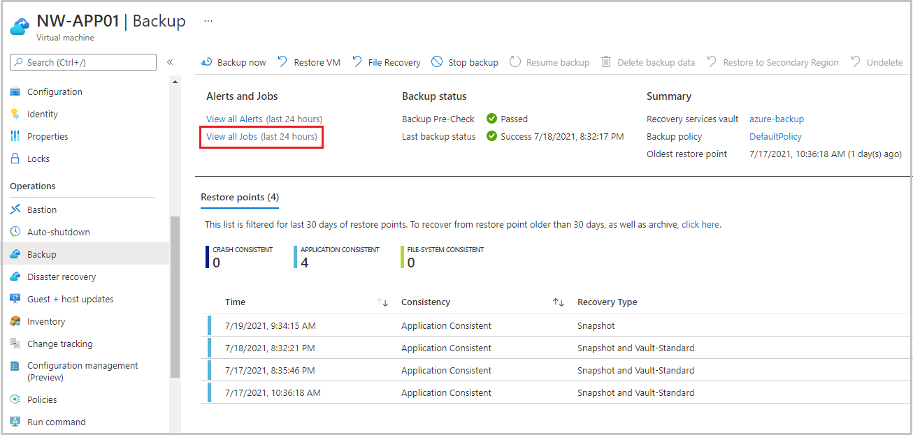
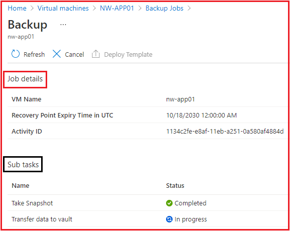

A few days after you backed up your first Azure virtual machine (VM), the server had issues. It needs to be restored from a backup. You want to restore the virtual machine's disk and attach it to the problematic live server, and then track the restore to ensure that it has finished successfully.

In this exercise, you'll see how to restore a successful backup to replace a VM that has become corrupted, and monitor its progress.

## Restore a virtual machine in the Azure portal

### Create a storage account to use as a staging location

1. Sign in to the [Azure portal](https://portal.azure.com/?azure-portal=true) by using the same account that you used in the previous exercise.

1. In the Azure portal, search for and select **Storage accounts**.

    

    The **Storage accounts** pane appears.

1. In the top menu bar, select **Create**. The **Create a storage account** pane appears.

1. On the **Basics** tab, enter the following values for each setting to create a storage account.

    | Setting | Value |
    |-|-|
    | Resource group | From the dropdown list, select **vmbackups**. |
    | **Instance details** |
    | Storage account name | Enter a unique name like **restorestagingYYYYMMDD**, where YYYYMMDD is replaced with today's date. |
    | **Region** | From the dropdown list, select **(US) West US 2**. |

    

1. Select **Review + create**.

1. After validation passes, select **Create**.

    Wait for the storage account to be deployed.

### Stop the virtual machine to allow for the restore

A backup can't be restored if the VM is allocated and running. If you forget to stop the VM, you'll see an error that's similar to the following example.

To prevent this error, follow these steps:

1. In the Azure portal, search for and select **Virtual machines**, and then select **NW-APP01**.

    

    The **NW-APP01** virtual machine pane appears.

1. In the top menu bar, select **Stop** to shut down the VM.

    

1. In the **Stop this virtual machine** dialog box, select **OK**.

    

### Restore the virtual machine

The Recovery Services vaults are accessible at the subscription level. When you're viewing the VM, Azure provides a quick link to the specific vault under **Operations**.

1. In the middle menu pane, under **Operations**, select **Backup**.

    

1. To restore the virtual machine, in the top menu bar, select **Restore VM**. The **Restore Virtual Machine** pane appears for nw-app01.

1. Under the **Restore point** text box, select **Select**. The **Select restore point** pane appears.

1. Select the restore point to use for the recovery, and then select **OK**.

    

    The **Restore Virtual Machine** pane for nw-app01 appears.

1. Enter the following values for each setting.

    | Setting | Value |
    |-|-|
    | **Restore Configuration** |
    | Replace existing | Select this option. |
    | Staging Location | From the dropdown list, select the storage account that you previously created. |

    

1. Select **Restore**. The **Backup** pane for the NW-APP01 virtual machine appears.

## Track a restore

1. In the top section, under **Alerts and Jobs**, select **View all Jobs**.

    

    The **Backup Jobs** pane appears.

1. Under **Details**, select **View details** for the *Restore* job.

    

    The **Backup** pane appears for nw-app01.

1. You can now monitor the progress of the VM restore:
    - **Job details**: Real-time percentage of the job as a whole.
    - **Sub tasks**: Status of the current task within the job.

    
