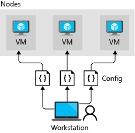
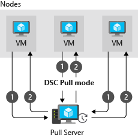

You use Azure Automation State Configuration to ensure that the virtual machines (VMs) in a cluster area are in a consistent state, with the same software installed and the same configurations.

In this unit, you learn about the features and capabilities of Azure Automation, review the declarative model of PowerShell Desired State Configuration (DSC), and explore its benefits.

Azure Automation State Configuration is an Azure service built on PowerShell. It enables you to consistently deploy, reliably monitor, and automatically update the desired state of all your resources. Azure Automation provides tools to define configurations and apply them to real and virtual machines.

## Why use Azure Automation State Configuration?

Manually maintaining a correct and consistent configuration for the servers that run your services can be difficult and error prone. Azure Automation State Configuration uses PowerShell DSC to help address these challenges. It centrally manages your DSC artifacts and the DSC process.

Azure Automation State Configuration has a built-in pull server. You can target nodes to automatically receive configurations from this pull server, conform to the desired state, and report back on their compliance. You can target virtual or physical Windows or Linux machines, in the cloud or on-premises.

You can use Azure Monitor logs to review the compliance of your nodes by configuring Azure Automation State Configuration to send this data.  

## What is PowerShell DSC?

PowerShell DSC is a declarative management platform that Azure Automation State Configuration uses to configure, deploy, and control systems. A declarative programming language separates intent (what you want to do) from execution (how you want to do it). You specify the desired state and let DSC do the work to get there. You don't have to know how to implement or deploy a feature when a DSC resource is available. Instead, you focus on the structure of your deployment.

If you're already using PowerShell, you might wonder why you need DSC. Consider the following example.

When you want to create a share on a Windows server, you might use this PowerShell command:

```PowerShell
# Create a file share
New-SmbShare -Name MyFileShare -Path C:\Shared -FullAccess User1 -ReadAccess User2
```

The script is straightforward and easy to understand. However, if you use this script in production, you encounter several problems. Consider what might happen if the script runs multiple times or if `User2` already has full access rather than read only access.

This approach isn't *idempotent*. Idempotence describes an operation that has the same effect whether you run it once or 10,001 times. To achieve idempotence in PowerShell, you need to add logic and error handling. If the file share doesn't exist, you create it. If the share does exist, there's no need to create it. If `User2` exists but doesn't have read access, you add read access. 

Your PowerShell script would look something like:

```PowerShell
$shareExists = $false
$smbShare = Get-SmbShare -Name $Name -ErrorAction SilentlyContinue
if($smbShare -ne $null)
{
    Write-Verbose -Message "Share with name $Name exists"
    $shareExists = $true
}

if ($shareExists -eq $false)
{
    Write-Verbose "Creating share $Name to ensure it is Present"
    New-SmbShare @psboundparameters
}
else
{
    # Need to call either Set-SmbShare or *ShareAccess cmdlets
    if ($psboundparameters.ContainsKey("ChangeAccess"))
    {
       #...etc., etc., etc
    }
}
```

Other special cases you haven't considered might come to light only when problems arise. DSC handles unexpected cases automatically. With DSC, you describe the result rather than the process to achieve the result. 

The following DSC code snippet shows an example:

```PowerShell DSC
Configuration Create_Share
{
   Import-DscResource -Module xSmbShare
   # A node describes the VM to be configured

   Node $NodeName
   {
      # A node definition contains one or more resource blocks
      # A resource block describes the resource to be configured on the node
      xSmbShare MySMBShare
      {
          Ensure      = "Present"
          Name        = "MyFileShare"
          Path        = "C:\Shared"
          ReadAccess  = "User1"
          FullAccess  = "User2"
          Description = "This is an updated description for this share"
      }
   }
}
```

The previous example uses the `xSmbShare` module, which tells DSC *how* to check the state of a file share. The DSC Resource Kit has more than 80 resource modules, including one for installing an IIS site. You can find a link to the DSC Resource Kit in the Summary at the end of this lesson.

You'll learn more about the structure of the PowerShell DSC code in the next unit.

## What is the LCM?

The local configuration manager (LCM) is a component of the Windows Management Framework (WMF) on a Windows operating system. The LCM is responsible for updating the state of a node, like a VM, to match the desired state. Every time the LCM runs, it completes the following steps:

1. **Get**: Gets the current state of the node.
1. **Test**: Compares the current state of a node against the desired state by using a compiled DSC script (.mof file).
1. **Set**: Updates the node to match the desired state described in the .mof file.

You configure the LCM when you register a VM with Azure Automation.

## Push and pull architectures in DSC

The LCM on each node can operate in two modes.

- **Push mode**: An administrator manually sends, or *pushes*, the configurations to one or more nodes. The LCM makes sure that the state on each node matches what the configuration specifies.

    

- **Pull mode**: A *pull server* holds the configuration information. The LCM on each node polls the pull server at regular intervals, by default every 15 minutes, to get the latest configuration details. These requests are denoted as step 1 in the following diagram. In step 2, the pull server sends the details about any configuration changes back to each node.
  
    In pull mode, each node has to be registered with the pull service.

    

Both modes have advantages:

- Push mode is easy to set up. It doesn't need its own dedicated infrastructure, and it can run on a laptop. Push mode is helpful to test the functionality of DSC. You could also use push mode to get a newly imaged machine to the baseline desired state.
- Pull mode is useful in an enterprise deployment that spans a large number of machines. The LCM regularly polls the pull server and makes sure the nodes are in the desired state. If an external tool or team applies hotfixes that result in configuration drift on individual machines, those machines are quickly brought back in line with the configuration you've set. This process can help you achieve a state of continuous compliance for your security and regulatory obligations.

## Supported platforms and operating systems

Azure Automation DSC is supported by Azure Cloud Services and other cloud providers, your on-premises infrastructure, or a hybrid of all of these environments.

Azure Automation DSC supports the following operating systems:
  
- Windows
  - Server 2019
  - Server 2016
  - Server 2012 R2
  - Server 2012
  - Server 2008 R2 SP1
  - 11
  - 10
  - 8.1
  - 7
- Linux
  - The DSC Linux extension supports all the Linux distributions listed in the [PowerShell DSC documentation](/powershell/dsc/getting-started/lnxgettingstarted).

PowerShell DSC is installed on all Linux machines supported by Azure Automation DSC.

## DSC requirements for Windows

For Windows machines, the Azure Desired State Configuration (DSC) VM extension uses WMF to manage the versions of Windows features like Windows PowerShell DSC and Windows Remote Management (WinRM). Azure DSC supports WMF 4.0 and later. So Windows machines must run Windows Server 2008 R2 SP1, Windows 7, or later.

The first time the Azure DSC extension is called, it installs an OS-compatible version of WMF on all Windows versions except Windows Server 2016 and later. Windows Server 2016 and later versions already have the latest version of WMF installed. After WMF is installed, the machine requires a restart.

WinRM is enabled on machine nodes that run Windows Server 2012 or later, and Windows 7 or later.

Proxy support for the DSC agent is available in Windows builds 1809 and later. Proxy support is unavailable in DSC for previous versions of Windows.

## Other DSC requirements

If your nodes are located in a private network, DSC needs the following port and URLs to communicate with Azure Automation:

- **Port**: Only TCP 443 is required for outbound internet access.
- **Global URL**:  *.azure-automation.net
- **Global URL of US Gov Virginia**: *.azure-automation.us
- **Agent service**: https://`<workspaceId>`.agentsvc.azure-automation.net
