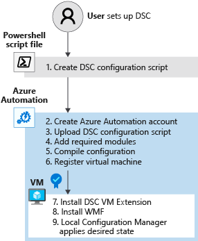
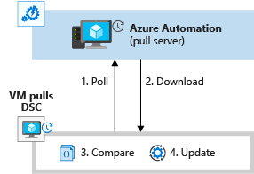

You can use PowerShell DSC to specify a VM's desired state. In this unit, you'll learn more about PowerShell DSC and how to use it to control the state of your VMs. In the example scenario, you'll use PowerShell DSC to make sure that IIS for Windows Server is installed and configured consistently across all of your web servers.

By the end of this unit, you'll:

- Understand node and configuration blocks.
- Understand credential assets.
- Write PowerShell DSC code to install Microsoft IIS idempotently.

## DSC resources

You've seen that PowerShell DSC is a declarative scripting language. Declarative programming focuses on the outcome, not the journey. When you need to configure and deploy an Azure resource in a consistent way across a set of VMs, PowerShell DSC can help. You can use PowerShell DSC even when you're not familiar with the technical steps to install and configure the software and services.  

Windows Server has a set of built-in PowerShell DSC resources. You can view these resources by running the `Get-DSCResource` PowerShell cmdlet.

```powershell
Get-DscResource | select Name,Module,Properties
```

The following table lists some of the built-in PowerShell DSC resources.

| Resource               | Description                                        |
|------------------------|----------------------------------------------------|
| File                   | Manages files and folders on a node                |
| Archive                | Decompresses an archive in the .zip format         |
| Environment            | Manages system environment variables              |
| Log                    | Writes a message in the DSC event log              |
| Package                | Installs or removes a package                     |
| Registry               | Manages a node's registry key (except HKEY Users) |
| Script                 | Executes PowerShell commands on a node             |
| Service                | Manages Windows services                           |
| User                   | Manages local users on a node                      |
| WindowsFeature         | Adds or removes a role or feature on a node           |
| WindowsOptionalFeature | Adds or removes an optional role or feature on a node |
| WindowsProcess         | Manages a Windows process                          |

For more complex resources like Active Directory integration, use the DSC Resource Kit, which is updated monthly. You can find a link to the DSC Resource Kit in the Summary unit at the end of this module.

The resource you want to configure must already be part of the VM or part of the VM image. Otherwise, the job fails to compile and run.

## Anatomy of a DSC code block

A DSC code block contains four sections. Use the following example to take a closer look. In the example, the numbers aren't part of the syntax. They're denoted as comments, and they refer to sections in the discussion that follows.

```powershell
Configuration MyDscConfiguration {              ##1
    Node "localhost" {                          ##2
        WindowsFeature MyFeatureInstance {      ##3
            Ensure = 'Present'
            Name = 'Web-Server'
        }
    }
}
MyDscConfiguration -OutputPath C:\temp\         ##4
```

The configuration syntax includes these sections:

1. **Configuration**: The configuration block is the outermost script block. It starts with the `Configuration` keyword, and you'll provide a name. Here, the name of the configuration is `MyDscConfiguration`.

    The configuration block describes the desired configuration. Think of a configuration block like a function, except that it contains a description of the resources to install rather than the code to install them.

    Like a PowerShell function, a configuration block can take parameters. For example, you could parameterize the node name.

    ```powershell
    Configuration MyDscConfiguration {
    param
    (
        [string] $ComputerName='localhost'
    )

    Node $ComputerName {
        ...
    }
    ```
  
2. **Node**: You can have one or more node blocks. The node block determines the names of .mof files that are generated when you compile the configuration. For example, the node name `localhost` generates only one *localhost.mof* file, but you can send that .mof file to any server. You generate multiple .mof files when you use multiple node names.

    Use the array notation in the node block to target multiple hosts. For example:

    ```powershell
    Node @('WEBSERVER1', 'WEBSERVER2', 'WEBSERVER3')
    ```

3. **Resource**: You can use one or more resource blocks to specify the resources to configure. In this case, a single resource block references the `WindowsFeature` resource. The `WindowsFeature` resource here ensures that the `Web-Server` Windows feature is installed.

4. **MyDscConfiguration**: This call invokes the `MyDscConfiguration` block. It's like running a function. When you run a configuration block, it's compiled into a Managed Object Format (MOF) document. MOF is a compiled language created by Desktop Management Task Force, and it's based on interface definition language.

    For every node listed in the DSC script, a .mof file is created in the folder you specified with the `-OutputPath` parameter.

## Configuration data in a DSC script

In a configuration data block, you can provide data that the configuration process might need. You can apply this data to named nodes, or you apply it globally across all nodes.

A configuration data block is a named block that contains an array of nodes. The array must be named `AllNodes`. Inside the `AllNodes` array, you specify the data for a node by using the `NodeName` variable.

Using the previous scenario, let's say that on the web server that's installed on each node, you want to set the `SiteName` property to different values. You could define a configuration data block like this:

```powershell
$datablock =
@{
    AllNodes =
    @(
        @{
            NodeName = "WEBSERVER1"
            SiteName = "WEBSERVER1-Site"
        },
        @{
            NodeName = "WEBSERVER2"
            SiteName = "WEBSERVER2-Site"
        },
        @{
            NodeName = "WEBSERVER3"
            SiteName = "WEBSERVER3-Site"
        }
    );
}
```

If you want to set a property to the same value in each node, specify `NodeName = "*"` in the `AllNodes` array.

## Secure credentials in a DSC script

A DSC script might require credential information for the configuration process. Avoid putting a credential in plaintext in your source-code management tool. Instead, DSC configurations in Azure Automation can reference credentials stored in a `PSCredential` object. You can define a parameter for the DSC script by using the `PSCredential` type. Before running the script, get the user credentials, use the credentials to create a new `PSCredential` object, and pass this object into the script as a parameter.

Credentials aren't encrypted in .mof files by default; they're exposed as plaintext. To encrypt credentials, use a certificate in your configuration data. The certificate's private key needs to be on the node on which you want to apply the configuration. Certificates are configured through the node's LCM.

Starting in PowerShell 5.1, .mof files on the node are encrypted at rest. In transit, all credentials are encrypted through WinRM.

## Push the configuration to a node

After you create a compiled .mof file for a configuration, you can push it to a node by running the  `Start-DscConfiguration` cmdlet. If you add the path to the directory, it applies any .mof file it finds in that directory to the node:

``` powershell
Start-DscConfiguration -path D:\
```

This step corresponds to *push mode*, which you learned about in the previous unit.

## Pull the configuration for nodes

If you have hundreds of VMs on Azure, pull mode is more appropriate than push mode.

You can configure an Azure Automation account to act as a pull service; just upload the configuration to the Automation account, then register your VMs with this account.

Before you compile your configuration, import into your Automation account any PowerShell modules the DSC process needs. These modules define how to complete the task to achieve the desired state.

For example, a DSC script in the previous unit used the `xSmbShare` PowerShell module to tell DSC *how* to check the state for a file share. DSC automatically pulls modules from the Automation account to the node.

The following diagram shows how to set up Azure Automation State Configuration. We'll explore these steps more in the next unit.



By default, after 15 minutes, the LCM on the VM polls Azure Automation for any changes to the DSC configuration file. Any changes in the VMs are recorded in the desired state configuration. If you change a configuration, you can upload it to the Automation account to automatically reconfigure the VMs.

The following diagram shows the LCM's process to manage the desired state on the VM.



Your Automation account handles the credentials natively. This management reduces the complexity of securing and working with credentials.
