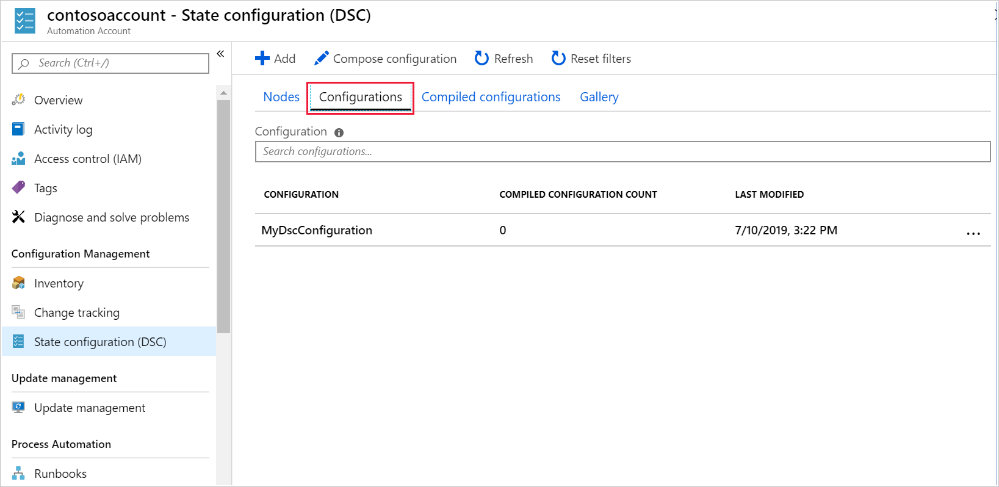
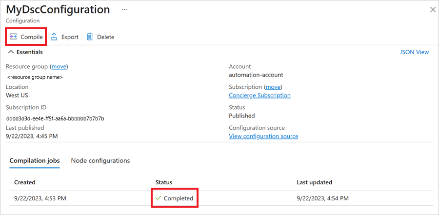
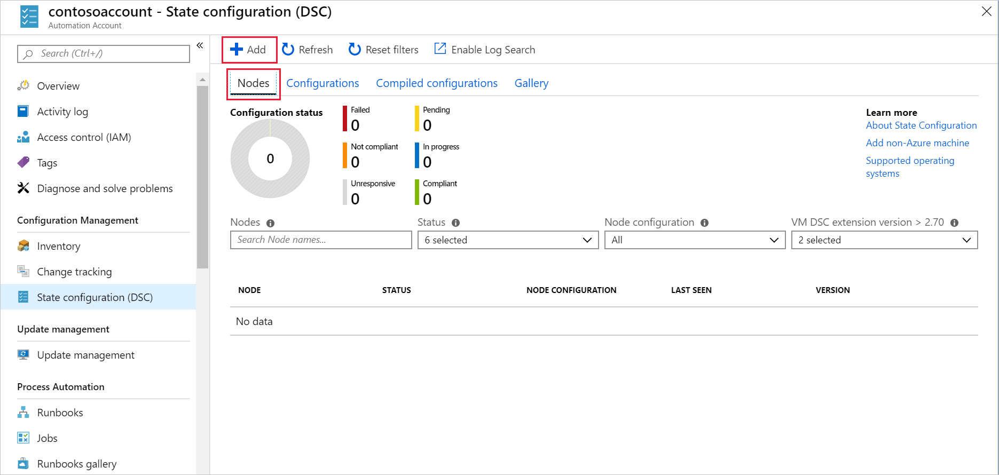
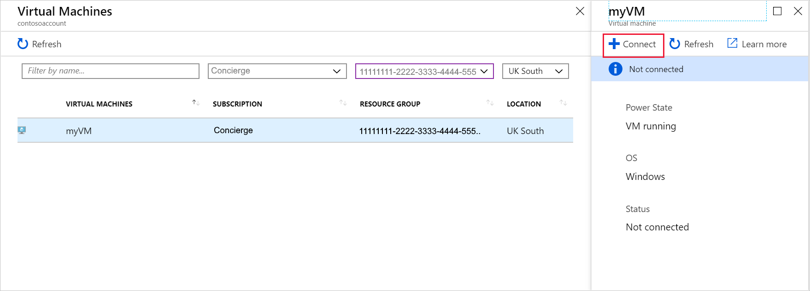
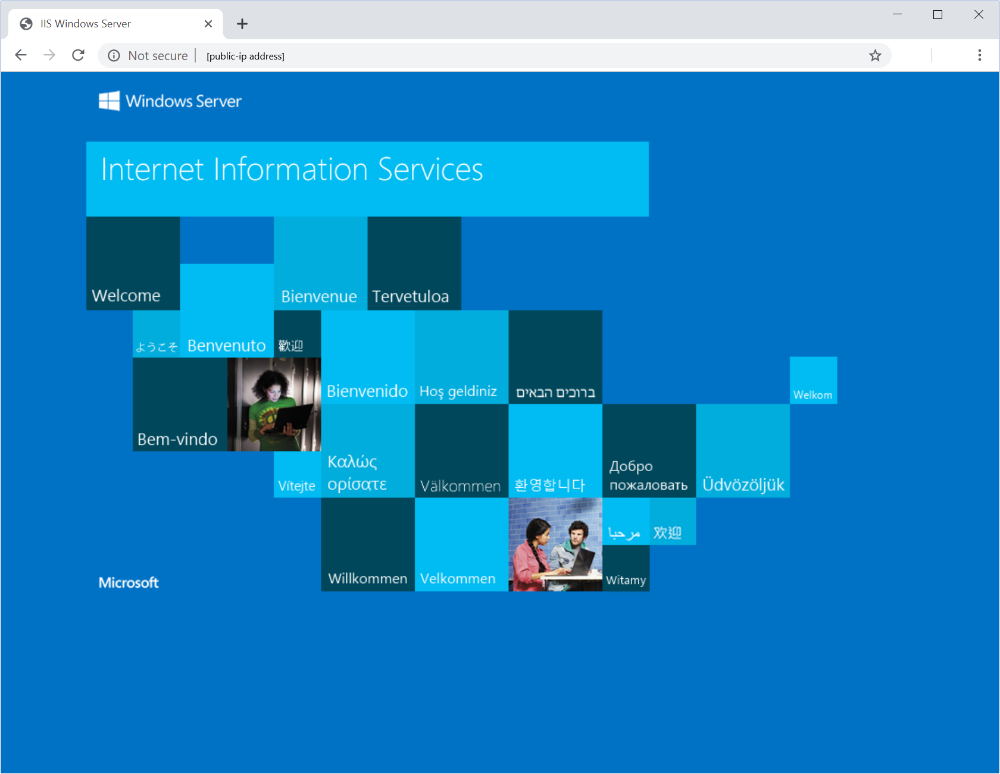

In this exercise, you'll create an Azure Automation account, and upload a PowerShell Desired State Configuration (DSC). You'll also onboard an existing virtual machine into Azure Automation. Then, if it's missing, you'll run code to install and configure IIS on the virtual machine.

## Create a virtual machine

Start by deploying a new virtual machine from a Windows 2016 Server image.

1. In the Cloud Shell, run the following commands to create a username and generate a random password.

    ```bash
    USERNAME=azureuser
    PASSWORD=$(openssl rand -base64 32)
    ```

1. Run the following command in the Cloud Shell to create a virtual machine.

    ```azurecli
    az vm create \
      --resource-group <rgn>[Sandbox resource group name]</rgn> \
      --name myVM \
      --image win2016datacenter \
      --admin-username $USERNAME \
      --admin-password $PASSWORD
    ```

    It takes a few minutes to create the virtual machine and supporting resources. If the virtual machine is created successfully, you should see output similar to the following example:

    ```JSON
    {
      "fqdns": "",
      "id": "/subscriptions/<guid>/resourceGroups/myResourceGroup/providers/Microsoft.Compute/virtualMachines/myVM",
      "location": "eastus",
      "macAddress": "00-0D-3A-23-9A-49",
      "powerState": "virtual machine running",
      "privateIpAddress": "10.0.0.4",
      "publicIpAddress": "52.174.34.95",
      "resourceGroup": "myResourceGroup"
    }
    ```

1. Note the `publicIpAddress` in this output. You need this address later to access the virtual machine.

1. Run the following command in the Cloud shell to open port 80 on your virtual machine for web traffic:

    ```azurecli
    az vm open-port \
      --port 80 \
      --resource-group <rgn>[Sandbox resource group name]</rgn> \
      --name myVM
    ```

1. In your web browser, go to **http://*\[public-ip\]*** where **\[public-ip\]** is the public IP address of your virtual machine. Although port 80 is open, you receive a website can't be reached error message. IIS isn't deployed on your virtual machine.

## Create an Azure Automation account

1. Sign in to the [Azure portal](https://portal.azure.com/learn.docs.microsoft.com?azure-portal=true) using your MSLearn account.

1. In the left pane, select **Create a resource**.

1. In the **Search the Marketplace** text box, enter **Automation**, and then press Enter.

1. On the **Automation** page, select **Create**

1. On the **Add Automation Account** page, enter the following property values. The automation account must have a unique name. We suggest using something like **\[*your name or initials*\]account**. Use this name wherever you see *\[your-automation-account-name\]* in this exercise.

    | Property  | Value  |
    |---|---|
    | Name | *\[your-automation-account-name\]* |
    | Subscription | Concierge Subscription  |
    | Resource Group | Use the existing resource group |
    | Location | Use the default location |
    | Create Azure Run As account | No |

1. Select **Create**. Wait until the automation account has been created before continuing.

## Create a DSC configuration script

1. In the Cloud Shell, run the following command to start a PowerShell session:

    ```bash
    pwsh
    ```

1. At the PowerShell prompt, start the Code editor and create a file named **MyDscConfiguration.ps1** in your home directory.

    ```powershell
    code $HOME/MyDscConfiguration.ps1
    ```

1. Enter the following code block in the file. This code creates a configuration to install IIS when it's not installed, and then runs the script to compile the configuration:

    ```azurecli
    Configuration MyDscConfiguration {
      Node "localhost" {
        WindowsFeature MyFeatureInstance {
          Ensure = 'Present'
          Name = 'Web-Server'
        }
      }
    }
    ```

1. Press **Ctrl-S** to save the file, and then press **Ctrl-Q** to close the editor.

1. Run the following PowerShell to upload your DSC script into your Azure Automation account:

    ```powershell
    Import-AzureRmAutomationDscConfiguration `
        -AutomationAccountName [your-automation-account-name] `
        -ResourceGroupName <rgn>[Sandbox resource group name]</rgn> `
        -SourcePath $HOME/MyDscConfiguration.ps1 `
        -Force `
        -Published
    ```

    The command should produce output that looks similar to the following text:

    ```text
    ResourceGroupName     : <rgn>[Sandbox resource group name]</rgn>
    AutomationAccountName : [your-automation-account-name]
    Location              : eastus
    State                 : Published
    Name                  : MyDscConfiguration
    Tags                  : {}
    CreationTime          : 6/25/19 5:44:36 PM +00:00
    LastModifiedTime      : 6/25/19 5:44:36 PM +00:00
    Description           :
    Parameters            : {}
    LogVerbose            : False
    ```

## Add required modules

After you upload your DSC configuration script, you import any PowerShell modules that the DSC process needs into your automation account. Our configuration doesn't need any additional modules imported, so we can skip this step.

If you needed to add modules, you'd go to your automation account under **Shared Resources**, and select **Modules** > **Add a module**.

## Compile the DSC script

1. Return to your Azure Automation account in the Azure portal.

1. Under **Configuration Management**, select **State configuration (DSC)**.

1. On the **State configuration (DSC)** page, select **Configurations**.

    Verify that the configuration **MyDscConfiguration** appears.

    

1. Select **MyDscConfiguration**.
  
1. Select **Compile**.

1. In the **Compile DSC Configuration** message box, select **Yes**.

1. Wait for the compilation job to queue and run. The **Status** will change to **Completed**. You might need to refresh the screen to see the compilation status change.

    

1. Close the **MyDscConfiguration page** and return to the **State configuration (DSC)** page.

## Register the virtual machine with your Azure Automation account

1. On the **State configuration (DSC)** page, select **Nodes**, and then select **+Add**.

    

1. On the **Virtual Machines** page, select the virtual machine you created at the start of this unit, **myVM**.

1. On the **myVM** page, select **+Connect**.

    

1. On the **Registration** page, enter the following settings, and then select **OK**.

    | Property  | Value  |
    |---|---|
    | Node configuration name | MyDscConfiguration.localhost |
    | Refresh Frequency | 30  |
    | Configuration Mode frequency | 15 |
    | Configuration Mode | ApplyAndMonitor |
    | Allow Module Override | Select |
    | Reboot Node if Needed | Select |
    | Action after Reboot | ContinueConfiguration |

1. Wait until the virtual machine is connected, and then close the **myVM** page.

1. Close the **Virtual Machines** page.

1. On the **State configuration (DSC)** page, select **Refresh**.

1. Verify that the node **myVM** appears in the list, and that its status is **Compliant**.

    

## Verify that IIS is installed on the virtual machine

In your web browser, go to **http://*\[public-ip\]*** where **\[public-ip\]** is the public IP address of your virtual machine. You recorded this address when you first created the VM.

You should see the default IIS webpage. IIS has been deployed. Azure Automation used the PowerShell DSC script you uploaded to your Azure Automation account.

   
