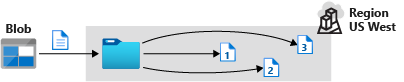
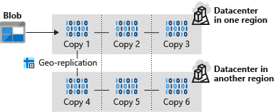
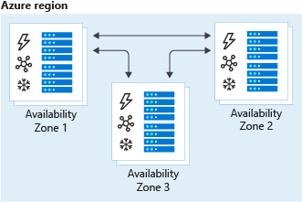

Data availability is business critical for most organizations.

Suppose that your customers have had problems accessing music streams on rare occasions. When you investigated, you found that these problems occurred during outages that affected the entire region. These occasions were rare, but they had a large impact.

To improve your company's data availability, you decide to investigate the replication options available for Azure Storage.

Here, you'll explore the different replication options for Azure Storage. You'll learn how they work and when to use them. You'll also learn how to switch and migrate your data between them.

## Replication options for Azure Storage

In Azure Storage, you have several options for replication. The choice you make depends on the level of resilience you need.

### Locally redundant storage



Locally redundant storage (LRS) copies your data three times across separate racks of hardware in a datacenter inside one region. Even if there's a hardware failure or if there's maintenance work in the datacenter, this replication type ensures data is available for use.

LRS doesn't protect you from a datacenter-wide outage. If the datacenter goes down, you could lose your data.

### Geographically redundant storage



With geographically redundant storage (GRS), your data is copied three times within one region and three times in a secondary region that's paired with it. This way, if your primary region is experiencing an outage, your secondary region is available for use.

### Read-access geo-redundant storage

With GRS, your secondary region isn't available for read access until the primary region fails. If you want to read from the secondary region, even if the primary region hasn't failed, use Read-access geo-redundant storage (RA-GRS) for your replication type.

### Zone-redundant storage



Zone-redundant storage (ZRS) copies your data in three storage clusters in a single region. Each cluster is in a different physical location and is considered as a single availability zone. Each cluster uses its own separate utilities for things like networking and power. If one datacenter is experiencing an outage, your data remains accessible from another availability zone in the same Azure region.

Because all availability zones are in a single region, ZRS can't protect your data from a regional-level outage.

### Geo-zone-redundant storage

Geo-zone-redundant storage (GZRS) combines the high availability benefits of ZRS with GRS. With this replication type, your data is copied across three availability zones in one region. Data is also replicated three times to another secondary region that's paired with it. This way, your zone-redundant data is also secure from regional-level outages.

### Read-access geo-zone-redundant storage

Read-access geo-zone-redundant storage (RA-GZRS) uses the same replication method as GZRS, but lets you read from the secondary region. If you want to read the data that's replicated to the secondary region, even if your primary isn't experiencing downtime, use RA-GZRS for your replication type.

GZRS and RA-GZRS are currently available in the following regions:

- South Africa North
- Australia East
- East Asia
- Japan East
- Korea Central
- Southeast Asia
- Central India
- France Central
- Germany West Central
- North Europe
- Norway East
- Sweden Central
- Switzerland North
- UK South
- West Europe
- Canada Central
- Central US
- East US
- East US 2
- South Central US
- West US 2
- West US 3
- US Gov Virginia
- Brazil South

### Paired regions

A paired region is where an Azure region is paired with another in the same geographical location to protect against regional outage. Paired regions are used with GRS and GZRS replication types.


Here's a list showing some of the regions that are paired together. You can get the full list at [Azure paired regions](/azure/reliability/cross-region-replication-azure#azure-paired-regions).

| |Region|Region|
|---------|---------|---------|
|**Asia**|East Asia|Southeast Asia|
|**Australia**|Australia East|Australia Southeast|
|**Canada**| Canada Central|Canada East|
|**China**|China North|China East|
|**Europe**|North Europe (Ireland)|West Europe (Netherlands)|
|**Japan**|Japan East|Japan West|
|**North America**|East US|West US|
|**South Africa**|South Africa North|South Africa West|
|**UK**|UK West|UK South|

## Use cases for each replication type

The following table summarizes how many copies you get with each replication type and when you should use it.

|Replication type  |Copies  | Use case  |
|---------|---------|---------|
|LRS|3|Data remains highly available, but for compliance reasons, isn't allowed to leave the local datacenter.|
|GRS|6|App has access to the data, even if an entire region has an outage.|
|RA-GRS|6|App reads from multiple geographical locations, so you can serve users from a location that's closer to them.|
|ZRS|3|Need redundancy in multiple physical locations, but because of compliance, data isn't allowed to leave a region.|
|GZRS|6| App can access data, even if the primary region has failed, and your secondary region has a datacenter that's experiencing an outage, but you don't want to read from the secondary region unless the primary region is down.|
|RA-GZRS|6| Regularly read data from your secondary region, perhaps to serve users from a location closer to them, even if a datacenter is up in your primary region.|

## Switch replication strategies

You can switch your replication strategy for any storage account. The process you use depends on the current replication strategy for your account. For example, if you want to migrate from a storage account with LRS, you have two options:

- Manually move or copy your data to a new account with GZRS.
- Switch the replication type to GRS/RA-GRS first, then create a request with Azure Support for a live migration to GZRS.

### Convert account

If you're using a ZRS account, you can convert it to use GZRS. You convert an account using the Azure portal, the Azure CLI, or Azure PowerShell.

For example, to convert your account to GZRS by using Azure PowerShell, you'd use this command:

```powershell
Set-AzStorageAccount -ResourceGroupName <resource-group> -AccountName <storage-account> -SkuName "Standard_GZRS"
```

### Switch replication type in the Azure portal

You can also switch your account's replication type in the Azure portal. For example, to switch from ZRS to GZRS, go to your storage account, select **Redundancy**, and change the replication type.

:::image type="content" source="../media/2-change-zrs-gzrs-portal.png" alt-text="Screenshot of the storage account configuration, where you can change the replication type from ZRS to GZRS.":::

### Live migration

You can also use live migration to migrate your data to an account that uses ZRS, GZRS, or RA-GZRS. Use live migration to avoid downtime or data loss. Your live migration's duration generally depends on the amount of data in your account.

You can do a live migration by creating an Azure support request in the Azure portal.


You'll then be contacted by a support representative about your live migration request.

There are some limitations to live migration. For example:

- Unlike a manual app, you won't know exactly when a live migration will complete.
- Data can only be migrated to the same region.
- Live migration is only supported for data held in standard storage account types.
- If your account contains a large file share, live migration to GZRS isn't supported.

### Manual migration

Manual migration is more flexible than live migration. For example, because you control the timing, you can use manual migration if you need completion by a fixed date.

To do a manual migration, you could use the `AzCopy` utility or one of the various third-party tools available.

For example, through `AzCopy`, you can run the following command in your terminal, which copies all blobs, directories, and containers in your storage account to another one.

```powershell
azcopy copy 'https://<source-storage-account-name>.blob.core.windows.net/?<your-SAS-token>'
'https://<destination-storage-account-name>.blob.core.windows.net/' --recursive
```
