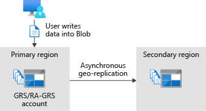
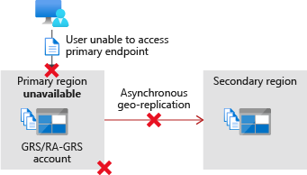
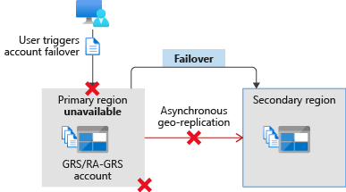

Failover is how the system responds to a failure by using the replicated copy of the data.

Your organization's directors want to know whether listeners will get any kind of interruption in their music when the system responds to a failure. You've been asked to investigate how the failover process works and report back on the potential implications for your company and its data.

In this unit, you'll explore how the failover process starts and how it works. You'll understand the implications for data when you start a failover and how to estimate any potential data loss.

### How the failover process works

Azure Storage lets you fail over your storage account to a different region if the primary region becomes unavailable. When a failover is triggered and completed, your data is accessible from a secondary region. You'll use the secondary region until the primary region is up again.

The process is as follows:

1. **Before a failure**

    While the primary region is up and running, clients use your primary region. At the same time, that data is copied asynchronously to your secondary region.

    
  
1. **Failure occurs**

    When a primary region fails, your clients and users can't access data from that primary region. Asynchronous replication to the secondary region stops.

    

1. **Failover is started**

    You or Microsoft can start failovers. When Microsoft starts a failover, it's called a *Microsoft-managed failover*. During the failover process, Azure Storage starts to point your users and clients to the secondary region instead of the primary region.

    

    You can start a failover by using the Azure portal or tools like Azure PowerShell and the Azure CLI. In the Azure portal, go to your storage account and select **Redundancy** > **Prepare for failover**.

    :::image type="content" source="../media/4-portal-failover-prepare.png" alt-text="Screenshot of the Prepare for failover button on Storage account > Redundancy in the Azure portal.":::

1. **Failover is complete**

    When the failover process is complete, your storage account is updated to use locally redundant storage (LRS). If you want to replicate your data to a secondary region, configure the storage account to again use a geo-redundant storage option like geographically redundant storage (GRS) or geo-zone-redundant storage (GZRS).

### Data loss

When you fail over your account, you'll have some data loss. This loss happens because your data is copied asynchronously. When data is copied in this way, there's always a delay before it's copied from the primary region and written to the secondary. It might be that your most recent writes haven't been copied to your secondary region before your primary failed.

Also, when you start a failover, data in your primary region is lost. Any data that wasn't written to the secondary region before you started the failover is also lost.

Use **last sync time** to understand the extent of data loss you might experience. This property shows the most recent point in time that data from your primary region was written to the secondary region. All data written to the primary before this point in time is guaranteed to be available on the secondary. Data written to the primary region after this last sync time might not be available in the secondary region, and might be lost.

You can find the **last sync time** by using the Azure portal, the Azure CLI, or Azure PowerShell. For example, the **last sync time** is shown when you select **Prepare for failover** in the Azure portal.

:::image type="content" source="../media/4-portal-failover-confirm.png" alt-text="Screenshot of the failover confirmation page with the last sync time shown.":::

### Track Azure Storage service outage

We recommend you track the health status of Azure Storage and other Azure services by using Azure Service Health. You can subscribe to these updates with your applications and configure applications to handle or report issues to you.

:::image type="content" source="../media/4-service-health-dashboard.png" alt-text="Screenshot of Azure Service Health > Health history that lists issues that impact your subscriptions.":::
