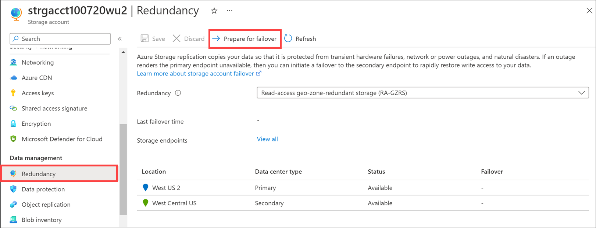

Failover is how the system responds to a failure, by using the replicated copy of the data.

The directors in your organization want to know whether listeners will get any kind of interruption in their music when the system responds to a failure. You've been asked to investigate how the failover process works, and report back on the potential implications for your company and its data.

In this unit, you'll explore how the failover process starts and how it works. You'll understand the implications for data when you start a failover, and how to estimate any potential data loss.

### How the failover process works

Azure Storage lets you failover your storage account to a different region if the primary region becomes unavailable. When a failover is triggered and completed, your data is accessible from a secondary region. You use the secondary region until the primary region is up again.

The process is as follows:

1. **Before a failure**

    While the primary region is up and running, clients use your primary region. At the same time, that data is copied asynchronously to your secondary region.

    
  

1. **Failure occurs**

    When a primary region fails, your clients and users can't access data from that primary region. Asynchronous replication to the secondary region stops.

    

1. **Failover is started**

    Failovers can be started by you or by Microsoft. The latter is called a Microsoft-managed failover. During the failover process, the Azure Storage service starts to point your users and clients to the secondary region instead of the primary region.

    

    You can start a failover using the Azure portal, or tools like Azure PowerShell and Azure CLI. In the Azure portal, go to your storage account and select **Prepare for failover** in the **Geo-replication** pane.

    

1. **Failover is complete**
    
    When the failover process is complete, your storage account is updated to use locally redundant storage (LRS). If you want to use replication to a secondary region, you'll configure the storage account again to use geo-redundant storage like GRS, or RA-GRS.
    To reset your replication mode to geo-redundant storage, use tools like Azure PowerShell, Azure CLI, or the Azure portal. For example, in the Azure portal, go to the configuration pane of your Azure Storage account, and set the replication field to geo-redundant storage.

### Data loss

When you fail over your account, you'll generally have some data loss. This loss happens because your data is copied asynchronously. When data is copied in this way, there's always a delay before it's copied from the primary region, and written to the secondary. It might be that your most recent writes haven't been copied to your secondary region yet, before your primary failed.

Also, when you start a failover, data in your primary region is lost. Any data that wasn't written to the secondary before you started the failover is also lost.

Use the **Last Sync Time** property to understand the extent of data loss you may have. This property shows the most recent point in time that data from your primary region was written to the secondary. All data written to the primary before this point in time is guaranteed to be available on the secondary. Data then written to the primary might not be available on the secondary, and may be considered lost.

You can find the **Last Sync Time** through tools like the Azure portal, Azure CLI, or Azure PowerShell. For example, to find the **Last Sync Time** through the Azure portal, you view it before confirming you want to start a failover.

### Track Azure Storage service outage

We recommend you track the health status of Azure Storage and other Azure services by using the Azure Service Health. You can subscribe to these updates with your applications and configure applications to handle or report issues to you.

:::image type="content" source="../media/4-service-health-dashboard.png" alt-text="Screenshot of Azure Service Health > Health history that lists issues that impact your subscriptions.":::
