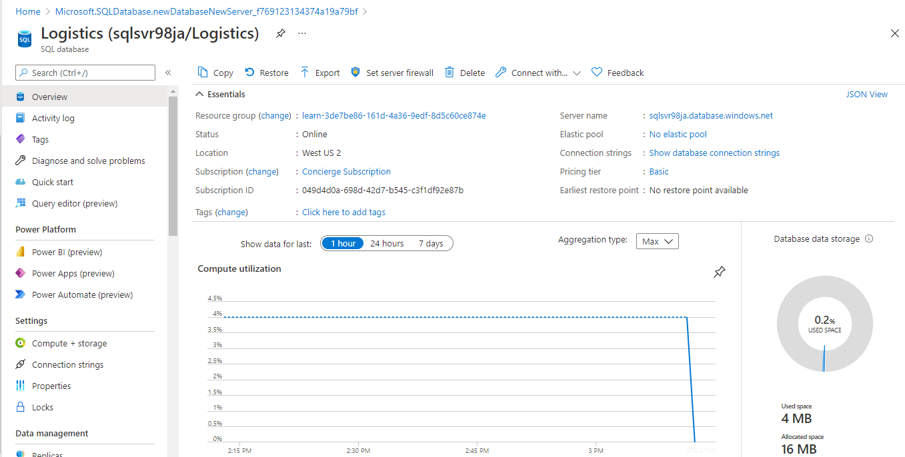
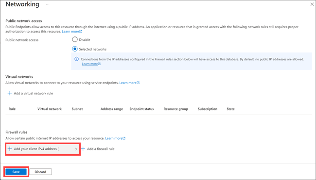

Your transportation company wants to set itself apart from other companies, without breaking the bank. You must have a good handle about how to set up the database to provide the best service while controlling costs.

Here, you'll learn:

- What considerations you need to make when creating an Azure SQL database, including:
  - How a logical server acts as an administrative container for your databases.
  - Differences between purchasing models.
  - How elastic pools enable you to share processing power among databases.
  - How collation rules affect how data is compared and sorted.
- How to bring up Azure SQL Database from the portal.
- How to add firewall rules so that your database is accessible from only trusted sources.

Let's take a quick look at some things you need to consider when you create an Azure SQL database.

## One server, many databases

When you create your first Azure SQL database, you also create an _Azure SQL logical server_. Think of a logical server as an administrative container for your databases. You can control logins, firewall rules, and security policies through the logical server. You can also override these policies on each database within the logical server.

For now, you need just one database. But a logical server enables you to add more later and tune performance among all your databases.

## Choose performance: DTUs versus vCores

Azure SQL Database has two purchasing models: _DTU_ and _vCore_.

- **What are DTUs?**

    DTU stands for _Database Transaction Unit_, and is a combined measure of compute, storage, and IO resources. Think of the DTU model as a simple, preconfigured purchase option.

    Because your logical server can hold more than one database, there's also the idea of eDTUs, or _elastic Database Transaction Units_. This option enables you to choose one price, but allow each database in the pool to consume fewer or greater resources depending on current load.

- **What are vCores?**

    vCores are _Virtual cores_, which give you greater control over the compute and storage resources that you create and pay for.

    While the DTU model provides fixed combinations of compute, storage, and IO resources, the vCore model enables you to configure resources independently. For example, with the vCore model, you can increase storage capacity but keep the existing amount of compute and IO throughput.

Your transportation and logistics prototype only needs one Azure SQL Database instance. You decide on the DTU option because it provides a good balance of compute, storage, and IO performance and is less expensive to get started.

## What are SQL elastic pools?

When you create your Azure SQL database, you can create a _SQL elastic pool_.

SQL elastic pools relate to eDTUs. They enable you to buy a set of compute and storage resources that are shared among all the databases in the pool. Each database can use the resources they need, within the limits you set, depending on current load.

For your prototype, you won't need a SQL elastic pool because you need only one SQL database.

## What is collation?

Collation refers to the rules that sort and compare data. Collation helps you define sorting rules when case sensitivity, accent marks, and other language characteristics are important.

Let's take a moment to consider what the default collation, **SQL_Latin1_General_CP1_CI_AS**, means:

- **Latin1_General** refers to the family of Western European languages.
- **CP1** refers to code page 1252, a popular character encoding of the Latin alphabet.
- **CI** means that comparisons are case insensitive. For example, "HELLO" compares equally to "hello".
- **AS** means that comparisons are accent sensitive. For example, "résumé" doesn't compare equally to "resume".

Because you don't have specific requirements around how data is sorted and compared, you choose the default collation.

## Create your Azure SQL database

Here you'll set up your database, which includes creating your logical server. You'll choose settings that support your transportation logistics application. In practice, you would choose settings that support the kind of app you're building.

Over time, if you realize you need additional compute power to keep up with demand, you can adjust performance options or even switch between the DTU and vCore performance models.

1. Sign into the [Azure portal](https://portal.azure.com/learn.docs.microsoft.com?azure-portal=true) using the same account you activated the sandbox with.

1. From the Azure portal menu or the **Home** page, select **Create a resource**. On the left menu pane, select **Databases**, and then select **SQL Database**. The **Create SQL Database** pane appears.

   

1. Use these values on the **Basics** tab, under **Project details**.

    | Setting | Value |
    | --- | --- |
    | **Subscription** | *Concierge Subscription* |
    | **Resource group** | *<rgn>[sandbox resource group name]</rgn>* |

1. Use these values in  the **Database details** section.

    | Setting | Value |
    | --- | --- |
    | **Database name** | *Logistics* |
    | **Server** | _[See step 5]_ |
    | **Want to use SQL elastic pool?** | *No* |
    | **Compute + storage** | _[See step 6]_ |

1. Under **Server**, select **Create new**. The **New server** pane appears. Enter the following values for each setting.

    | Setting | Value |
    | --- | --- |
    | **Server name** | A globally unique [server name](https://docs.microsoft.com/azure/architecture/best-practices/naming-conventions). |
    | **Server admin login** | A [database identifier](https://docs.microsoft.com/sql/relational-databases/databases/database-identifiers) that serves as your primary administrator login name. |
    | **Password** | Any valid password that has at least eight characters and contains characters from three of these categories: uppercase characters, lowercase characters, numbers, and non-alphanumeric characters. |
    | **Location** | Any valid location from the dropdown. |

    [!include]

    Select **OK**.

1. Under **Compute + storage**, select **Configure database**, and then perform the following steps:

    1. To configure your database to use DTUs, select **Looking for basic, standard, premium?**

    1. Depending on your application needs, select **Basic**, **Standard**, or **Premium**.

    1. Select **Apply**.

1. Select the **Additional settings** tab, and enter these values for each setting.

    | Section | Setting | Value |
    | --- | --- | --- |
    | **Data source** | **Use existing data** | *None* |
    | **Database Collation** | **Collation** | *SQL_Latin1_General_CP1_CI_AS* |
    | **Azure Defender for SQL** | **Enable Azure Defender for SQL** | *Not now* |

1. Select **Review + create**, and then select **Create** to create your Azure SQL database.

    > [!IMPORTANT]
    > Remember your server name, admin login, and password for later.

1. On the toolbar, select **Notifications** to monitor the deployment process.

When the process completes, select **Pin to dashboard** to pin your database server to the dashboard so that you have quick access when you need it later.

   

## Set the server firewall

Your Azure SQL database is now up and running. You have many options to further configure, secure, monitor, and troubleshoot your new database. You can also specify which systems can access your database through the firewall. Initially, the firewall prevents all access to your database server from outside of Azure.

For your prototype, you only need to access the database from your laptop. Later, you can add additional systems, such as your mobile app.

For now, let's enable your development computer to access the database through the firewall.

1. Go to the overview pane of the Logistics database. If you pinned the database earlier, you can select the **Logistics** tile on the dashboard to get there.

1. Select **Set server firewall**. The **Firewall settings** pane appears.

    

1. Select **Add client IP**. This action automatically adds the IP address for your development computer.

    

1. Select **Save**.

In the next unit, you'll get some hands-on practice with your new database and with Azure Cloud Shell. You'll connect to the database, create a table, add some sample data, and execute a few SQL statements.
