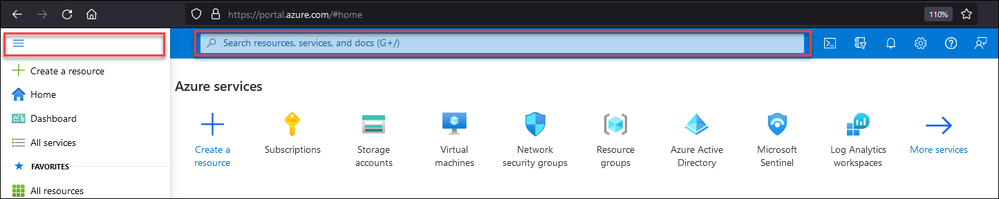
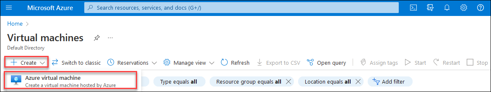
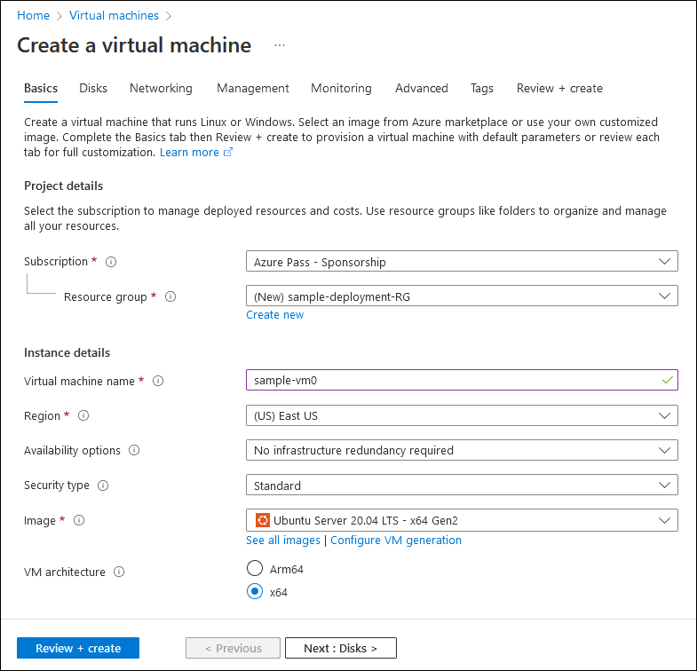
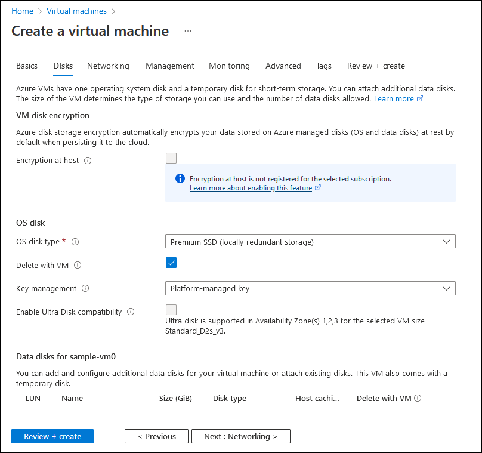
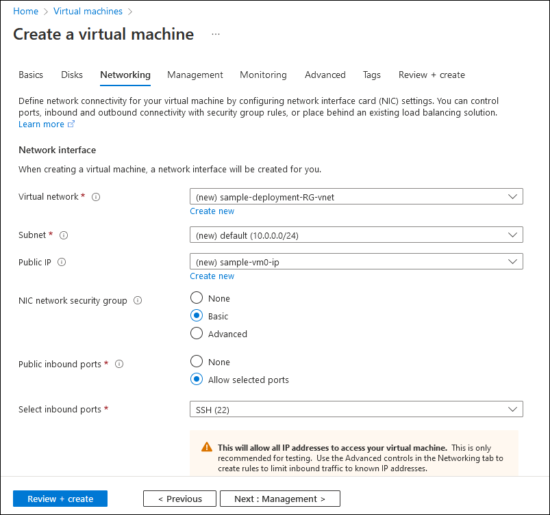
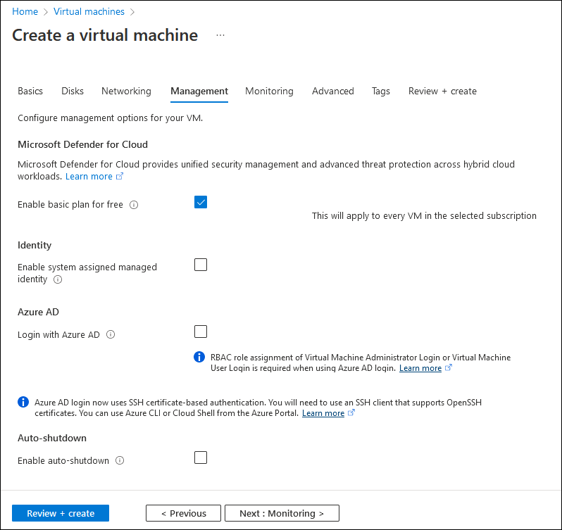
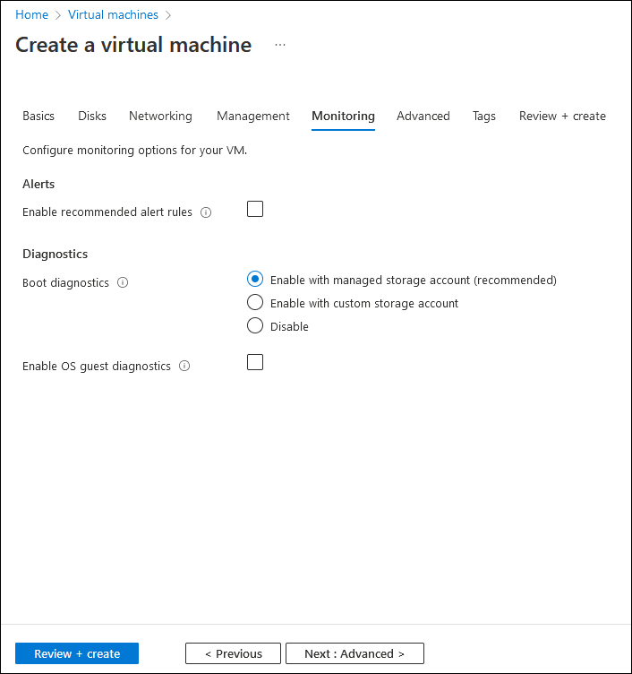
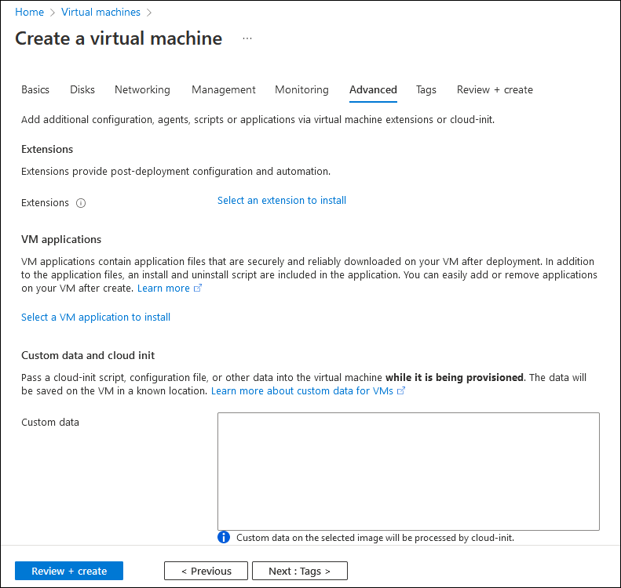
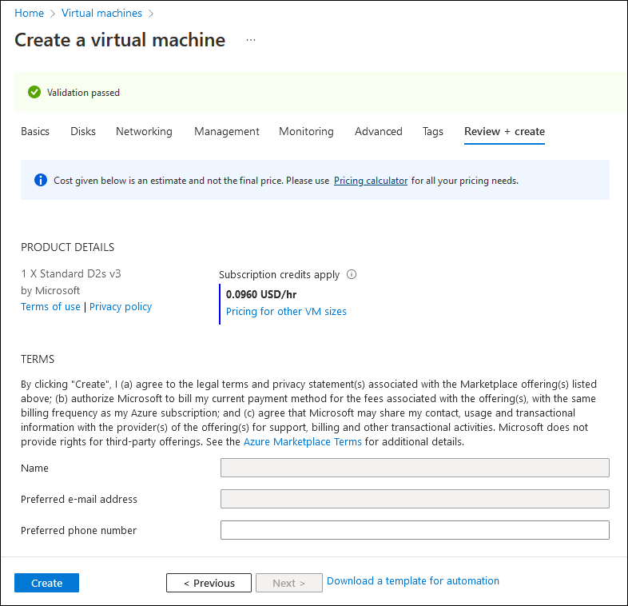

To access your Azure subscription by using the Azure portal, you must first sign in with an authorized account. After you're successfully authenticated, the Azure portal's home page displays. This page provides links to core services, recently accessed and favorite resources, built-in management tools, and online documentation. It also serves as a convenient entry point into your Azure environment.

If the functionality you're looking for isn't present on the home page, you can locate it by using either the portal menu or the global search textbox. Both options are available on every portal page to which you navigate.

- The portal menu simplifies accessing commonly used features and resource types, and it's available in the flyout and docked mode. 

- The global search identifies matches for the text you enter across all services, resources, resource groups, marketplace offers, Azure Active Directory (Azure AD) objects, and online documentation. (By default, the global search box displays the text "Search resources, services, and docs (G+/)".)

Because the global search box offers a more comprehensive and consistent behavior, all procedures covered in this module will use this option.

To navigate to the portal page dedicated to the provisioning and management of Azure VMs, in the global search box, start entering the phrase virtual machines, which designates the Azure resource type you intend to provision. The global search box displays a list of search results even before you've entered the entire phrase. In the search results list, in the Services section, locate the Virtual machines entry. Selecting this entry will automatically open the Virtual machines page of the portal.

> [!NOTE]
> 
> For more information about the Azure portal interface, refer to [What is the Azure portal?](/azure/azure-portal/azure-portal-overview)

## Deploy a Linux VM by using the Azure portal

The process of deploying Azure resources by using the Azure portal involves the following sequence of high-level steps:

- Initiate the provisioning wizard.
- Assign resource-specific settings.
- Validate the assigned settings.
- Initiate the deployment.

### Initiate the provisioning wizard

On the Virtual machines page, select the **+ Create** link. This step is the same regardless of the resource type you provision.

### Assign resource-specific settings

The settings you assign at this stage will determine the properties of the deployed resource. Although you can modify most of the settings after deployment, there are some settings that are immutable. The immutable settings include the resource name and the operating system (OS) image, so it's important to carefully consider their assignments. In addition, some of the modifiable settings might impact the resource availability if changed after deployment. For example, you can change the resource group of an online Azure VM, but moving it across virtual networks, subscriptions, and regions (although possible) will result in downtime. Similarly, changing the Azure VM size, while straightforward and commonly done, requires an OS restart. 

> [!NOTE]
> 
> Microsoft doesn't support moving resources across subscriptions associated with different Azure AD tenants, and provisioning multiple resources that are part of a larger deployment should follow a planning stage that determines their optimal configuration, including a naming convention.

The settings displayed by the Azure VM provisioning wizard in the Azure portal are grouped into the following pages:

- Basics
- Disks
- Networking
- Management
- Monitoring
- Advanced
- Tags

#### Basics

The settings on this page configure the target subscription (either an existing or new resource group), and the Azure region where the Azure VM and the resources on which it depends will reside. From here you also specify: 

- The Azure VM name.
- Availability options.
- OS image.
- Name of the administrator account
- Depending on your choice of the authentication type, either the corresponding password or the secure shell protocol (SSH) key.
- Whether you want to:
  - Generate a new key pair
  - Select an existing key stored in Azure
  - Provide an existing RSA public key in the Privacy Enhanced Mail (PEM) format
- Whether you want to allow connectivity to the deployed Azure VM from the internet via Transmission Control Protocol (TCP) port 22 (SSH).

> [!CAUTION]
> 
> If you deploy an individual Azure VM for testing or evaluation purposes, you might choose to allow connectivity from the internet due to the convenience it provides. However, in general, you should avoid exposing Azure VMs to connections originating from the internet without additional constraints. To enhance security in such scenarios, consider implementing Azure Bastion or just-in-time (JIT) VM access, which is available as part of the Microsoft Defender for Cloud service. Azure also offers hybrid connectivity options, including Site-to-Site (S2S) virtual private network (VPN), Point-to-Site (P2S) VPN, and Azure ExpressRoute. All three options eliminate the need for assigning public IP addresses to Azure VM network interfaces for connections originating from your on-premises datacenter or designated, internet-connected computers.

##### Disks

You use Disks settings to specify the type and encryption of the disk hosting the Azure VM OS. You can also attach one or more data disks, although this option is available at any point following the deployment. The maximum number of data disks that an Azure VM supports depends on its size.

##### Networking

In addition to the Basic grouping, networking is another critical part of Azure VM configuration that warrants careful consideration. Every Azure VM uses its network interface to attach to a subnet of a virtual network. Therefore, having a virtual network with at least one subnet is a prerequisite when provisioning an Azure VM. The Azure portal facilitates implementing this prerequisite by choosing an IP address space that doesn't overlap with any existing virtual network in your subscription, and by suggesting the virtual network and subnet names. For test or evaluation scenarios, this is a viable option. However, for any larger deployments, you should design your network environment first. This category also provides additional, more granular settings that you can use to restrict inbound internet traffic. Lastly, to minimize network latency, ensure that accelerated networking is enabled.

> [!NOTE]
> 
> Support for accelerated networking depends on the Azure VM size.

##### Management

From the Management page, you can enable several optional settings to enhance the manageability of your Azure VM. These settings control support for Microsoft Defender for Cloud and Azure AD authentication. You can also use them to schedule-based auto-shutdown, automatic backups, and patch orchestration.

> [!NOTE]
> 
> Support for patch orchestration depends on the OS image.

##### Monitoring

You use the Monitoring page to enable monitoring settings. These include automatic alerts that notify you about potential resource utilization issues, and boot and operating system diagnostics.

##### Advanced

This page provides miscellaneous options that allow you to further customize platform and operating system-level settings of the Azure VM that are deploying, including:

- Post-deployment configuration of the guest OS using a wide range of specialized software components and scripts such as Azure VM extensions, cloud-init, custom data, and user data.
- Installation of applications within the guest OS.
- Deployment to dedicated physical servers, ensuring that your Azure VM isn't running on hardware shared with other Azure customers.
- Minimizing latency between multiple Azure VMs by ensuring that they're part of the same placement proximity group.
- Minimizing costs by using capacity reservations.

##### Tags

You use this page to create descriptive labels (_tags_) that you want to assign to the resource. Tags help organize resources based on your own custom criteria, facilitating functionality such as multiple-resource management, inventory, and billing.

### Validate the assigned settings

After completing the configuration steps in the various pages of the provisioning wizard, you'll reach the final page titled **Review + create**.

#### Review + create

At this point, the Azure portal will automatically invoke a validation task, which verifies that the options you've selected are valid. If you've misconfigured a setting or missed a required one, you'll have a chance to go back to the corresponding page to fix your mistake. When you return to the last page, validation will run again.

### Initiate deployment

If validation is successful, select Create to initiate the deployment. Your Azure VM should be running shortly.

