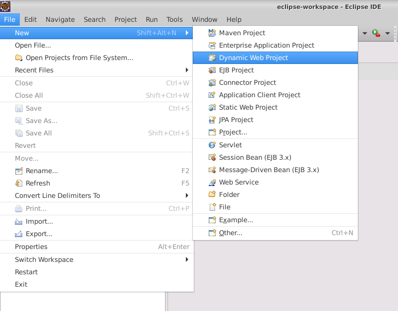
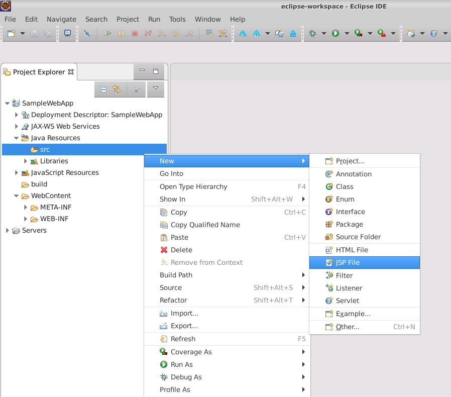
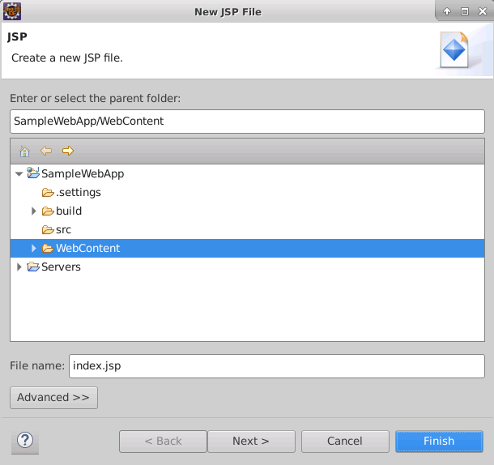
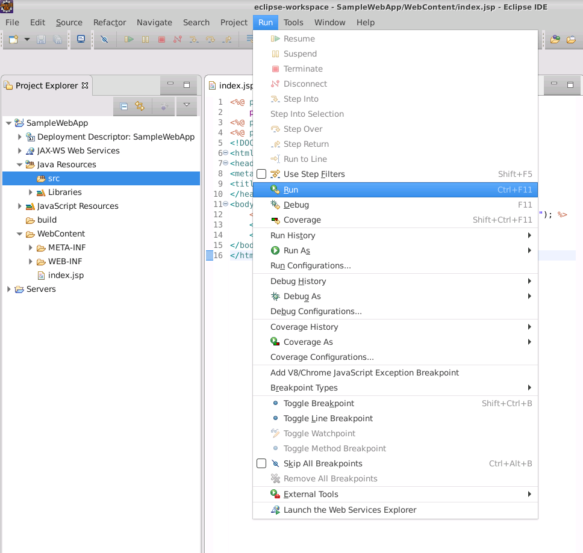
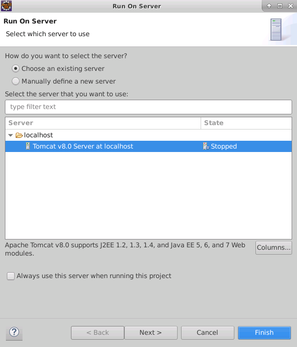
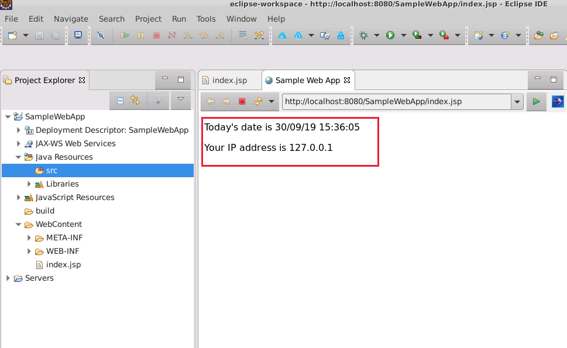

After you have installed the Azure Toolkit for Eclipse, you have an environment you can use to build and deploy Java web apps to Azure.

In this exercise, you'll use Eclipse to create a Java web app that uses Java Server Pages (JSP) to generate dynamic content for a web page. The page will display the current date and time, together with the IP address of the client computer running the web browser used to connect to the web app. You'll test the web app locally using the Apache Tomcat server.

## Create a new web app

1. Start Eclipse if it isn't already running.

1. On the **File** menu, select **New**, and then click **Dynamic Web Project**.

    > [!div class="mx-imgBorder"]
    > 

1. In the **New Dynamic Web Project** wizard, on the **Dynamic Web Project** page, enter **SampleWebApp** in the **Project name** box. Set the **Target runtime** is set to **Apache Tomcat v8.0**, and then click **Finish**.

    > [!div class="mx-imgBorder"]
    > 

    > [!NOTE]
    > If the **Apache Tomcat v8.0** runtime isn't listed, click **New Runtime**, and download it

1. In the **Project Explorer** pane, expand **SampleWebApp**, expand **Java Resources**, right-click **src**, select **New**, and then click **JSP File**.

    > [!div class="mx-imgBorder"]
    > 

1. In the **New JSP File** wizard, on the **JSP** page, verify that the parent folder is set to **SampleWebApp/WebContent**. In the **File name** box, enter **index.jsp**, and then click **Finish**.

    > [!div class="mx-imgBorder"]
    > 

1. In the code editor window that appears, displaying the **index.jsp** file, in the **head** section of the page, change the HTML markup for the title to **Sample Web App**, as follows:

    ```html
    <head>
        <meta charset="UTF-8">
        <title>Sample Web App</title>
    </head>
    ```

1. In the **body** section of the page, add the code shown below:

    ```html
    <body>
        <%! DateFormat fmt = new SimpleDateFormat("dd/MM/yy HH:mm:ss"); %>
        <p>Today's date is <%= fmt.format(new Date()) %></p>
        <p>Your IP address is <%= request.getRemoteAddr() %></p>
    </body>
    ```

    This code retrieves the current date then formats and displays it. The code also extracts the IP address of the client from the request message, and prints it.

1. Near the top of the page, after the first **@page** directive that specifies the language and content type of the page, add the two **@page** directives shown in the following code:

    ```html
    <%@ page language="java" contentType="text/html; charset=UTF-8"
        pageEncoding="UTF-8"%>
    <%@ page import ="java.util.*" %>
    <%@ page import ="java.text.*" %>
    ```

    These directives import the *java.util* and *java.text* libraries. The code in the body of the page uses these libraries.

    The completed code should look like this:

    ```html
    <%@ page language="java" contentType="text/html; charset=UTF-8"
        pageEncoding="UTF-8"%>
    <%@ page import ="java.util.*" %>
    <%@ page import ="java.text.*" %>
    <!DOCTYPE html>
    <html>
    <head>
    <meta charset="UTF-8">
    <title>Sample Web App</title>
    </head>
    <body>
        <%! DateFormat fmt = new SimpleDateFormat("dd/MM/yy HH:mm:ss"); %> 
        <p>Today's date is <%= fmt.format(new Date()) %></p>
        <p>Your IP address is <%= request.getRemoteAddr() %></p>
    </body>
    </html>
    ```

1. On the **File** menu, click **Save**.

## Test the web app locally

1. On the **Run** menu, click **Run**.

    > [!div class="mx-imgBorder"]
    > 

1. In the **Run On Server** wizard, select the server **Tomcat v8.0 Server at localhost**, and then click **Finish**.

    > [!div class="mx-imgBorder"]
    > 

    >[!NOTE]
    > If you have just installed Tomcat, there might not be an existing server available. In this case, select **Manually define a new server**, and select **Tomcat v8.0 Server**.

1. You'll see a few messages appear as the Tomcat server starts running. Eclipse will show the output of the web application in a browser window inside the IDE, which should look similar to the image shown below.

    > [!div class="mx-imgBorder"]
    > 

1. Click the **Go to the selected URL** button – the green arrow next to the URL in the **Sample Web App** window – to refresh the page. You should see the time change as the page is regenerated and Java code is executed again.

Congratulations! You've created a sample web app and deployed it locally using Eclipse. In the next exercise, you'll deploy the web app to Azure.