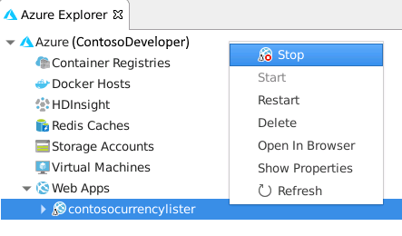
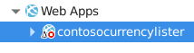
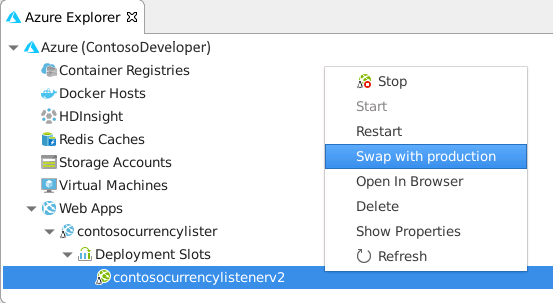
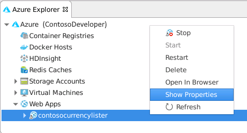
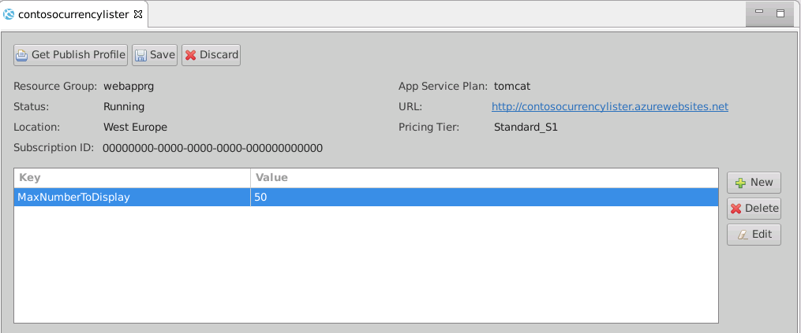

The Azure Toolkit for Eclipse provides several tools in the Azure Explorer that you can use to manage, configure, and redeploy web apps to an Azure App Service. In this unit, you'll learn how to use these features to start and stop a web app, redeploy it, switch deployment slots, set properties for a web app, and delete it.

## How to stop and restart a web app

Starting and stopping a web app using Azure Explorer is a straightforward process. 

To stop a web app in the **Azure Explorer** window, right-click the web app in the **Web Apps** folder, and then click **Stop**.

> [!div class="mx-imgBorder"]
> 

The web app will stop accepting new requests and then shut down. The icon for the web app will change to indicate that it has stopped.

> [!div class="mx-imgBorder"]
> 

To start a web app, use the **Start** command in the context menu for the web app. Once the app is running, the icon will change back to its original state.

If you need to quickly reset a stalled web app, use the **Restart** command to stop and start the web app in a single step.

## How to redeploy a web app

To redeploy a web app after you've made changes, follow the same procedure that you used to originally deploy the web app; for example: in the **Project Explorer** pane, right-click your web app, select **Azure**, and then click **Publish as Azure Web App**. However, instead of creating a new App Service, select an existing App Service and then click **Deploy**, and the previous version of the web app will be replaced by the new version.

### How to use deployment slots

As described in an earlier unit, if you're redeploying a web app after making modifications to its functionality, it's a good idea to use a new deployment slot. You would leave the existing version of the web app running until you're satisfied that the new version is functioning correctly. When you deploy the new version of the web app, in the **Deploy Web App** wizard, select the **Deploy to Slot** option. You can reuse an existing deployment slot, or create a new one. The example below deploys a new version of the **contosocurrenylistener** web app to a deployment slot named **contosocurrenylistenerv2**. The previous version of the web service stays in the original deployment slot.

:::image type="content" source="../media/6-deploy-web-app.png" alt-text="The Deploy Web App wizard. The user is deploying the web app to a new deployment slot." loc-scope="third-party":::

After you have deployed your web app to a new deployment slot, the deployment slot name will be appended to the name of the web app. In the example shown above, the new version of the web app would be available through the URL **http:\//contosocurrencylister-contosocurrencylistenerv2.azurewebsites.net/**, while the original web app would still be available at **http:\//contosocurrencylister.azurewebsites.net/**.

### How to swap deployment slots

You can easily switch the new version of your web app with the original. Once you have made the switch, the new version will be available through the URL **http:\//contosocurrencylister.azurewebsites.net/**. To make the switch, in the **Azure Explorer** window, expand your web app and then expand **Deployment Slots**. Right-click the new deployment slot, and then click **Swap with production**.

> [!div class="mx-imgBorder"]
> 

> [!NOTE]
> In the Azure Explorer, you can manage web apps running in a deployment slot as you would any web app. For example: you can start, stop, and reconfigure the properties of a web app that is running in a deployment slot.

## How to configure web app properties

Web apps (and deployment slots) can have developer-defined properties. A property is a key-value pair that is provided to the web app as an environment variable. You can use properties to pass configuration information to a web app. A Java web app can read the value of a property using the `System.getenv()` function, which enables developers to change the value of a property without having to modify or redeploy the web app. For example: if your web app stores a connection string in a property, you would only need to update the property if you need to change the location of your database.

You create and modify properties by using the **Show Properties** command in the **Azure Explorer** window.

> [!div class="mx-imgBorder"]
> 

The properties window contains a list of properties. This list is initially empty, but you can add, remove, and change property values using the **New**, **Delete**, and **Edit** buttons. You make the changes permanent with the **Save** button.

The example below defines a property named **MaxNumberToDisplay**, with the value **50**.

> [!div class="mx-imgBorder"]
> 

For example, you could modify the currency listing example from earlier in this module to read the value of the **MaxNumberToDisplay** property and use that property to limit the number of currencies that will be displayed, as shown in the following code:

```java
<%! int counter;
    Set<Currency> currencies = Currency.getAvailableCurrencies(); 
    int maxNumberToDisplay = Integer.valueOf(System.getenv("MaxNumberToDisplay"));%>
  
<% counter = 1;
   for(Currency currency : currencies){ %>
        <p>Currency is <%= currency.toString() %> </p>
<%      counter++;
        if (counter >= maxNumberToDisplay)
            break;
    } %>
<p> There are <%= counter %> currencies available.</p>
```

## How to delete a web app

To remove a web app, right-click the web app in the **Azure Explorer** window, and then click **Delete**. You'll be prompted to confirm the deletion, as this operation can't be easily undone.

When you delete a web app, the application is removed from Azure App Service, but the App Service Plan stays – so you'll still be charged. If you wish, you can delete the App Service Plan using the Azure portal.

You can also delete individual deployment slots from a web app. In this case, only the deployment slot will be removed.
