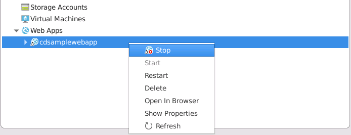
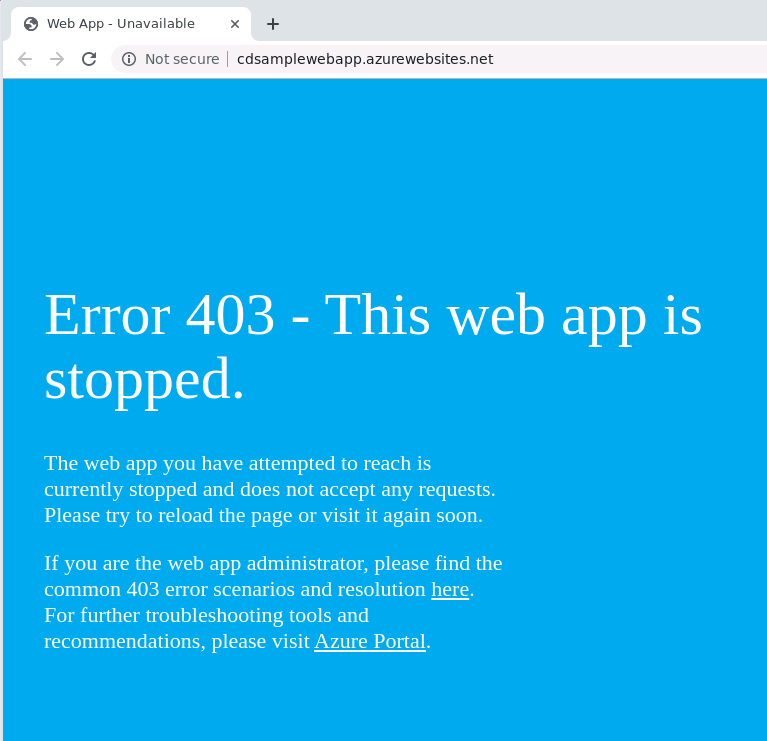
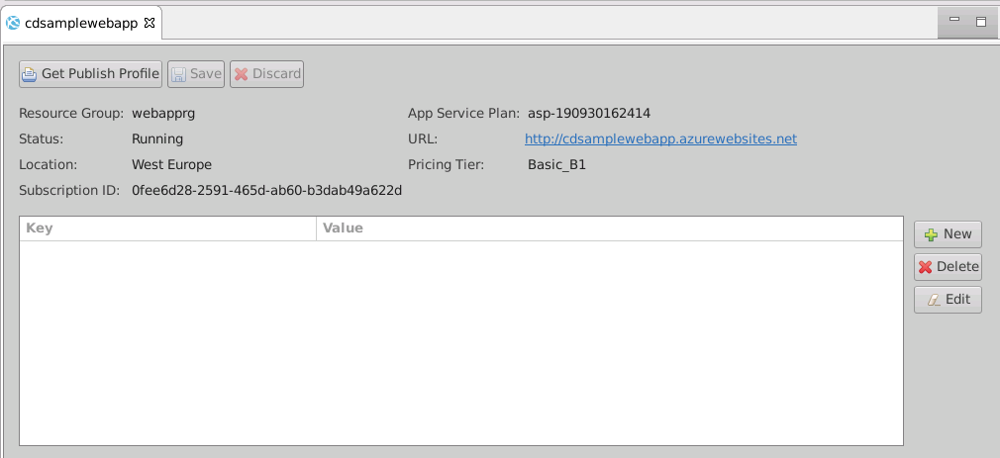
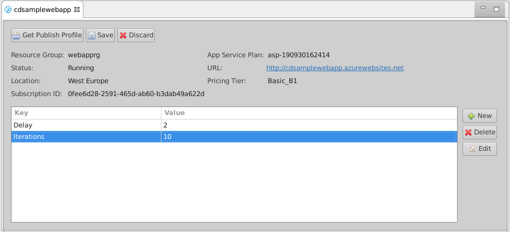
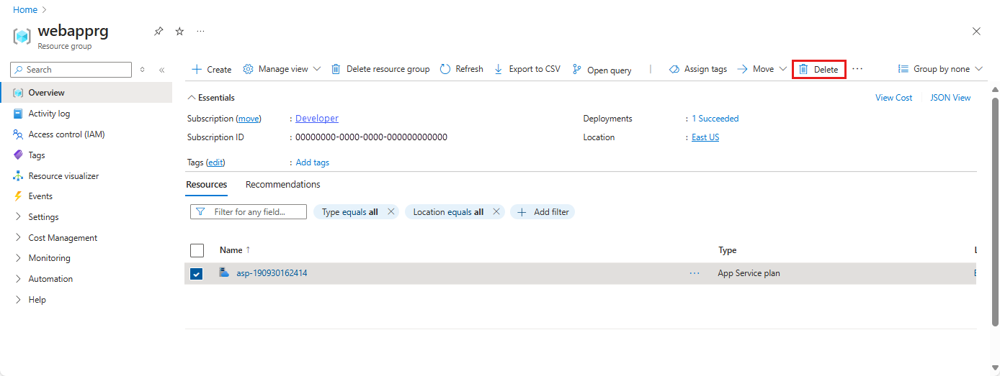

In the previous unit, you learned that the Azure Explorer in the Azure Toolkit for Eclipse enables you to manage and configure Azure web apps. In this exercise, you'll see how to use Azure Explorer to stop and restart the *SampleWebApp* Azure web app.

Next, you'll modify the web app by using Azure Explorer to add a pair of properties to the configuration. You'll modify the web app to read the value of these properties and use them in the web app logic. You'll then redeploy the web app and verify that it functions as expected.

Finally, you'll use Azure Explorer to delete the web app and remove it from Azure.

## Stop and restart the web app

1. Start Eclipse if it isn't already running, and open the **SampleWebApp** project.

1. In the Azure Toolkit for Eclipse toolbar, click **Show Azure Explorer**.

1. If you aren't currently signed in to Azure, follow the procedure described in the previous exercise to sign in to your Azure account and select your subscription.

1. In the **Azure Explorer** window, expand **Web Apps**, right-click your web app, and then click **Stop**.

    > [!div class="mx-imgBorder"]
    > 

1. Right-click your web app again, and then click **Open in Browser**. The web browser should display an HTTP 403 message indicating that the web app isn't currently running.

    > [!div class="mx-imgBorder"]
    > 

1. Leave the web browser open and return to Eclipse. 

1. In the **Azure Explorer** window, right-click the web app once, and then click **Start**.

1. Return to the web browser, and refresh the display. The web app should be running again. 

1. Close the web browser and return to Eclipse.

## Add configuration properties to the web app

1. In the **Azure Explorer** window, right-click the web app, and then click **Show Properties**. The properties window for the web app should appear:

    > [!div class="mx-imgBorder"]
    > 

1. In the properties window, click **New** to add a new property key and value.

1. In the **Key** column of the new property, enter the name **Delay**, and then press Enter.

1. Click **Edit**, and in the **Value** column for the property, type the value **2**, and then press Enter.

1. In the properties window, click **New** again.

1. Add another property named **Iterations**, with the value **10**.

    > [!div class="mx-imgBorder"]
    > 

1. Click **Save**.

1. When the **Properties updated** message box appears, click **OK**.

## Modify the web app to use the properties

1. In the **Project Explorer** window, expand **SampleWebApp**, expand **WebContent**, and then double-click **index.jsp**.

1. In the **body** section of the code for the web page, change the code as shown below:

    ```html
    <body>
        <%! int delayms = Integer.valueOf(System.getenv("Delay")) * 1000;
            int iterations = Integer.valueOf(System.getenv("Iterations"));
            DateFormat fmt = new SimpleDateFormat("dd/MM/yy HH:mm:ss"); %>
        <%  for (int i = 0; i < iterations; i++) {
            Thread.sleep(delayms); %>
            <p>Today's date is <%= fmt.format(new Date()) %></p>
        <% } %>
        <p>Your IP address is <%= request.getRemoteAddr() %></p>
    </body>
    ```

    This code reads the values of both properties – they are exposed as environment variables for the web app runtime. The code displays the date and time at **Delay** seconds intervals, looping **Iterations** times.

    > [!NOTE]
    > In this example, the code runs synchronously when it generates the output. This means it will take up to 20 seconds for the page to appear.

1. On the **File** menu, click **Save**.

1. In the **Project Explorer** window, right-click **SampleWebApp**, select **Azure**, and then click **Publish as Azure Web App**.

1. In the **Deploy Web App** window, accept the default settings – this action will overwrite the existing web app with the new version – then click **Deploy**.

    > [!NOTE]
    > If you want to preserve the original version of the web app until the new version has been fully tested, deploy the new web app to a new deployment slot, using the options at the bottom of the **Deploy Web App** window.

1. In the **Azure Activity Log** window, wait until the progress column indicates that the web app has been successfully deployed.

1. Click the **Published** link in the **Azure Activity Log** window. A new browser window will open. After 20 seconds, the messages displaying the time at two-second intervals will appear, followed by the IP address of the client computer.

    :::image type="content" source="../media/7-updated-web-app.png" alt-text="Screenshot of the web browser running the new version of the web app." loc-scope="third-party":::

1. Leave the browser window open, and return to Eclipse.

1. In the **Azure Explorer** window, right-click the web app, and then click **Show Properties**.

1. In the properties window, select the **Delay** property, and click **Edit**. Change the value to **1**.

1. Select the **Iterations** property, click **Edit**, and change the value to **5**.

1. Click **Save**.

1. In the **Properties updated** message box, click **OK**.

1. Switch back to the web browser and refresh the display. This time, the page will display the time at one-second intervals, repeated only five times. Notice that you didn't need to redeploy the web app.

1. Close the web browser and return to Eclipse.

## Delete the web app

1. In the **Azure Explorer** window, right-click the web app, and then click **Delete**.

1. In the **Azure Explorer** message box that prompts you to make sure this is really what you want to do, click **OK**.

    :::image type="content" source="../media/7-delete-web-app.png" alt-text="Screenshot of the message box confirming that the user wants to delete the web app." loc-scope="third-party":::

1. When the web app has been deleted, it will disappear from the **Web Apps** folder in **Azure Explorer**.

> [!IMPORTANT]
> Deleting the web app using the Azure Toolkit for Eclipse doesn't delete the app service plan, but you can remove the plan using the Azure portal. To do so, navigate to the appropriate resource group, select the app service plan, and then click **Delete**, as shown in the image below:
>
> [!div class="mx-imgBorder"]
> 
