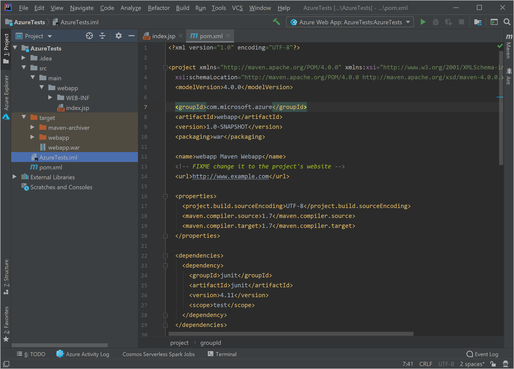

If you prefer to use IntelliJ IDEA to write code, you can work with Azure resources by installing the Azure Toolkit for IntelliJ.

Suppose your team of Java developers uses IntelliJ IDEA to create web apps with the Java Server Pages (JSP) framework. Your manufacturing company has been migrating to Azure, but you want to migrate with as little disruption as possible to your current development environment. You've been asked to evaluate the easiest way to enable your developers to work with Azure. 

In this unit, you'll learn about the Azure Toolkit for IntelliJ and what developers can use it to do. But first, let's review the technologies and components that are used to build a typical Java web site. 

## Java Web Applications

There are several different technologies that you can use to create web applications using the Java language; for example:

- **Java Servlets**

    A servlet is a Java component that extends the capabilities of a server. Often servlets extend the capabilities of a web server by implementing a container for a web application. A servlet that implements a web application usually has HTML code embedded in the Java code.

- **Java Server Pages (JSP)**

    JSP is a standard technology where you can embed Java code into HTML pages to create dynamic content. JSP pages must be deployed in a specific type of Java servlet called a web container, and Apache Tomcat is a commonly used web container.

    To deploy a JSP web application using IntelliJ IDEA, you will package it as a Web Application Resource (WAR) file. This file is a standard form of archive file that defines the content and structure of the web application. Tomcat and other web containers can use this file as an installation source for the web application.

## IntelliJ IDEA

IntelliJ IDEA is one of the most popular Integrated Development Environments (IDE) in the Java community, and is developed by JetBrains. It runs on Windows, macOS, and any 64-bit version of Linux that supports Gnome or KDE. 

There are two editions of IntelliJ IDEA:

- **Community Edition**

    This free edition is open source with an Apache 2 license.

- **Ultimate Edition**

    This retail edition supports many features that are not present in the community edition; for example: JavaScript, TypeScript, and the Team Foundation Server version control system.

## Maven

Maven is a popular tool for building and managing Java projects. It provides an easy-to-use and consistent build process for all your Java products. Maven can also provide information about a project when it is built such as change logs, dependency lists, and unit test results. The output from a Maven build process is called an artifact.

Maven Archetype is a separate project, built on top of Maven, that you can use to create or select project templates. An archetype is a template for a specific type of project. For example, if you want to build a JSP web app, you can use the **maven-archetype-webapp** archetype from the **org.apache.maven.archetypes** repository. Your project will include, for example, a starter **index.jsp** home page for the web app and a WAR file for deployment.

An important file in any Maven archetype is the **pom.xml** file, which stores the project object model. This file contains the configuration details and values that Maven needs to build a project. For example:

- The build directory, where the artifacts will be placed.
- The source directory, where the source code is.
- The location of test directories and resources.
- Profiles for building test, release, and other versions of the project.

## The Azure Toolkit for IntelliJ

The Azure Toolkit for IntelliJ is an extension for IntelliJ IDEA that provides templates and tools for those developers who want to work with Azure resources from their preferred IDE. When you install the toolkit, you can perform these tasks in IntelliJ IDEA without using any other tools or software:

- Manage Azure resources such as:
    - Virtual Machines, which are virtualized servers that you can use to run Windows or Linux operating system and can host any application.
    - Azure Storage Accounts, which can store files, queues of messages, or tables of data.
    - Redis Cache, which is a caching system that is popular for increasing the performance of databases.
- Deploy a web app to these types of hosts:
    - Azure App Service
    - Docker containers
    - Azure Virtual Machines

You also use the Azure Explorer with the Azure Toolkit for IntelliJ, which provides an additional window within IntelliJ IDEA where you can see and manage the resources that exist in your Azure subscription. In the Azure Explorer window you can create new web apps, storage accounts, and other resources, or configure Azure resources that you have created.

There are alternatives to the Azure Toolkit for IntelliJ to deploy your web app. For example, you could use `git` to deploy code and publish it to Azure. However, the Azure Toolkit for IntelliJ provides close integration within IntelliJ IDEA itself. Developers can package and deploy an app, and create and configure resources in Azure, all without leaving their favorite IDE.

In the following exercises, you'll use the Azure Toolkit for IntelliJ to deploy a web app, based on a Maven archetype, to Azure App Service, and manage that web app using the Azure Explorer from within IntelliJ IDEA.

## Using containers with Azure

This module will illustrate using the Azure App Service to host a web app. However, the Azure Toolkit for IntelliJ makes it easy to work with containers, which are virtualized computers that share an operating system and other resources with the host computer. To run a container, you need a host application, such as Docker. Because containers share resources with their host, they don't need to run a complete operating system. This sharing makes them lightweight and faster to start and stop. Containers have become popular for hosting applications recently, because they provide an isolated, controlled environment for the application, and you can respond to changes in demand by deploying extra containers quickly. As for virtual machines, you use an image to define the software environment for a container. In Docker, the image is configured in a text file called **Dockerfile**. In this file, you can define a parent image, such as one that includes Linux and the Apache server, and then add other components, such as the compile production version of your Java web app. 
 
If you want to run containers in Azure, you have several options:

- **Run Docker on a virtual machine**: If you want to set up and manage the host computers yourself, create them as virtual machines. You can either choose an image that includes Docker from the Azure image library, or you can install Docker on the virtual machines once they are running.

- **Azure Kubernetes Service**: Kubernetes is a popular container orchestration system that you can use to deploy and manage large numbers of containers to build a scaled-out and resilient system. Kubernetes balances load between containers, restarts failed containers, and orchestrates shared storage. With the Azure Kubernetes Service (AKS), you can deploy a Kubernetes cluster in the Azure cloud. 

- **Azure Container Instances**: If you just want to create one or two containers quickly and you don't want to deal with virtual machines or Kubernetes clusters, consider using the Azure Container Instances service. This service provides, for example, an easy way to set up a test environment to run some unit tests on your custom code.

You might also want to create a registry of images in Azure. In Docker, a registry is a location where images are stored. The Docker application can download images from this registry and use them to start new containers. You can use the Azure Container Registry service to create private registries in the Azure cloud and populate them with the images that include your application. You can configure the registry to replicate between different Azure regions to ensure that the images are available quickly throughout your organization. From the Azure registry, you can deploy containers to virtual machines, Kubernetes, or on-premises Docker computers. 

The Azure Toolkit for IntelliJ includes several tools that you can use to set up containers in your Azure subscription:

- **Add Docker support**: Use this option to add a **Dockerfile** image to your Java project. By default, this image is a child of a Tomcat image and includes the web app as a .WAR archive.

- **Docker Run**: Use this tool to compile a Docker image and send it to a Docker host to run. By default, the image will run on the local computer, but you could choose a Docker host in Azure, such as a virtual machine or Azure Container Instances.

- **Push Image**: Use this tool to compile the Docker image and then send it to a Docker registry. You could choose an Azure Container Registry as a destination for the image. Then, the image could be used in Azure destinations, like virtual machines or the Azure Kubernetes Service.
