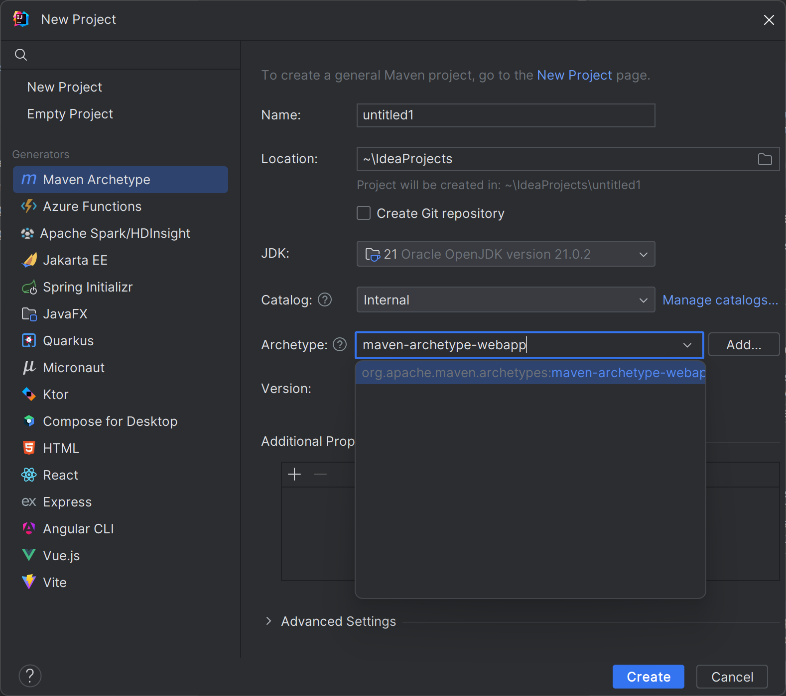

Suppose you're beginning the process of researching how to move your website to Azure. You've learned that the Azure Toolkit for IntelliJ makes it easy to work with sites in Azure App Service from IntelliJ IDEA, and you want to test that by using the toolkit to explore the resources in your company's Azure subscription.

In this exercise, you'll use the Azure Explorer to examine your Azure subscription.

## Create a web app project

Before you can examine your Azure resources with the Azure Explorer, you must create a new project. Let's create a web app project by using a Maven archetype:

1. Start IntelliJ IDEA.

1. In the **Welcome to IntelliJ IDEA** window, select **Create new project**.

1. In the menu on the left, select **Maven Archetype**.

1. In the list of archetypes, search for and select **maven-archetype-webapp**.

    

1. Type **webapp** in the **Name** field.

1. To accept the default Maven settings, select **Create**.

> [!NOTE]
> Creating your project takes a few moments.

## Complete the web app

Let's start by adding some simple code to the web app:

1. In the **Project** window, expand **src/main/webapp** and then open **index.jsp**.

1. Remove all of the existing code and replace it with the following HTML:

    ```html
    <%@ page language="java" contentType="text/html; charset=UTF-8" pageEncoding="UTF-8"%>
    <%@ page import ="java.util.*" %>
    <%@ page import ="java.text.*" %>
    <!DOCTYPE html>
    <html>
    <head>
    <meta charset="UTF-8">
    <title>Sample Web App</title>
    </head>
    <body>
        <%! DateFormat fmt = new SimpleDateFormat("dd/MM/yy HH:mm:ss"); %> 
        <p>Today's date is <%= fmt.format(new Date()) %></p>
        <p>Your IP address is <%= request.getRemoteAddr() %></p>
    </body>
    </html>
    ```

1. On the **File** menu, select **Save All**.
