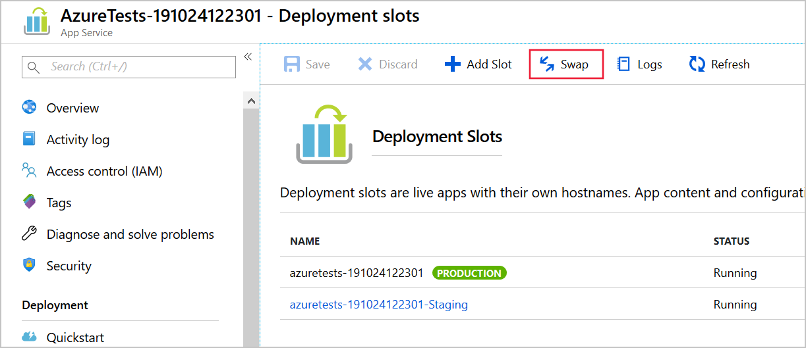

The Azure Toolkit for IntelliJ provides several tools in the Azure Explorer that you can use to manage, configure, and redeploy web apps to an Azure App Service. If your deployment requirements are more complex, you can customize the steps when using the **Deploy to Azure** wizard, which provides a flexible application deployment system.

In this unit, you'll learn how to use these features to manage, troubleshoot, switch deployment slots and set properties for a web app.

## How to manage and troubleshoot web app on Azure

IntelliJ provides powerful tools to troubleshoot the app deployed from your IDE, including:

- Log streaming
- Remote file explorer
- One click SSH to the app
- Profiling on the fly

Using these tools from Azure Explorer is straightforward. Open the **Azure Explorer** window, right-click the web app in the **Web Apps** folder, and you'll see some useful actions in the menu.

:::image type="content" source="../media/6-streaming-logs-entry.png" alt-text="Screenshot of the Azure Explorer window." loc-scope="third-party":::

There are also many frequently used actions, like start/stop/restart app, in the context menu. If you select the **Stop** command, the web app stops accepting new requests and shuts down, and the icon for the web app changes to indicate that it has stopped. To start a web app, use the **Start** command in the context menu for the web app. Once the app is running, the icon changes back to its original state. If you need to quickly reset a stalled web app, use the **Restart** command to stop and start the web app in a single step.

## How to use deploy configurations

If you deploy your web app to Azure App Service and use a standard, premium, or isolated tier app service plan, you can use deployment slots to ease your deployment process. A deployment slot is another instance of the web app with a different host name. It's easy to swap the web apps in two different deployment slots.

> [!NOTE]
> Deployment slots aren't supported in the Free, Shared, or Basic service plan tiers.

When you create an app service instance in Azure, one default deployment slot is created. This slot is the production slot. If you want to test a new version of the site, you could create a second slot and deploy the new code to that slot for running your test suite. During tests, the production slot still contains and serves the old version of your code. If the new code passes all tests, you can deploy it to production by swapping the slots. This operation moves the new version into the production slot, and the old code into the test slot. Users now see the new version of the site.

The advantages of deploying new versions of an app this way include:

- The secondary slots are very similar environments to the production slot, so they're great places to execute testing and staging.
- If you find a problem in the new production site that wasn't detected during testing, it's easy and quick to move back to the old version of the site. You just swap slots again.
- Before a swap, Azure ensures that all instances of the slot are warmed up, so there's no downtime or drop in performance.

In IntelliJ IDEA, the **Deploy to Azure** wizard allows you to choose a deployment slot, or to create a new one:

:::image type="content" source="../media/6-deploy-to-slot.png" alt-text="Screenshot of deploying to a specific deployment slot." loc-scope="third-party":::

You can use the Azure portal to execute the swap.

