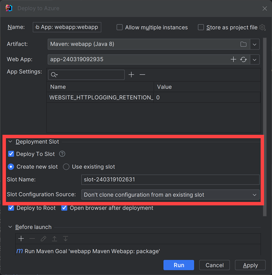
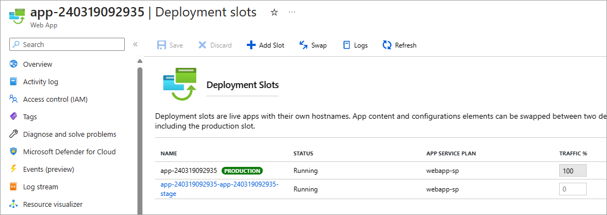

The Azure Toolkit for IntelliJ provides several tools in the Azure Explorer that you can use to manage, configure, and redeploy web apps to an Azure App Service. If your deployment requirements are more complex, you can customize the steps when using the **Deploy to Azure** wizard, which provides a flexible application deployment system.

In this unit, you'll learn how to use these features to start and stop a web app, redeploy it, switch deployment slots, set properties for a web app, and delete it.

## How to stop and restart a web app

Starting and stopping a web app using Azure Explorer is a straightforward process. 

To stop a web app in the **Azure Explorer** window, right-click the web app in the **Web Apps** folder, and then click **Stop**.

The web app will stop accepting new requests and then shut down, and the icon for the web app will change to indicate that it has stopped.

To start a web app, use the **Start** command in the context menu for the web app. Once the app is running, the icon will change back to its original state.

If you need to quickly reset a stalled web app, use the **Restart** command to stop and start the web app in a single step.

## How to redeploy a web app

To redeploy a web app after you've made changes, follow the same procedure that you used to originally deploy the web app; for example: in the **Project Explorer** pane, right-click your web app, select **Azure**, and then click **Publish as Azure Web App**. However, instead of creating a new App Service, select an existing App Service and then click **Deploy**, and the previous version of the web app will be replaced by the new version.

## How to use deploy configurations

If you deploy your web app to Azure App Service and use a standard, premium, or isolated tier app service plan, you can use deployment slots to ease your deployment process. A deployment slot is another instance of the web app with a different host name. It's easy to swap the web apps in two different deployment slots.

> [!NOTE]
> Deployment slots are not supported in the free, shared, or basic service plan tiers.

When you create an app service instance in Azure, one default deployment slot is created. This slot is the production slot. If you want to test a new version of the site, you could create a second slot, and deploy the new code to that slot for running your test suite. During tests, the production slot still contains and serves the old version of your code. If the new code passes all tests, you can deploy it to production by swapping the slots. This operation moves the new version into the production slot, and the old code into the test slot. Users now see the new version of the site. 

The advantages of deploying new versions of an app this way include:

- The secondary slots are very similar environments to the production slot, so they are great places to execute testing and staging.
- If a problem is found in the new production site, which wasn't detected during testing, it's easy and quick to move back to the old version of the site. You just swap slots again.
- Before a swap, Azure ensures that all instances of the slot are warmed up, so that there is no downtime or drop in performance.

In IntelliJ IDEA, the **Deploy to Azure** wizard allows you to choose a deployment slot, or to create a new one:

You can use the Azure portal to execute the swap.

## How to add extra actions to your deployment

In the lower part of the **Deploy to Azure** wizard, you can add custom actions for the deployment tool to execute, before the web app is launched. For example:

- **Run External Tool**

    You can specify any executable program on your development computer and pass parameters to it.

- **Launch Web Browser**

    You can use the **Open browser after deployment** checkbox to specify that your default browser will open and display the deployed web app. However, if you want to open another browser or display a different web page, you can use this deployment action.

- **Run Maven Goal**

    In Maven, a project build lifecycle is composed of phases, such as **validate**, **compile**, **test**, and **deploy**. Each of these phases is composed of goals that run in a specific order. If you've created your IntelliJ IDEA project based on a Maven archetype, then the complete default lifecycle will execute before the web app is deployed to Azure, but you can add extra Maven goals by using this deployment option. You could use this option, for example, to add an extra test goal or deploy the web app to a second, backup destination.

- **Run Gradle Task**

    Gradle is an alternative build automation system that you might use instead of Maven lifecycles. You can use this deployment option to run extra Gradle tasks before the web app is launched. 

    
