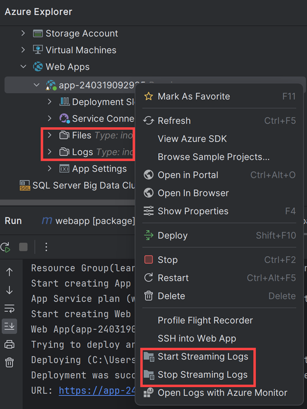
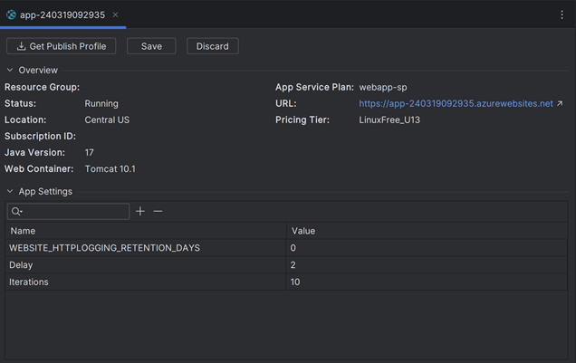
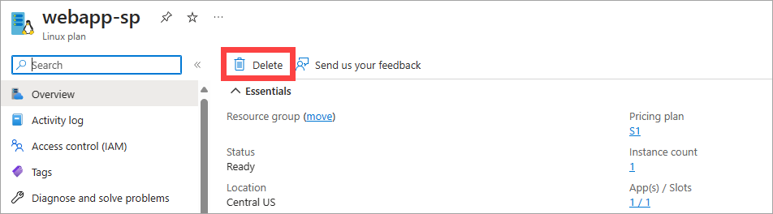

In the previous unit, you learned that the Azure Explorer in the Azure Toolkit for IntelliJ allows you to manage and configure Azure web apps. In this exercise, you'll see how to use Azure Explorer to stream logs from your web app in Azure App Service within IntelliJ IDEA.

Next, you'll modify the web app by using Azure Explorer to add a pair of properties to the configuration. You'll modify the web app to read the value of these properties and use them in the web app logic. You'll then redeploy the web app and verify that it functions as expected.

## Monitor the app with log streaming

1. In **IntelliJ IDEA**, on the **View** menu, select **Tool windows** and then select **Azure Explorer**.

1. In the **Azure Explorer** window, expand **Web Apps**, right-click your web app, then select **Start Streaming Logs**.

    

1. You'll see logs showing up in a few seconds. You can access the web app to generate some logs.

    :::image type="content" source="../media/7-log-streaming.png" alt-text="Screenshot of the web browser displaying the HTTP 403 message." loc-scope="third-party":::

1. To stop steaming logs, right-click your web app and select **Stop Streaming Logs**.

## Add configuration properties to the web app

1. In the **Azure Explorer** window, right-click the web app, then select **Show Properties**. The properties window for the web app should appear:

    

1. In the properties window, select the **Add** icon to add a new property key and value.

1. In the **Name** column of the new property, enter the name **Delay**.

1. In the **Value** column for the property, type the value **2**, then press <kbd>Enter</kbd>.

1. In the properties window, select the **Add** icon again.

1. Add another property named **Iterations**, with the value **10**.

    

1. Select **Save**.

## Modify the web app to use the properties

1. In the **Project Explorer** window, double-click the **index.jsp** to reopen it.

1. In the `<body>` section of the code for the web page, update the code as shown here:

    ```html
    <body>
        <%! int delayms = Integer.valueOf(System.getenv("Delay")) * 1000;
            int iterations = Integer.valueOf(System.getenv("Iterations"));
            DateFormat fmt = new SimpleDateFormat("dd/MM/yy HH:mm:ss"); %>
        <%  for (int i = 0; i < iterations; i++) {
            Thread.sleep(delayms); %>
            <p>Today's date is <%= fmt.format(new Date()) %></p>
        <% } %>
        <p>Your IP address is <%= request.getRemoteAddr() %></p>
    </body>
    ```

    This code reads the values of both properties, which are exposed as environment variables for the web app runtime. The code displays the date and time at **Delay** seconds intervals, looping **Iterations** times.

    > [!NOTE]
    > In this example, the code runs synchronously when it generates the output. This means it can take up to 20 seconds for the page to appear.

1. On the **File** menu, select **Save All**.

1. In the **Project Explorer** window, right-click your web app, select **Azure**, then select **Deploy to Azure Web Apps**.

1. In the **Deploy Web App** window, accept the default settings, then select **Run**. This action overwrites the existing web app with the new version.

1. In the **Azure Activity Log** window, wait until the progress column indicates that the web app has been successfully deployed.

1. Select the **Published** link in the **Azure Activity Log** window. A new browser window opens. After 20 seconds, the messages displaying the time at two-second intervals will appear, followed by the client computer's IP address.

    :::image type="content" source="../media/7-updated-web-app.png" alt-text="Screenshot of the web browser running the new version of the web app." loc-scope="third-party":::

    > [!NOTE]
    > If you attempt to browse to your website while it's still being published, you'll see an HTTP 403 error. If that happens, wait a few seconds and refresh your web browser.

1. Leave the browser window open and return to IntelliJ IDEA.

1. In the **Azure Explorer** window, right-click the web app, then select **Show Properties**.

1. In the properties window, select the **Delay** property, double-click in the **Value** field to edit it. Change the value to **1**.

1. Select the **Iterations** property and change the value to **5**.

1. Select **Save**.

1. Switch back to the web browser and refresh the display. This time, the page will display the time at one-second intervals, repeated only five times. Notice that you didn't need to redeploy the web app.

    :::image type="content" source="../media/7-modified-web-app.png" alt-text="Screenshot of the web browser running the modified version of the web app." loc-scope="third-party":::

> [!IMPORTANT]
>
> Deleting the web app using the Azure Toolkit for IntelliJ doesn't delete the app service plan, but you can remove the plan using the Azure portal. To do so, navigate to the appropriate resource group, select the app service plan, and then click **Delete**, as shown in the following image:
>
> 
