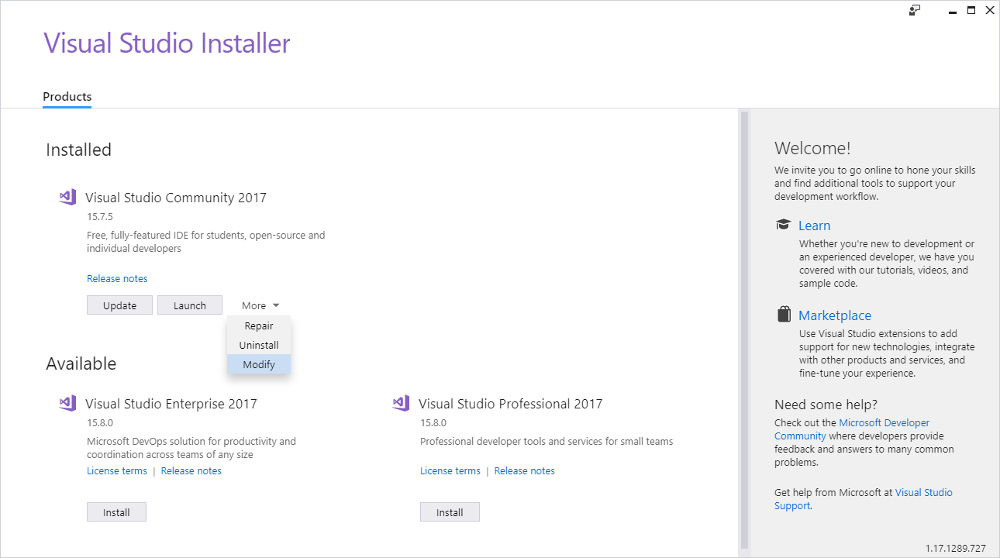
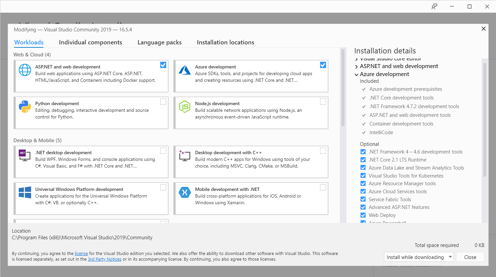

The first step in getting your new site ready is to prepare your development environment. Creating and deploying ASP.NET web applications requires that you have the necessary tools installed on your local machine. Here, we will cover the tools you need and how to install them.


Visual Studio 2017 has two workloads that you need to create, publish, and deploy your website to Azure. These workloads include all of the templates for your ASP.NET site and provide the ability to connect and deploy your site to Azure.

You need to make sure you have the following workloads installed:

- **ASP.NET and web development**: The web development workload in Visual Studio 2017 is designed to maximize your productivity in developing web applications using ASP.NET and standards-based technologies like HTML and JavaScript.
- **Azure development**: The Azure development workload in Visual Studio 2017 installs the latest Azure SDK for .NET and tools for Visual Studio. Once these items are installed, you can view resources in Cloud Explorer, create resources using Azure Resource Manager tools, build applications for Azure web and Cloud Services, and perform big data operations using Azure Data Lake tools.


You will use the Visual Studio Installer to modify the components installed as part of Visual Studio.

1. To launch the Installer, from your Windows Start menu, scroll down to **V**, and then click **Visual Studio Installer**. Alternatively, while the Start menu is open, you can just type ```Visual Studio Installer``` to find the Installer link. Then select **Enter.**

1. The Visual Studio Installer window appears. Click the **Modify** button. If that is not visible, you can select **Modify** under the **More** drop-down menu.

    

1. Ensure the **ASP.NET and web development** and **Azure development** workloads are selected under the **Web & Cloud** section of the **Workloads** tab.
    

1. Next, click the **Modify** button on the bottom right of the Installer. The Visual Studio Installer will download and install the necessary components.

1. Click **Launch** in preparation for creating your ASP.NET application in the next unit.

You can create, manage, and publish an ASP.NET website from Visual Studio 2017 with the **ASP.NET and web development** and **Azure development** workloads.
