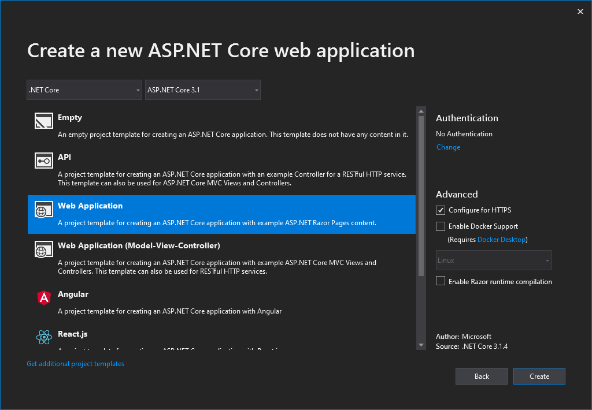
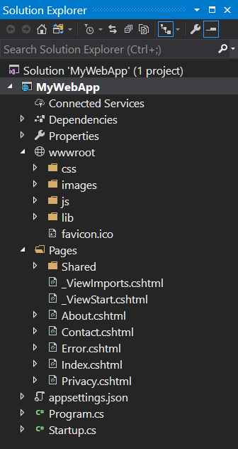
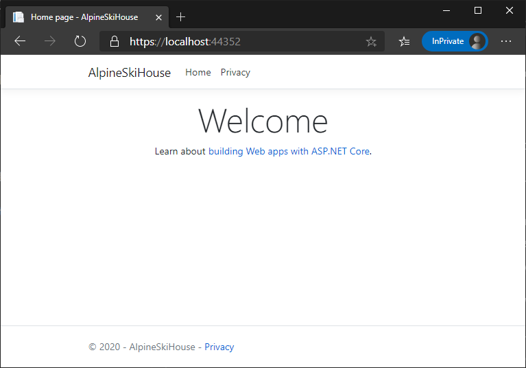

In this unit, you will create, build, and run a new ASP.NET web application on your local machine.

## Create a project

The first step is to start Visual Studio and create a local ASP.NET Core web application.

1. On the Visual Studio start page, select **File**, then click **New**, and then click **Project..**.

1. In the **New Project** dialog box, on the left-hand pane, select **Web**.

1. In the center pane, click **ASP.NET Core Web Application**.

1. At the bottom of the dialog box, in the **Name** field, enter **AlpineSkiHouse**.

1. Select a **Location** for your new solution.

1. Click the **OK** button to create your project.

1. In the **New ASP.NET Core Web Application** dialog box, you will see a selection of starting templates. For this exercise, select **Web Application**, and then click **OK** to create your project.

    

    > [!NOTE]
    > You can also select different starting templates in this dialog box depending on your web development requirements. At the top of the dialog box, you are also able to select the version of ASP.NET Core. You should select ASP.NET Core 2.0 or later.

1. You should now have your new ASP.NET Core web application solution.

    

## Build and test on your local machine

Now, let's build and test your application on your local machine before deploying to Azure.

1. Run the app

    Press <kbd>F5</kbd> to build the project and run in debug mode.

    Press <kbd>Ctrl+F5</kbd> to build the project and run without attaching the debugger.
    
    > [!TIP]
    > Launching the app in non-debug mode allows you to make code changes, save the file, refresh the browser, and see the code changes. Many developers prefer to use non-debug mode to quickly launch the app and view changes.

1. Visual Studio starts the IIS Express web browser and loads the app.

    

    When Visual Studio creates a web project, a random port is used for the web server. In the preceding image, the port number is 44381. When you run the app, you'll likely see a different port number.

    > [!IMPORTANT]
    > You might notice the section at the top of the web page that provides a place for your privacy and cookie use policy. Select **Accept** to consent to tracking. This app doesn't track personal information. The template-generated code includes assets to help meet General Data Protection Regulation (GDPR).

You've now created a web application from the sample template and it is running locally. The next step is to deploy it to Azure.

