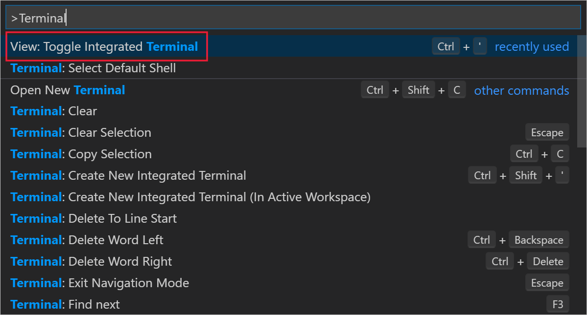
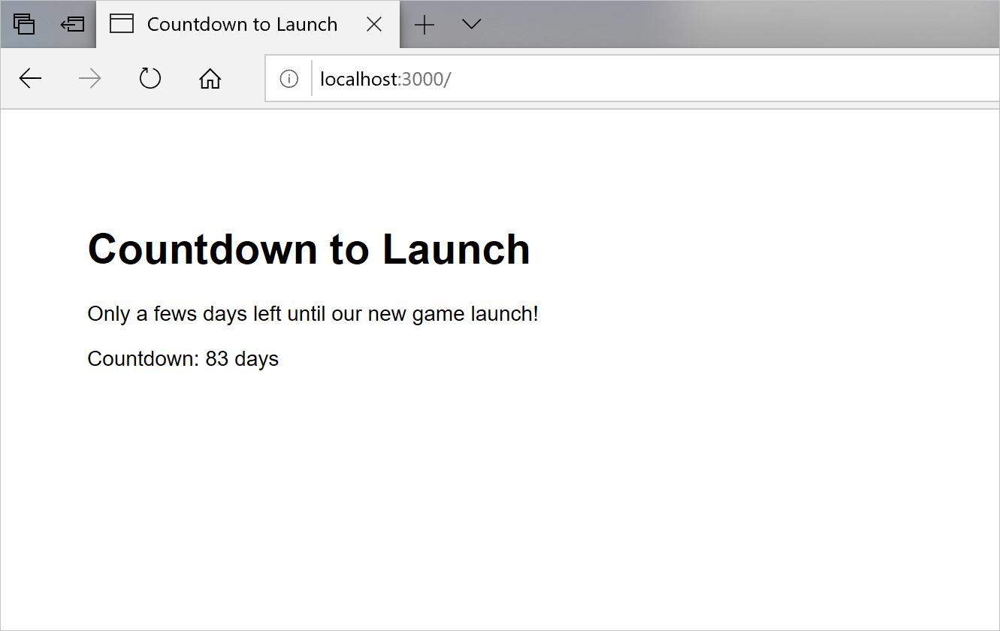

<!-- See https://review.docs.microsoft.com/en-us/learn-docs/docs/id-guidance-introductions?branch=master#use-the-standard-exercise-unit-introduction-format -->

<!-- The titles of exercise units specified in the YAML should be prefixed with "Exercise - " -->

<!-- Keep module prerequisites in mind when writing instructions for readers. Don't spend lots of words on instructions about steps that they should generally already know how to do. Focus on the configuration options and items they need to select. -->

<!-- The CLI is more time- and space-efficient for tasks that are not directly relevant to the module. For example, if your exercise requires creating an App Service web app to host an app, but the module isn't directly about creating App Service instances, strongly consider using the CLI. -->

<!-- If you have sample code, include it with the content. Assume that it will end up in a public git repo for consumption during the exercise (and write your instructions with that assumption, but leave a TODO for the repo name). The Learn team will work with you to get it into the right place.-->

<!-- Exercises should generally make use of the sandbox. See the following:
  - https://review.docs.microsoft.com/en-us/learn-docs/docs/unit-enable-azure-sandbox?branch=master
  - https://review.docs.microsoft.com/en-us/learn-docs/docs/unit-add-embedded-interactivity?branch=master

    The most important things to keep in mind are:
  - Include the proper YAML markup for the unit
  - Don't ask the user to create a resource group; use <rgn>[Sandbox resource group]</rgn> to specify the sandbox resource group name (search the repo for "<rgn>" for examples)
  - Use [Azure portal](https://portal.azure.com/learn.docs.microsoft.com?azure-portal=true) to link to the portal
  - Use the appropriate region includes (search the repo for "azure-sandbox-regions" for examples. There are four includes for different situations - the "friendly" ones are for activities in the portal as opposed to the CLI, and the "first mention" includes are to be used at the first mention of location specification in a module exercise)
  - There's also an include (azure-sandbox-activate.md) that should precede the first interactive directions that require the sandbox to have been activated
-->

<!-- Keep bulleted/numbered lists to seven items max. Break them up into groups with headers if necessary -->

With Node.js and Express.js, you can create a webapp very quickly. 

Suppose you've been asked to start building the website to promote the new video game launch. You've decided to use Node.js to run server-side code and, to make the development as quick as possible, you're going to use the Express.js framework for webapps. You want to create a quick, proof-of-concept webapp that displays a countdown to the launch date.

Here, you'll install the necessary software and then use Visual Studio Code to create and test a website.

> [!NOTE]
> You must have Visual Studio Code installed on your Windows computer before you begin this exercise.

## Install Node.js

Express.js is a webapp framework that extends the Node.js server-side JavaScript runtime. Let's start by installing Node.js:

1. Open a browser and go to the [Node.js download page](https://nodejs.org/en/download/). Download the right .msi installer for your operating system.
1. When the .msi file has downloaded, double-click on it to start the installation wizard, and then select **Next**.
1. Accept the license agreement and then select **Next**.
1. Accept the default installation location and then select **Next**.
1. Accept the default installation options, select **Next**, and then select **Install**.
1. If the **User Account Control** dialog appears, select **Yes**.
1. When the installation is complete, select **Finish**.

## Create an app folder and install Express.js

You can use Visual Studio Code to run all the commands and edit all the code for your webapp. Here, you'll use its integrated terminal to set up a folder with Express.js installed:

1. Start Visual Studio Code. 
1. To bring up the command palette, press CTRL + SHIFT + P.
1. Type **Terminal** and then select **View: Toggle Integrated Terminal**.

    

1. To check your version of `npm` type this command, and then press Enter:

    ```PowerShell
    npm --version
    ```

1. To create a new folder, type the following commands:

    ```PowerShell
    cd ~
    mkdir countdownExpressApp
    cd countdownExpressApp
    ```

1. To initialize the `npm` tool, type this command, and then accept all the defaults:

    ```PowerShell
    npm init
    ```

 1. To install Express.js, type this command:

    ```PowerShell
    npm install express --save
    ```

## Scaffold an Express.js application

Express in now installed, but you can use the Express Generator tool to create all the components of a boiler-plate webapp:

1. To check the contents of the folder, type this command:

    ```PowerShell
    ls
    ```

1. To run the Express Generator, use this command:

    ```PowerShell
    npx express-generator
    ```

1. To see the default Express.js scaffolding, type this command:

    ```PowerShell
    ls
    ```

## Calculate the countdown

You now have a functional webapp that Node.js can run. Let's modify its code to calculate the amount of time to display:

1. To edit the **index.js** file in Code, type the following commands:

    ```PowerShell
    cd routes
    code ./index.js
    ```

1. Add the following code, immediately after the `var router = express.Router();` line. In the first line of the inserted code, use a date around a month in the future:

    ```JavaScript
    var launchTime = new Date("January, 1, 2020").getTime();
    var currentTime = new Date().getTime();
    var numberOfMilliseconds = parseInt(launchTime - currentTime);
    ```

1. Locate this line of code:

    ```JavaScript
    res.render('index', { title: 'Express' });
    ```

1. Replace that line with this line of code:

    ```JavaScript
    res.render('index', { title: 'Countdown to Launch', countDown: numberOfMilliseconds });
    ```

1. On the **File** menu, select **Save**, then close the **index.js** file.

## Render the countdown 

Now, modify the default homepage for the webapp to display the countdown:

1. In the Code integrated terminal, to edit the **index.jade** view, type these commands:

    ```PowerShell
    cd ../views
    code ./index.jade
    ```

1. Locate the following line of code:

    ```jade
    p Welcome to #{title}
    ```

1. Replace that line with this code:
  
    ```jade
    p Only a fews days left until our new game launch!
    ```

1. Add this new line of code at the end of the file:

    ```jade
    p Countdown: #{countDown} milliseconds
    ```

1. On the **File** menu, select **Save** and then close the **index.jade** file.

## Run the webapp

Now the app is complete, let's run it on your local computer and see if it shows the countdown:

1. In the Code integrated terminal, to install the webapp's dependencies, type these commands:

    ```PowerShell
    cd ..
    npm install
    ```

1. To run the webapp on your local computer, type this command:

    ```PowerShell
    npm start
    ```

1. Open a web browser and navigate to the address **http://localhost:3000**.

    

1. Close the web browser and then, in the Code integrated terminal, press CTRL-C to stop the webapp.
