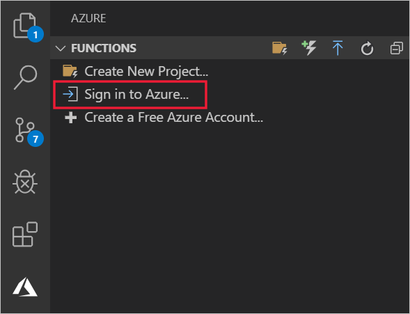
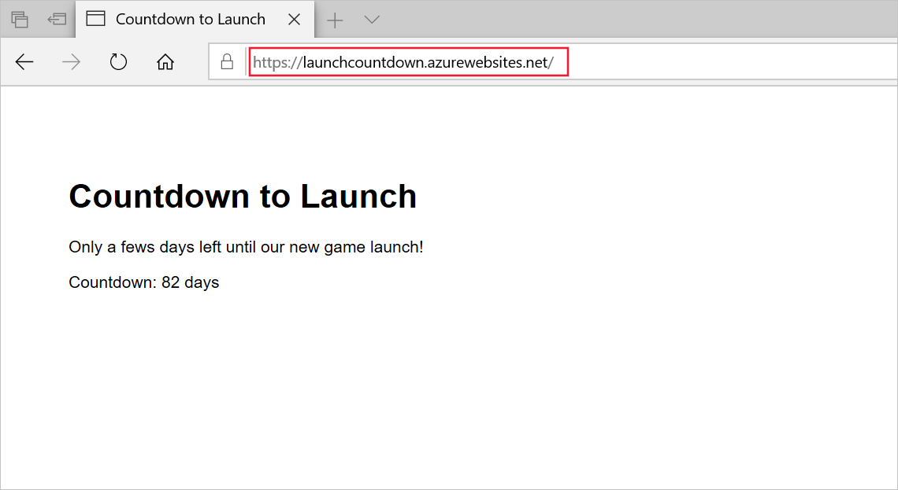

In Visual Studio Code, you can use the Azure App Service extension to create and deploy webapps to Azure.

Suppose you have started to create the new website that will promote the new video game launch. The new site has been written in JavaScript and uses Node.js and Express.js. You've decided that the completed website will be hosted in Azure App Service. Now, you want to create that instance of App Service and deploy the first version of the website to it.

In this unit, you'll use VS Code to deploy the Express.js site, which you created in the last exercise, to Azure.

## Install the Azure App Service extension in VS Code

The **Azure App Service** extension is not installed by default in VS Code. Let's start by installing it:

1. In VS Code, on the **View** menu, select **Extensions**.
1. In the **Search Extensions in Marketplace** textbox, type **Azure App Service**, and then select the **Azure App Service** extension.

    

1. Select **Install**.

## Sign in to your Azure account through the Azure explorer

To view and make changes in your Azure subscription, first authenticate yourself:

1. In VS Code, to open the **Azure** explorer, on the **View** menu, select **Open View...** and then select **Azure**.
1. In the **AZURE** explorer, select **Sign in to Azure...**.

    

1. Sign in with the same credentials you used to set up the sandbox and then close the browser page.

## Create a new Azure App Service Web App by using the Azure App Service extension

Now that the extension is installed, we can use it to create an instance of App Service, as well as a resource group, and a service plan, in your subscription:

1. In VS Code, in the **Azure** explorer, under **APP SERVICE**, select the **Concierge Subscription**.
1. Right-click the **Concierge Subscription**, and then select **Create new web app... (Advanced)**.
1. In the first page of the **Create new web app** wizard, type a globally unique name for the app, such as **LaunchCountDown&lt;your initials&gt;**, and then press Enter.

    

1. Select the resource group **<rgn>[sandbox resource group name]</rgn>**, select **Linux**, and then select **Node 12 LTS**. 
1. Select **Create new App Service plan** and name the new plan **LaunchCountDownPlan**.
1. Select the **F1 free** tier and skip creating a new Application Insights resource.
1. Select the **Central US** region. VS Code creates an App Service plan and webapp in your Azure subscription.

## Deploy the Express.js webapp to Azure App Service

Now, you can deploy your Express.js site to Azure:

1. In VS Code, in the **Azure** explorer, right-click the webapp you created, and then select **Deploy to Web App**.
1. Click **Browse**, locate the **countdownExpressApp** folder in your home folder, and then click **Select**.
1. If you are asked if you would like to update your workspace configuration, select **No, and don't show again**.
1. If you are asked if you are sure, click **Deploy**. If you are asked if you always want to deploy this workspace to App Service, click **Yes**.
1. When the deployment is complete, select **Browse Website**, and then select **Open Link**. Then Azure website is displayed in your browser. Notice that the website is hosted in the **azurewebsites.net** domain.

    
