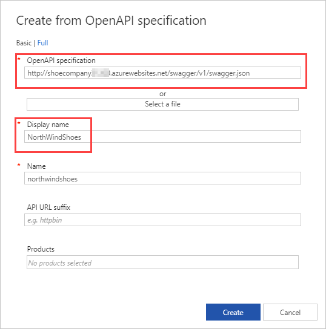

To make an API available through an API gateway, you need to import and publish the API.

In the shoe company example, NorthWind Shoes wants to enable selected partners to be able to query inventory and stock levels.

Here, you'll learn how to import an API into Azure API Management, and how to make an API available to clients.

## API

An API is a standardized way for organizations to expose specific data to potential developers or partners. For example, in the previous exercise you created an API to share information about products and inventory.

Making an API available starts with importing the API into API Management. You can then:

- Use the visualization tools in the API gateway to test out your API.
- Manage access to your APIs using policies.

## API frameworks

There are various API frameworks and standards. API Management provides you with several options for importing APIs.

|Type  |Details |
|---------|---------|
|**HTTP**|You can import an HTTP API with a blank API definition. You then manually specify all the required parameters. |
|**WebSocket**| Set up pass-through to a backend WebSocket service.  |
|**GraphQL**| Set up pass-through to a backend GraphQL service, or import a GraphQL schema and create a synthetic GraphQL API with custom field resolvers. |
|**OpenAPI**|OpenAPI is a specification that documents all the endpoints and operations for RESTful APIs, and all input and output parameters. OpenAPI was originally called Swagger.|
|**WADL**| Web Application Description Language is an XML description of HTTP-based web services. It's a simpler format and more lightweight than WSDL.|
|**WSDL**| Web Service Description Language is an XML description of any network service, not just HTTP.|

You can also import APIs from several backend Azure resources.

|Type  |Details |
|---------|---------|
|**Logic App**| Logic apps are used to orchestrate and automate workflows and integrations with various data sources.|
|**App Service**|An API hosted within an app service in Azure.|
|**Function App**|Serverless code that can be called through triggers.|
|**Container App**|Serverless containers for microservices.|

## Import an API

There are several ways to import an API into Azure API Management.

Using the Azure portal, you select **APIs**, and then **+ Add API**. You start by selecting the API type you'd like to import.

:::image type="content" source="../media/4-apim-import.png" alt-text="Screenshot of Azure portal showing API Management service with the APIs section highlighted and selected.":::

You then provide a link to your API specification as a URL or file, and a name for the API. Here's an example for an OpenAPI import.

The Azure portal isn't the most efficient tool for importing and configuring large numbers of APIs. As you scale up your API management, you'll need other tools, such as the Azure CLI, Azure Resource Manager or Bicep templates, or Azure PowerShell. For example, you can use Azure PowerShell cmdlets for deploying API gateways, defining and configuring products, importing APIs, and managing users and subscriptions.

## Visualize

You can use the API gateway as a way to visualize how data is processed through your imported APIs. You can interact with datasets, and pass parameters through your APIs.

If you're an administrator, you can visualize APIs in the Azure portal.

:::image type="content" source="../media/4-apim-azure-portal-visualize.png" alt-text="Screenshot of Azure portal API configuration showing a highlighted GET request test on an imported API.":::

## Policies

Policies provide powerful capabilities to change the behavior of an API through configuration. They exist as a collection of statements that are executed sequentially on the request or response of an API.

Popular configurations include:

- Conversion from XML to JSON
- Call rate limiting to restrict the number of incoming calls.
- Setting inbound and outbound headers

You use the Azure portal to apply different policies to APIs. Policies can be viewed in the **Design** tab.

:::image type="content" source="../media/4-policies-1.png" alt-text="Screenshot of Azure portal showing API configuration for all operations with base policies highlighted for inbound, outbound, and backend sections.":::

You can also use the **Design** tab to add new policies.

:::image type="content" source="../media/4-policies-2.png" alt-text="Screenshot of Azure portal showing inbound policy options for API configuration.":::

## Product

A product is a collection of APIs. You can assign APIs to more than one product. For example, you might want one product, **NorthWindShoesPartners**, to expose two APIs for your partners:

|Product  |NorthWindShoesPartners |
|---------|---------|
|API 1     |    **Inventory**     |
|API 2     |  **Planning**       |

For your suppliers, you might only want to expose one API:

|Product  |NorthWindShoesSuppliers |
|---------|---------|
|API 1     |    **Inventory**     |
|API 2     |         |

You assign policies so that your products can have different access rules, usage quotas, and terms of use. So if you want your partners and suppliers to have different access rights to your **Inventory** API, assign the API to two different products.

You use the Azure portal to associate APIs with a product.

:::image type="content" source="../media/4-apim-products.png" alt-text="Screenshot of Azure portal showing API Management with products section highlighted.":::

For all pricing tiers except Consumption, there are two default products: **Starter** and **Unlimited**. The Unlimited product is designed for production API management, as it has no restrictions on the number of attached APIs. You can create as many new products as you need. The Starter product has a limit of five API calls/minute, and a maximum of 100 API calls/week.
