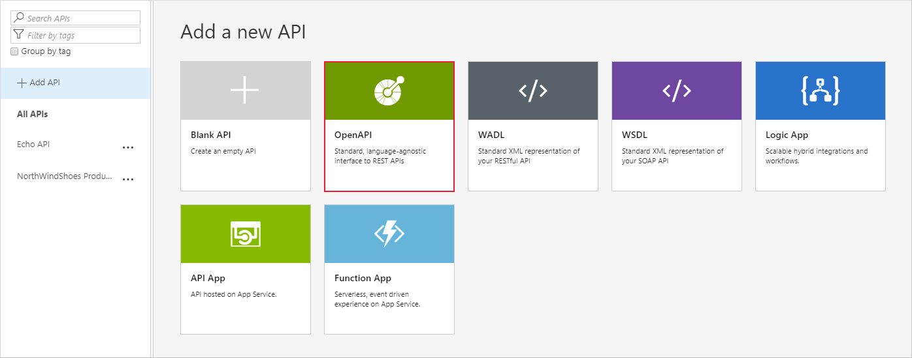

 Now that you've set up a gateway, you're ready to import and publish an API so that partners can access inventory and product information.

Here, you'll import your web API that exposes an OpenAPI endpoint. You'll test the imported API using visualization, and then publish the API.

 > [!NOTE]
 > This exercise uses the resources that you set up in the previous exercise.

## Import the API

The first part of the exercise is to import the NorthWind Shoes API into an API Management gateway.

1. In the Azure portal resource menu or from the **Home** page, select **All Resources**, and then select your API Management service.

1. In the API Management service menu, under **APIs**, select **APIs**, and then **+ Add API**.

1. Under **Create from definition**, select **OpenAPI**. The **Create from OpenAPI specification** pane appears.

   

1. In the OpenAPI specification window, complete the following settings:
 
    | Setting | Value |
    | --- | --- |
    | OpenAPI specification | Paste the Swagger JSON URL that you saved from the previous exercise. |
    | Display name | Accept the default, which should be `NorthWindShoes Products`. |
    | Name | Accept the default, which should be `northwindshoes-products`. |
    | API URL suffix | Ignore this setting.|
    | Base URL | Accept the default. |

   > [!NOTE]
   > You'll notice that by entering the JSON URL, several other fields auto-populate for you. This is because we have used OpenAPI, which specifies all of the required connection details.

1. Select **Create**. The **apim-NorthwindShoesNNNN | APIs** pane displays all of the operations for the NorthWindShoes Products API.

## Visualize the API

The last part of the exercise is to test the API and visualize the results using two tests. First, issue a basic GET request, passing in a single parameter.

1. On the **apim-NorthwindShoesNNNN | APIs** pane, select the NorthWindShoes Product API, and then select the **Test** tab.

1. Select the first GET operation, **Find the details of the specified product**. The details appear in the test console.

1. Under **Template parameters**, enter a numerical value for the product ID parameter.

   :::image type="content" source="../media/5-test-with-param.png" alt-text="Test pane with product ID value highlighted." lightbox="../media/5-test-with-param.png":::

1. Scroll down and note that the **Request URL** includes the `/api/Products/{productid}` suffix.

1. Select **Send**.

   You should get a **200 OK** response to the GET request, and details about the product ID you entered.

   Now, test using a basic GET request without any parameters.

1. Select the third GET operation, **Retrieve the entire product inventory for the company**, and make sure the **Test** tab is selected.

   :::image type="content" source="../media/5-test-without-param.png" alt-text="Test pane with third GET request." lightbox="../media/5-test-without-param.png":::

1. Scroll down and note that the **Request URL** includes the `/api/Inventory` suffix.

1. Select **Send**.

   You should get a **200 OK** response to the GET request, and details of the inventory (stock level) for all products in the payload.
