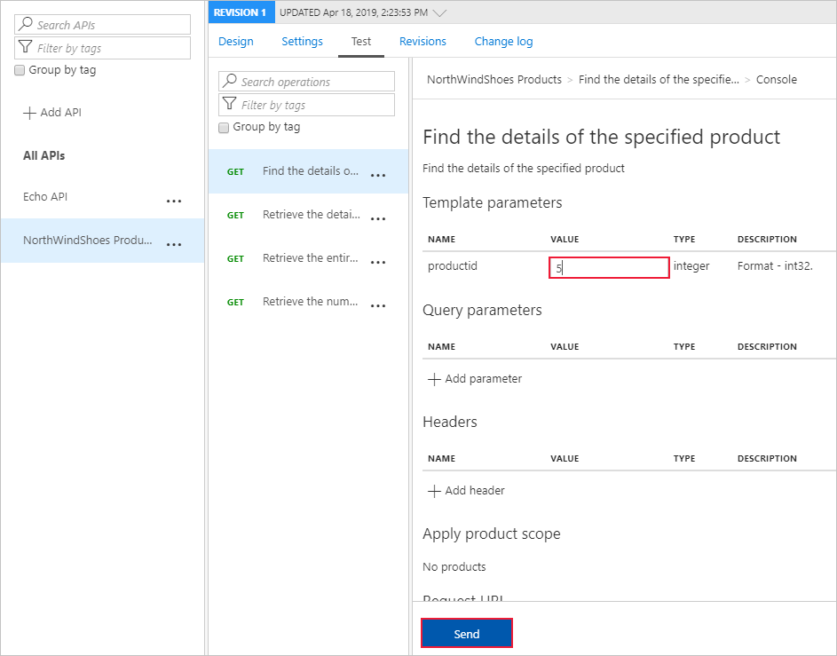

To share an API, you import the API into API Management, and then make it available by publishing it.

In the shoe company example, you're now ready to import and publish an API so that partners can access inventory and product information. 

Here, you'll import an API that exposes an OpenAPI endpoint. You'll test the imported API using visualization, and then publish the API.

## Import the API

The first part of the exercise is to import Northwind Shoes into an API Management gateway.

1. Sign into the [Azure portal](https://portal.azure.com/learn.docs.microsoft.com?azure-portal=true) using the same account you activated the sandbox with.
1. On the Azure portal menu or from the **Home** page, select **All Resources**, and then select your API gateway.
1. Under **API management**, click **APIs**.
1. On the **Add a new API** page, click **OpenAPI**.

   
1. On the **Create from OpenAPI specification** page, in the **OpenAPI specification** box, paste the swagger JSON URL that you saved at the end of the first exercise.
   > [!NOTE]
   > You'll notice that when you tab out of the box, some of the other fields will be populated for you. This is because we have used OpenAPI which specifies all of the required connection details.
1. Add **Display Name**.
1. Click **Create**.

## Visualize the API

The last part of the exercise is to test the API and visualize the results using two tests. You'll first issue a basic GET request passing in a single parameter.

1. On the API details page, click **Test**.
1. Click the first test, **Find the details of the specified product**.
1. Under **Template parameters**, type a number into the **Value** box.

   
1. Scroll down and note that the **Request URL** includes the `/api/Products/{productid}` suffix.
1. Click **Send**. 
1. You should get a **200 OK** response to the GET request, and details of all products in the payload.

Now, test using a basic GET request without any parameters.

1. Click the third test, **Retrieve the entire product inventory for the company**.

   
1. Scroll down and note that the **Request URL** includes the `/api/Inventory` suffix.
1. Click **Send**.
1. You should get a **200 OK** response to the GET request, and details of the inventory (stock level) for your product in the payload.
