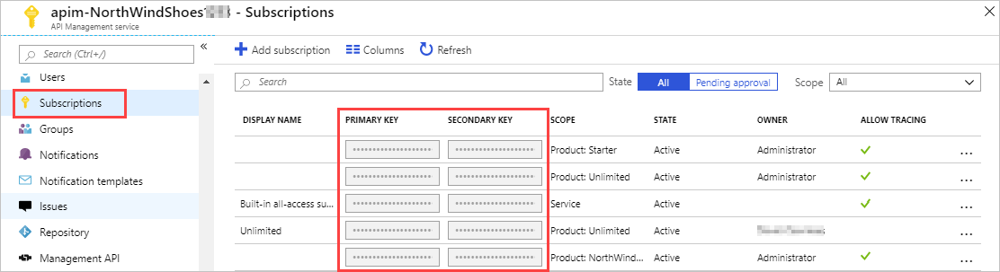

When you publish an API, you often want some level of control over who can access the API through the gateway. Subscription keys are used to restrict access to an API.

Here, you'll learn how to use subscription keys to secure your APIs.

## Subscriptions and keys
To protect your APIs, you can use a subscription key.

A subscription key is a unique auto-generated string which needs to be passed through in the headers of the client request. The key is directly related to a subscription which can be scoped to different areas, this gives granular control over permissions and policies. The three main subscription scopes are:

- All APIs
- A Single API
- A product

Applications that call a protected API must include the key in request calls.

You can regenerate these subscription keys at any time, for example, if you suspect that a key has been shared with unauthorized users.



Every subscription has two keys, a primary and a secondary. Having two keys makes it easier when you do need to regenerate a key. For example, if you want to change the primary key and avoid downtime, use the secondary key in your apps.

For products where subscriptions are enabled, you must supply a key when making calls to APIs in that product. As a developer, you can obtain a key by submitting a subscription request. This is a core part of the APIM workflow.

 > [!NOTE]
> Creating new users and giving them their subscription keys so they can access the API is a core part of the APIM workflow, but is outside the scope of this module.

## Call an API with the subscription key

Applications must include a valid key in all HTTP requests when they make calls to API endpoints that are protected by a subscription. Keys can be passed in the request header, or as a query string in the URL.

The default header name is **Ocp-Apim-Subscription-Key**, and the default query string is **subscription-key**. 

To test out your API calls, you can use the developer portal, or command-line tools, such as **curl**. Here's an example of a GET request using the developer portal, showing the subscription key header.

:::image type="content" source="../media/6-key-header-portal.png" alt-text="Call API from developer portal." loc-scope="other":::

Here's how you can pass a key in the request header using **curl**:
   ```bash
   curl --header "Ocp-Apim-Subscription-Key: <key string>" https://<apim gateway>.azure-api.net/api/path
   ```
Here's an example **curl** command that passes a key in the URL as a query string:
   ```bash
   curl https://<apim gateway>.azure-api.net/api/path?subscription-key=<key string>
   ```
If the key is not passed in the header, or as a query string in the URL, you'll get a **401 Access Denied** response from the API gateway. 
