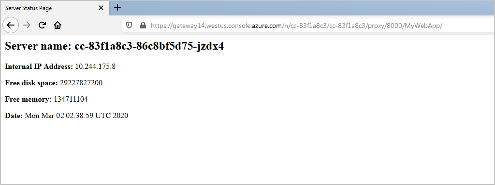

In the previous exercise, you learned how to configure your web app to use the Maven Plugin for Azure App Service. Your Maven project is properly configured and tested, and you can iterate, improve, and then redeploy your app to Azure. For example, let's say you want to retrieve some specific details about where Azure has deployed your application code and redeploy your web app.

In this exercise, you'll update the `index.jsp` page for your web app to include some information about the server. After testing those changes locally, you'll redeploy your web app to Azure.

## Update and test your web app

1. Use `code` to edit your `index.jsp` page.

    ```bash
    code ~/MyWebApp/src/main/webapp/index.jsp
    ```

1. Replace the contents of this file with the following HTML and inline Java code:

    ```html
    <%@ page import = "java.io.*,java.util.*, javax.servlet.*, java.net.InetAddress, java.io.File" %>
    <html>
    <head><title>Server Status Page</title></head>
    <body>
        <h2>Server name: <% out.print(InetAddress.getLocalHost().getHostName());%></h2>
        <p><strong>Internal IP Address:</strong> <% out.println(InetAddress.getLocalHost().getHostAddress()); %></p>
        <p><strong>Free disk space:</strong>
            <%
                File file = new File("/");
                out.println(file.getFreeSpace());
                file = null;
            %>
        </p>
        <p><strong>Free memory: </strong>
            <% 
                out.println(Runtime.getRuntime().freeMemory());
            %>
        </p>
        <p><strong>Date: </strong>
            <%
                Date date = new Date();
                out.print(date.toString());
                date = null;
            %>
        </p>
    </body>
    </html>
    ```
1. Save your changes by typing <kbd>Ctrl</kbd>+<kbd>S</kbd>.

1. Quit the code editor by typing <kbd>Ctrl</kbd>+<kbd>Q</kbd>.

1. You'll need to open a port to make the local web server available to view in a browser. In the cloud shell, use `CURL`.

    ```bash
    curl -X POST http://localhost:8888/openPort/8000;
    ```
1. Run the app locally with the following Maven command.

    ```bash
    mvn tomcat7:run
    ```

1. Open a new browser tab using the URL in the JSON, appending `MyWebApp/`. You should see the new Server Status page.

    

1. Visit the deployed app by selecting the URL in the shell to see the deployed app running on App Services.

1. Close the open port using `CURL`.

    ```bash
    curl -X POST http://localhost:8888/closePort/8000;
    ```

## Redeploy your web app

 1. Rebuild and redeploy the app.

    ```bash
    mvn clean package
    mvn azure-webapp:deploy 
    ```
1. You'll see this console output showing that the deployment used the new authentication configuration.

    ```console
    [INFO] Scanning for projects...
    [INFO]
    [INFO] ------------------------------------------------------------------------
    [INFO] Building MyWebApp Maven Webapp 1.0-SNAPSHOT
    [INFO] ------------------------------------------------------------------------
    [INFO]
    [INFO] --- azure-webapp-maven-plugin:1.9.0:deploy (default-cli) @ MyWebApp ---
    [INFO] [Correlation ID: 3e5cf479-6732-4c6a-96da-88044cdadcc0] Instance discovery was successful
    [INFO] Updating app service plan
    [INFO] Updating target Web App...
    [INFO] Successfully updated Web App.
    [INFO] Using 'UTF-8' encoding to copy filtered resources.
    [INFO] Copying 1 resource to /home/~/MyWebApp/target/azure-webapp/MyWebApp-1570214065588
    [INFO] Trying to deploy artifact to MyWebApp-1570214065588...
    [INFO] Deploying the war file MyWebApp.war...
    [INFO] Successfully deployed the artifact to https://MyWebApp-1570214065588.azurewebsites.net
    [INFO] ------------------------------------------------------------------------
    [INFO] BUILD SUCCESS
    [INFO] ------------------------------------------------------------------------
    [INFO] Total time: 19.448 s
    [INFO] Finished at: 2019-10-09T12:00:15+00:00
    [INFO] Final Memory: 40M/324M
    [INFO] ------------------------------------------------------------------------
    ```

1. Visit the deployed app by selecting the URL in the shell.

    :::image type="content" source="../media/6-web-app-on-tomcat-server.png" alt-text="Example web app running on Tomcat in a web browser." loc-scope="other"::: <!-- no-loc -->

## Stream logs in real time

1. Now you have your app deployed and running on App Service. In case for troubleshoot, you can use the simple Azure CLI command to get real time log streaming from the app:

    ```azcli
    az webapp log tail -n <app name> -g <sandbox resource group name>
    ```
In the next unit, you'll learn how to authenticate your web app deployments to Azure App Service.
