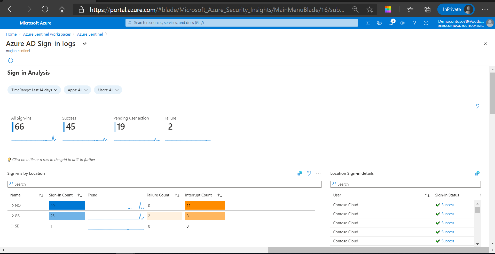
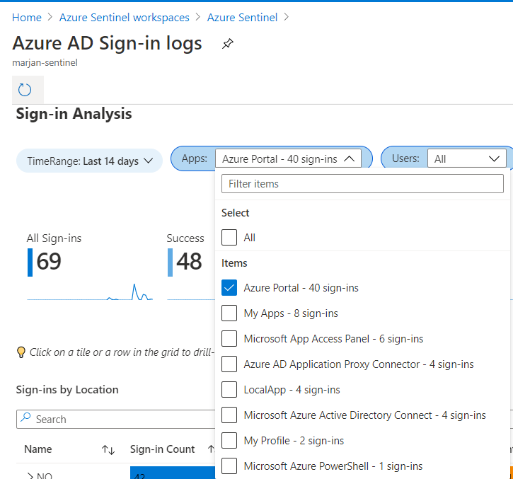
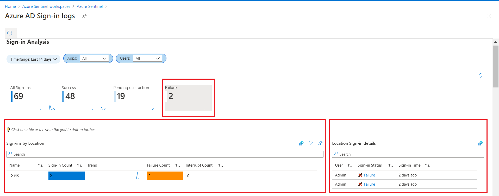
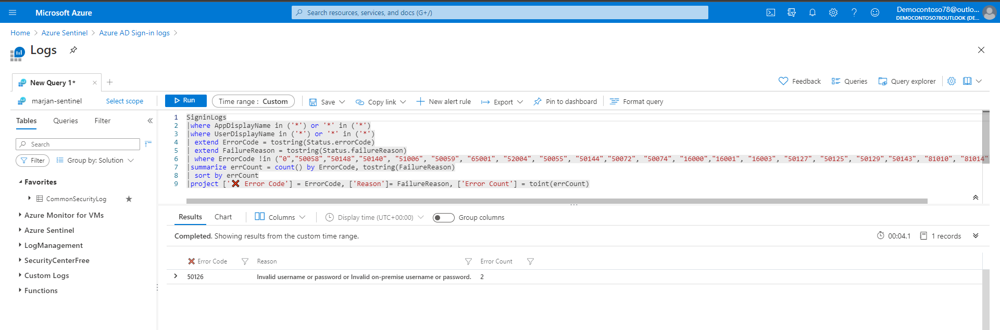

Azure Sentinel provides several templates that are ready for use. You can use these templates to create your own workbook and then  modify them as needed for Contoso.

## Azure Sentinel workbooks

Most of the data connectors Azure Sentinel uses to ingest data come with their own workbooks. You can get better insight into the data that is being ingested by using tables and visualizations, including bar and pie charts. You can also make your own workbooks from the beginning instead of using the predefined templates.

## Workbook page

You can access the **Workbook** page from the Azure Sentinel from the navigation pane on the left.

The **Workbook** page consists of the:

- Workbook header. You can add a new workbook and review the saved workbooks and templates that are available on the **Workbook** page.
- Templates section. You can access existing workbook templates on the **Templates** tab. You can save some of the workbooks for quick access and they will appear on the **My workbooks** tab.

From the **Templates** page, you can select an existing workbook to display a details pane on the right, which contains additional information for the templates. The details pane also contains information about the required data types and data connectors that must be connected to Azure Sentinel. You can also review how the report will display.

## Review an existing workbook template

As mentioned earlier, Contoso is concerned about compromised identities. As the security administrator, you can examine the existing **Audit AD Sign-in logs** workbook by selecting the template in the template section, and then selecting **View template** in the details pane. 

The **Azure AD Sign-in logs** workbook contains predefined charts, graphs, and tables that can provide important insight about the sign-in activity in Azure AD. You can find information about user sign-ins and locations, email addresses, and IP addresses of your users. In addition, you can also review information about failed activities and the errors that triggered the failures.

On the **Azure AD Sign-in logs** page, you can expand the time range or filter the apps and users that have sign-in privileges in the Azure AD. For example, Contoso wants to identify users that have the ability to sign-in to the Azure portal, so they can filter the data as displayed in the following screenshot:

Contoso is interested in identifying the failed sign-in attempts, so that they can display these accounts by selecting the information tiles, and then selecting a tile or a row to display more information such as: 

- **Sign-in Location**. This section indicates the location from which the user signed in to Azure AD.
- **Location Sign-in details**. This section on the right displays the users, their sign-in status, and the time of the sign-in attempt.
- **Sign-ins by Device**. This section lists devices used by the users to sign-in in Azure AD.
- **Device Sign-in details**. This section displays the users that signed in on a particular device and the time they signed in.

This information tile in the background is configured to run the query and filter the data collected from the Azure AD connector. Azure Sentinel then visualizes and presents the data collected with tables that are more meaningful and provide useful insight on user sign-in attempts.

 

The workbook contains additional tiles that indicate the users who signed in using conditional access. From the **Conditional access status** table, you can review users who required multifactor authentication (MFA) to validate their identity.

The rest of the page also contains tables and charts that are interactive and by selecting some of the rows or tiles, you can filter the data that is presented. Some tables are created with links to corresponding logs as displayed in the following screenshot:

> [!Note]
You can also pin the query step in the private or shared dashboard for quick retrieval.

## Edit the query from the workbook

For example, Contoso wants to search the logs for more information that presents the failed user sign-in and they are redirected to the Azure Data Explorer, where Azure Sentinel performs the log query to filter the information.

## Explore saved workbooks

From the **Templates** page, you can save <!--Azu, we can save the templates without opening.--> a workbook from existing templates by selecting one of the templates, and then selecting **Save.** You must provide a location to indicate where you want to save the workbook. This creates an Azure resource based on the template with template&#39;s JSON file.

Saved workbooks are available on the **My Workbooks** tab, and you can further customize them. You can open saved workbooks by selecting **View saved workbook**. This opens the same page as the template workbook page, but you can customize this one based on Contoso's requirements.

You can select **Edit** to open the workbook in the edit mode, where you can add or remove items and provide additional customization. The editing mode displays all content in the workbook, including steps and parameters that would be hidden in the reading mode.

The header bar in the editing mode contains several options, which the following screenshot depicts.

When you switch to the editing mode, you will notice a number of **Edit** options that appear on the right, which correspond to each individual aspect of your workbook.

If you select one of those edit options, you can examine the query that Azure Sentinel uses to filter the data from the corresponding log. 

When you select the gear icon, the **Settings** page opens, where you can provide additional resources that you want to use in the workbook. You can also change the style of the workbook, provide tagging, or pin an item in the workbook.

You can rearrange the placement of different tables in the workbook by selecting **Show Pin Options**.

For advanced customization, you can select **Advanced Editor** to open the JSON representation of the current workbook, and then further customize it in the text editor as the following screenshot displays.

You can save your changes in the existing workbook or save as another workbook. When you are done with all the customization, you can exit the edit mode by selecting **Done Editing**.

## Explore the Azure Sentinel repository on GitHub

The Azure Sentinel repository contains out-of-the-box detections, exploration queries, hunting queries, workbooks, playbooks and much more to help you secure your environment and detect threats. Microsoft and the Azure Sentinel community contribute to this repository.

The repository contains folders with contributed content for several areas of Azure Sentinel functionality, including detection queries. You can use the code from these queries to create custom queries in your Azure Sentinel workspace.
