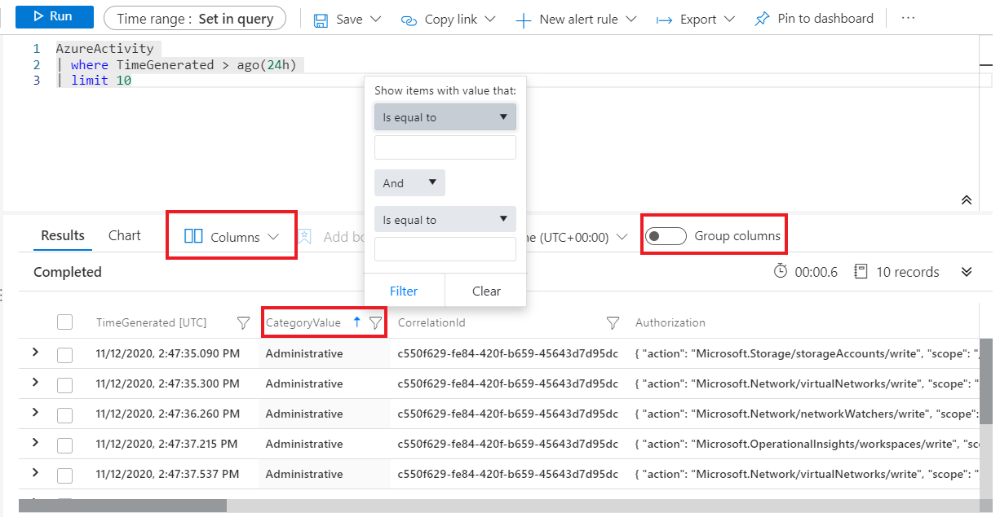
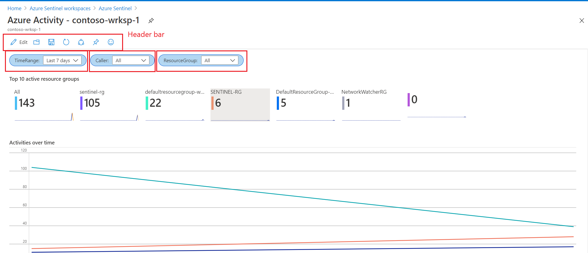

**Exercise**

**Task 1: Work with Logs in Azure Sentinel**

1. In the Azure portal, search for and select Azure Sentinel and select the previously created Sentinel workspace.
2. In the **Azure Sentinel** page, on the left side in the menu bar, in the **General** section, select **Logs.**
3. In the **Azure Sentinel | Logs** page in the **Tables** pane, from the **Group by: Solution** drop-down menu, select **Category.**

> [!Note]

> When you open the **Logs** page for the first time, you may be redirected in the **Queries** window. Close the **Queries** windows and return in the **New Query 1** section.

4. In the **Tables** list, expand **Azure Resources** category, and move the mouse over **Azure Activity** table, and then select **Preview data.**
5. In the **AzureActivity** window select **See in query editor.** This can be useful to ensure that this is the data that you&#39;re expecting before you actually run a query with it.


6. In the Query section, you can observe the query structure. This query will search and present the last 10 events from the Azure Activity log. The first raw in the query, **AzureActivity** specify the table used in the query. The second line contains a **where** statement, which filters the records from the last day. The third contains another statement **where,** to filter only the last 10 events.
7. The query results section present the results of the query. You can expand any of the records, to view the values from the table. Click on the name of any column to sort the results by that column. Click on the filter icon next to it to provide a filter condition. This is similar to adding a filter condition to the query itself except that this filter is cleared if the query is run again. If you select **Columns** drop-down menu, you can filter which column from the table to be presented. By selecting **Group columns** , you can group records by a particular column.



5. Click on  **Queries**  in the left pane. This pane includes example queries that you can add to the query window. If you&#39;re using your own workspace, you should have a variety of queries in multiple categories, but if you&#39;re using the demo environment, you may only see a single  **Log Analytics workspaces**  category.

> [!Note]

> You can try to practice writing queries in the following [Demo environment](https://ms.portal.azure.com/#blade/Microsoft_Azure_Monitoring_Logs/DemoLogsBlade).

**Task 2: Work with Workbooks in Azure Sentinel**

1. In the **Azure Sentinel** page, on the left side in the menu bar, in the **Threat Management** section, select **Workbooks.**
2. In the **Azure Sentinel | Workbooks** page, select **Templates** tab.
3. In the **Search** field type and select **Azure Activity.**
4. In the detailed pane on the right side, review the information provided for the template and select **Save.** In the **Save workbook to…** window select the same location that you select in the preparation exercise and then select **OK.**
5. In the **Azure Sentinel | Workbooks** page, select **My workbooks** tab. From the list of saved templates select **Azure Activity** and then from the detailed plane select **View saved workbook.**
6. In **Azure Activity-** _sentinelname_ page review all the element of the workbook.
7. You can interact with the workbook by selecting some of the elements.
8. Select the **Time range:** field to select different time range of the records presented from **Azure Activity** table. Select **Caller:** drop down menu to filter the records based on the user or service that generate the events. Select **Resource Group:** drop down menu to filter the events based on specific resource group.



9. Scroll down to the **Caller activities** table, that shows activities run from your users or security principals. By clicking on every column, you can sort the results presented in the table.
10. Scroll up to the header bar in the **Azure Activity-** _sentinelname_ page. Select the **Edit** button, to switch the workbook in the editing mode. Notice on the right side of the page, several **Edit** buttons appear.
11. Select the first **Edit** from the top. That will bring editing pane for one of the steps in the workbook. You can further customize the presentation of the elements, by adjusting the style, reordering them in different order.
12. You can add additional parameters with different types, such as text, drop down, multi-values or similar.
13. Select **Add parameter.**
14. In the **New Parameter** page, enter the following values:

|||
| --- | --- |
| **Parameter name*** | Level |
| **Display name** | Level |
| **Parameter type** | From the drop-down menu select **Drop down** |
| **Required?** | Select checkbox |
| **Allow multiple selections** | Select checkbox |
| **Limit multiple selections** | Do not select this checkbox |
| **Delimiter** | Leave default |
| **Quote with** | Leave default |
| **Explanation** | This parameter will filter the events based on level |
| **Hide parameter in reading mode** | Do not select this checkbox |
| **Get data from** | Query |

1. In the **Log Analytics workspace Logs Query** section type the following query and then select **Run Query.**

```kusto
AzureActivity

|summarize by Level
```

17. Confirm that the query result return two type of events based on the level: **Informational, Warning.**


18. Select **Save,** to commit the changes in the step.
19. Notice that the parameter step now includes one additional parameter name, called **Level.**
20. When you done all the changes in the step select **Done Editing.**
21. If you select the three dots right from the **Edit** button, the new drop-down menu will appear. From that menu, you can move this step, in different part of the workbook. You can also clone or remove the step from the workbook.
22. From the header bar select the icon to **Save as** the customized workbook.
23. In the title provide name for the new workbook and then select **Save.**
24. Your new workbook will be created in the **My workbooks** tab. If you don&#39;t see as listed, select **Refresh** button.
