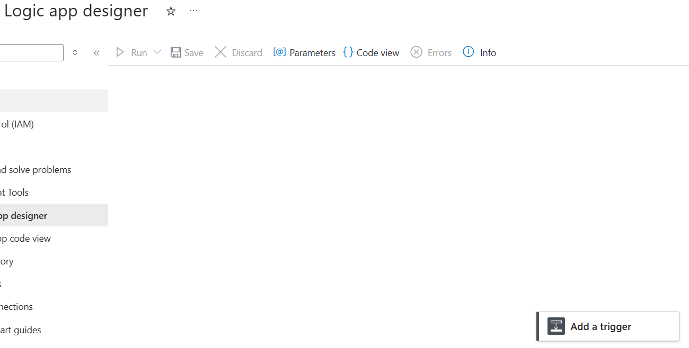
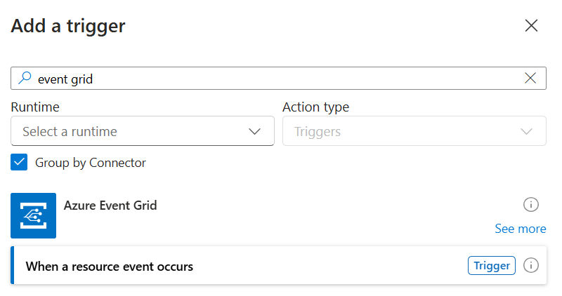
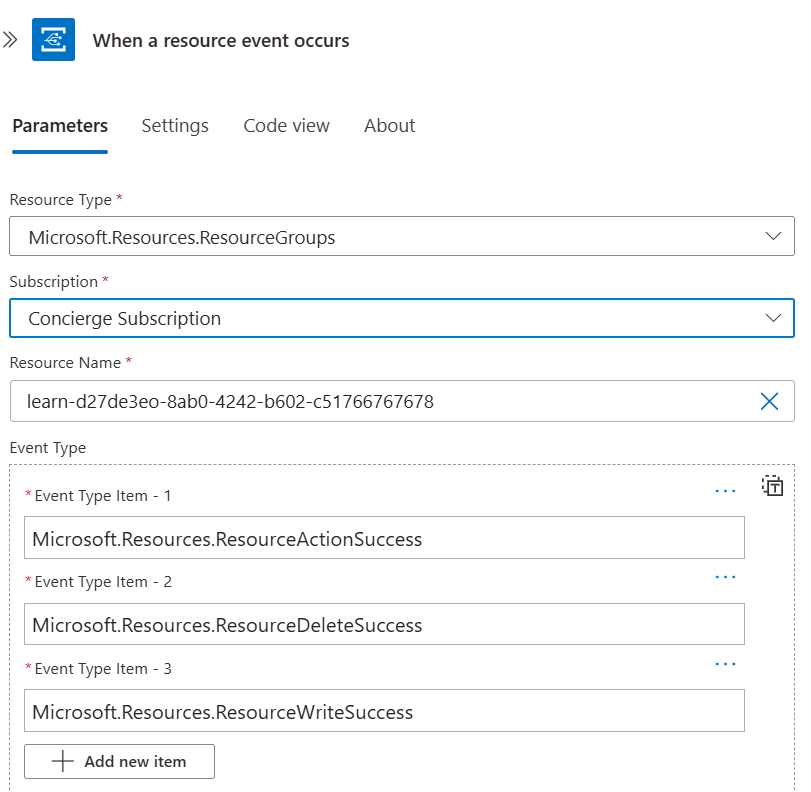
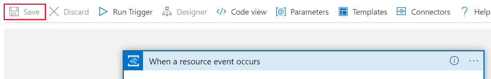

One easy way to use Azure Event Grid is to include it in a logic app.

Suppose you've chosen to use Event Grid to alert your administrators when a virtual machine is reconfigured. 

Here, you'll set up a virtual machine and create a logic app with an Event Grid trigger that responds to the events produced by the virtual machine.

## Create a virtual machine

Let's start by creating a new virtual machine in the Azure portal.

1. Sign in to the [Azure portal](https://portal.azure.com/learn.docs.microsoft.com?azure-portal=true) with the account that you used to activate the sandbox.
1. Select **+ Create a resource**.
1. Select **Compute** > **Virtual Machine**.
1. Complete the **Create a virtual machine** page with the following values:

    | Field | Value |
    | --- | --- |
    | **Subscription** | Concierge subscription |
    | **Resource group**   | <rgn>[sandbox resource group]</rgn> |
    | **Name** | vm1 |
    | **Region** | Select a region near you |
    | **Availability options** | No infrastructure redundancy required |
    | **Image** | Windows Server 2019 Datacenter-Gen1 |
    | **Azure Spot instance** | No |
    | **Size** | Standard DS1 v2 |
    | **Username** | vmadmin |
    | **Password** | Enter a complex password |
    | **Public inbound ports** | None |

1. Select **Review and create**, and then select **Create**.

## Create a logic app

The next step is to create the logic app that will run when a virtual machine change is detected. Let's create a blank logic app.

1. Select **+ Create a resource**.
1. Select **Integration** > **Logic App**.
1. Complete the **Create** page with the following values:

    | Field | Value |
    | --- | --- |
    | **Subscription** | Concierge subscription |
    | **Resource group** | Select **Use existing**, and then select **<rgn>[sandbox resource group]</rgn>** |
    | **Logic App name** | Enter a name |
    | **Select the location** | Region |
    | **Location** | Select a region near you |
    | **Log Analytics** | Off |

1. Select **Create**.

## Add an Event Grid trigger to the logic app

After your logic app is created, you add triggers for Event Grid events.

1. Select **All Resources**.
1. Select the logic app that you created in the previous step.
1. Under **Templates**, select **Blank Logic App**.

    

1. Within the designer, use the search box and enter **Event Grid** as your filter. From the list of triggers, select **When a resource event occurs**.

    

1. When you're prompted, sign in to the **Microsoft Learn Sandbox** organization by using your Azure account credentials.
1. Use these values to subscribe your logic app to publisher events:

    | Field | Value |
    | --- | --- |
    | **Subscription** | Concierge subscription |
    | **Resource Type** | `Microsoft.Resources.ResourceGroups` |
    | **Resource Name** | <rgn>[sandbox resource group]</rgn> |
    | **Event Type Item - 1** | `Microsoft.Resources.ResourceActionSuccess` |
    | **Event Type Item - 2** | `Microsoft.Resources.ResourceDeleteSuccess` |
    | **Event Type Item - 3** | `Microsoft.Resources.ResourceWriteSuccess` |
    | | |

    

1. Select **Save**.

    

Your logic app is now ready and set up to be a subscriber to the events from Azure Event Grid.
