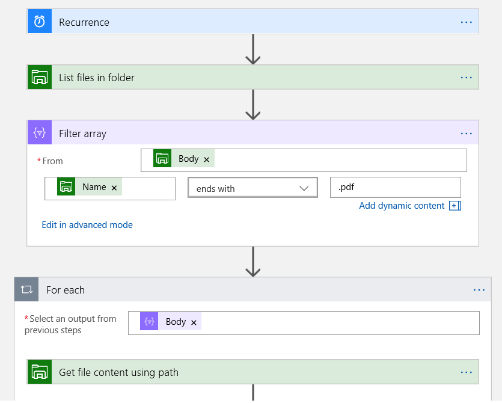
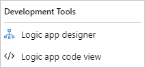

When you create events in Azure Event Grid, you choose how to respond to those events and which actions should occur.

You've set up a logic app for your healthcare organization to listen for events related to your Azure resources. You now need to filter the events and create actions based on conditions within them.

Here, you'll learn how to create actions and conditions to respond to events.

## Conditions

To run actions in your logic app after events pass a specified condition, you add a conditional statement. This control structure compares the data in your workflow against specific values or fields. You then specify different actions that run based on whether the data meets the condition.

The following image shows an example of a filter that checks whether a filename in a directory has the .pdf extension.



For example, suppose you have a logic app that needs to send an email based on certain fields being found in an Event Grid trigger. You'd create a condition in your logic app that could check the event data, and conditionally call an action.

## Actions

Logic apps provide built-in triggers and actions so you can orchestrate workflows, communicate with other apps and services, and manage or manipulate data.

There are many built-in actions that you can use. Here are some examples:

- Azure Service Bus
- SQL Server
- Office 365 Outlook
- Salesforce

Suppose you have a logic app that needs to send an email in response to an event. You could use the built-in Office 365 Outlook action.

## JSON configuration

A logic app has two different views in the Azure portal that are used for development and configuration:

- **Designer view**: User interface that visually maps all triggers, actions, and connectors.
- **Code view**: JSON configuration that allows any field to be edited in a code editor.



The following example demonstrates the JSON configuration for an Event Grid trigger. By using your logic app's JSON view, you'll become familiar with the concepts and structure. You'll then be confident to edit the JSON directly.

``` json
"triggers": {
    "When_a_resource_event_occurs": {
        "inputs": {
            "body": {
                "properties": {
                    "destination": {
                        "endpointType": "webhook",
                        "properties": {
                            "endpointUrl": "@{listCallbackUrl()}"
                        }
                    },
                    "filter": {
                        "includedEventTypes": [
                            "Microsoft.Resources.ResourceActionSuccess"
                        ]
                    },
                    "topic": "/subscriptions/4b7b842a-0350-11e4-8f5f-8bb9135f3a1f/resourceGroups/LogicApp-EventGrid"
                }
            },
            "host": {
                "connection": {
                    "name": "@parameters('$connections')['azureeventgrid']['connectionId']"
                }
            },
            "path": "/subscriptions/@{encodeURIComponent('4b7b842a-0350-11e4-8f5f-8bb9135f3a1f')}/providers/@{encodeURIComponent('Microsoft.Resources.ResourceGroups')}/resource/eventSubscriptions",
            "queries": {
                "x-ms-api-version": "2017-09-15-preview"
            }
        },
        "splitOn": "@triggerBody()",
        "type": "ApiConnectionWebhook"
    }
},
"parameters": {
    "$connections": {
        "value": {
            "azureeventgrid": {
                "connectionId": "/subscriptions/4b7b842a-0350-11e4-8f5f-8bb9135f3a1f/resourceGroups/LogicApp-EventGrid/providers/Microsoft.Web/connections/azureeventgrid",
                "connectionName": "azureeventgrid",
                "id": "/subscriptions/4b7b842a-0350-11e4-8f5f-8bb9135f3a1f/providers/Microsoft.Web/locations/northeurope/managedApis/azureeventgrid"
            }
        }
    }
}
```

An extension is also available for Visual Studio Code to enable you to edit your logic apps. You can download and install this extension from the Visual Studio Marketplace or directly from inside Visual Studio Code.

:::image type="content" source="../media/4-find-install-logic-apps-extension.png" alt-text="Azure Logic Apps in a list of Visual Studio Code extensions." loc-scope="vs-code":::

Let's use the designer view in the portal to update the logic app to respond to triggers.
