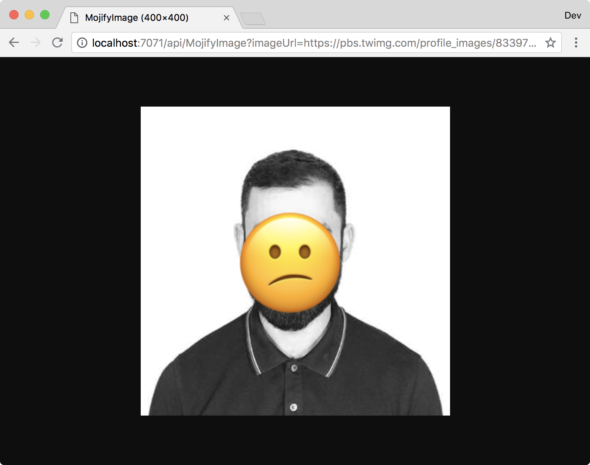

Now that you've created your Azure Function project, and a minimal JavaScript Azure function, you're going to develop this Azure Function in TypeScript. The final function will read an image URL from its query parameters, use the Face API to find the faces and their emotions in the image, then replace the face(s) with matching emoji(s). It returns this composite image as raw image data.

## Convert to TypeScript

The Azure function extension created a JavaScript function. We need to convert it to TypeScript.

1. Rename the `index.js` file to `index.ts`

    > [!NOTE]
    > If you're running `npm run build` and the related `tsc -w` command, then the `index.ts` file is instantly compiled to `index.js`. It should also create an `index.js.map` file. If the `index.js` and `index.js.map` files are not automatically created, check whether the `npm run build` command is running and that the output doesn't show any errors.

1. Replace the code in `index.ts` with the following code:

    ```typescript
    export async function index(context, req) {
      context.log("ReplyWithMojifiedImage HTTP trigger");
      context.res.body = "Hello!";
    }
    ```

    > [!NOTE]
    > With Azure Functions we use `context.log` instead of `console.log` to log output to the console.

## Test your function

1. Make sure the local Azure function application is running using one of the methods you previously used: either use `func host start` or run it from the debug menu using the **Attach to JavaScript Function** task.

    If the function app started correctly, then the output window should show something like this output:

    ```
    Http Functions:
            MojifyImage: http://localhost:7071/api/MojifyImage
    ```

1. Visit the URL in your browser. If everything is functioning correctly, it should print out `Hello!`.

    If you see `Hello`, you've converted your function trigger from TypeScript to JavaScript.

## Configure your Face API environment variables

To make your code more secure, you shouldn't hard-code private data in your code. Instead we use environment variables to store the Face API URL and key.

When you create an Azure Functions project, it creates a file called `local.settings.json`. This file is in the `.gitignore` file so it isn't checked into source control. It's a place to store sensitive or local configurations that you don't want to be published. Anything in the `Values` object is made available to your Node.js code as an environment variable.

1. Open `local.settings.json` in Visual Studio Code. By default, the file has these contents:

    ```json
    {
      "IsEncrypted": false,
      "Values": {
        "AzureWebJobsStorage": "",
        "FUNCTIONS_WORKER_RUNTIME": "node"
      }
    }
    ```

1. **Replace** the contents of this file with your Face API variables (i.e. remove the default settings from the file). Replace the `<face-api-url>` and `<face-api-key>` values with the variables that you saved, when you created your Face API Azure resource.

    ```json
    {
        "Values": {
          "FACE_API_URL": "<face-api-url>",
          "FACE_API_KEY": "<face-api-key>"
        }
    }
    ```

The `FACE_API_URL` and `FACE_API_KEY` variables will be available to Node.js as environment variables.

The variables are used in the [calls to the Face API](https://github.com/MicrosoftDocs/mslearn-the-mojifier/blob/master/shared/faceapi/index.ts)

## Write the MojifyImage function

1. Replace the code in `MojifyImage/index.ts` with the following code:

    ```typescript
    import Jimp = require("jimp");
    import * as path from "path";
    import * as FaceApi from "../shared/faceapi";

    async function createMojifiedImage(context, imageUrl, faces) {
      // TODO
    }

    export async function index(context, req) {
      context.log(`ReplyWithMojifiedImage HTTP trigger`);
      context.res.body = "Hello!";
    }
    ```

    You'll be developing the `createMojifiedImage` function and the `index` function in this unit.

1. Call the Face API with an image and get a response

    Replace the body of the `index(context, req)` function in the `index.ts` file with the following code.

    ```typescript
    const { imageUrl } = req.query;

    if (!imageUrl) {
      let message = `imageUrl is required`;
      context.log(message);
      context.res = { status: 400, body: message }
    } else {
      context.log(`Called with imageUrl: "${imageUrl}"`);

      // Get the response from the faceAPI
      try {
        let faces = await FaceApi.getFaces(context, imageUrl);
        context.log(faces);
        context.res = { status: 200, body: faces }
      } catch (err) {
        let message = `There was an error processing this image: ${err.message}`;
        context.log(message);
        context.res = { status: 400, body: message };
      }
    }
    ```

1. Run this function in your browser

    You should see the json response that the Face API returns when passed an image: `http://localhost:7071/api/MojifyImage?imageUrl=<image>`.

    Look at the code in [`shared/faceapi/index.ts`](https://github.com/MicrosoftDocs/mslearn-the-mojifier/blob/master/shared/faceapi/index.tsazure-portal=true) to see how the response from the Face API is being converted into an instance of an array of `Face` objects. Each `Face` object contains the emotive coordinates, the location of the face in the image, the matching emoji, and the emoji icon.

1. Create the mojified image

    Next, fill in the `createMojifiedImage(context, imageUrl, faces)` TypeScript function to create the composite image consisting of the original image along with its matching emoji(s). This function uses the `Jimp` npm package, an open-source image manipulation library.

    Replace the `TODO` line in this function with the following code:

    ```typescript
    let sourceImage = await Jimp.read(imageUrl);
    // Create a composite image, we will "append" to this composite an emoji image for each face found
    let compositeImage = sourceImage;

    if (faces.length == 0) {
      throw new Error(`No faces found in image`);
    }

    for (let face of faces) {
      const mojiName = face.mojiName;
      const faceHeight = face.faceRectangle.height;
      const faceWidth = face.faceRectangle.width;
      const faceTop = face.faceRectangle.top;
      const faceLeft = face.faceRectangle.left;

      // Load the emoji from disk
      let mojiPath = path.resolve(
        __dirname,
        "../shared/emojis/" + mojiName + ".png"
      );
      let emojiImage = await Jimp.read(mojiPath);

      // Resize the emoji to fit the face
      emojiImage.resize(faceWidth, faceHeight);

      // Compose the emoji on the image
      compositeImage = compositeImage.composite(emojiImage, faceLeft, faceTop);
    }

    try {
      return await compositeImage.getBufferAsync(Jimp.MIME_JPEG);
    } catch (error) {
      context.log(`There was an error adding the emoji to the image: ${error}`);
      throw new Error(error);
    }
    ```

    Let's break this code down step by step

    - To load an image using Jimp, you use the `Jimp.read` function.

        ```typescript
        let sourceImage = await Jimp.read(imageUrl);
        ```

    - There is a directory of png files for each emoji in `shared/emojis`.

    - For each face in the image
        - Load up the emoji image

            ```typescript
            let mojiPath = path.resolve(
                __dirname,
                "../shared/emojis/" + mojiName + ".png"
            );
            let emojiImage = await Jimp.read(mojiPath);
            ```

        - Resize the emoji image to the size of the face found in the image

            ```typescript
            emojiImage.resize(faceWidth, faceHeight);
            ```

        - Create a composite image of the original image and the resized emoji located on the face in the image

            ```typescript
            compositeImage = compositeImage.composite(emojiImage, faceLeft, faceTop);
            ```

    - Return the composite image as a buffer

        ```typescript
        try {
            return await compositeImage.getBufferAsync(Jimp.MIME_JPEG);
        } catch (error) {
            context.log(`There was an error adding the emoji to the image: ${error}`);
            throw new Error(error);
        }
        ```

1. Set up the return HTTP response in the `index` function

    Add the following code to the top of the `index(context, req)` TypeScript function to configure the HTTP response:

    ```typescript
    context.res = {
        status: 200,
        headers: {
          "Content-Type": "image/jpeg"
        },
        isRaw: true
    };
    ```

1. Add the call to `createMojifiedImage` from the `index` function, replacing the `try` block with:

    ```typescript
    try {
      let faces = await FaceApi.getFaces(context, imageUrl);
      if (faces) {
        let buffer = await createMojifiedImage(context, imageUrl, faces);
        context.res.body = buffer;
        context.log(`Posted reply with mojified image`);
      } else {
        context.res = { status: 400, body: `Could not process image: ${imageUrl}` };
      }
    } catch (err) {
      let message = `There was an error processing this image: ${err.message}`;
      context.log(message);
      context.res = { status: 400, body: message };
    }
    ```

## Try it out

1. Make sure that the local Azure function application is running using one of the methods you previously used: either use `func host start` or run it from the debug menu using the **Attach to JavaScript Function** task.

    If the function app started correctly, then the output window should show something like this output:

    ```
    Http Functions:
            MojifyImage: http://localhost:7071/api/MojifyImage
    ```

1. Visit the URL in your browser. Remember to pass in the URL of an image via the `imageUrl` query parameter.

1. It should return a mojified version of the image.

    You've written an Azure function in TypeScript to mojify an image! 👏👏👏

    
