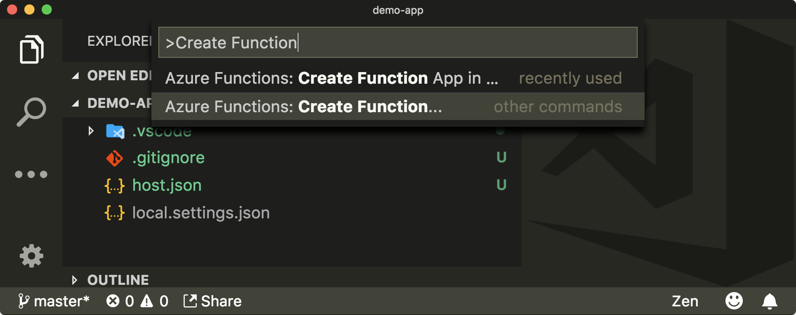
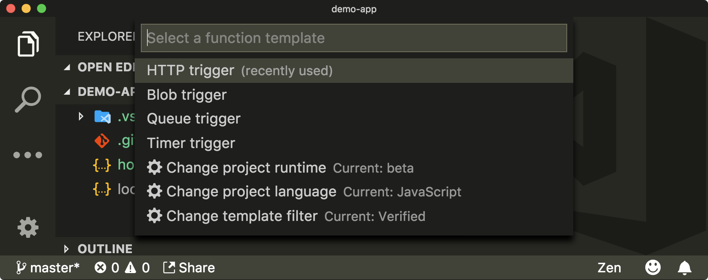
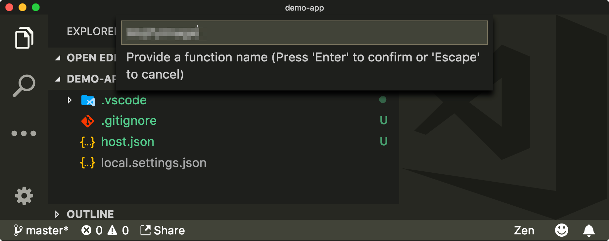
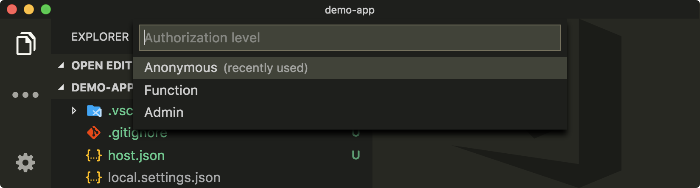

You've created the Azure Function `MojifyImage`, which returns a mojified image. You need a second endpoint that Slack calls whenever someone executes the `/mojify` command. This second endpoint needs to return the URL to the `MojifyImage` function.

When you run a Slack command like `/mojify <some-image-url>`, it makes a POST request to the endpoint you've configured, and passes in `<some-image-url>` as a `text` query parameter embedded in the body of the message. You're going to create this function, which will coordinate and respond to the Slack commands as `RespondToSlackCommand`. You'll create the HTTP endpoint that uses the format Slack expects for the request, and how to get the function to respond with an image.

## Create the Function Trigger and convert to TypeScript

You need to create another HTTP-triggered Azure Function. These instructions are basically the same as before. What's different is that you're calling this function `RespondToSlackCommand` instead of `MojifyImage`.

1. Click on **View** then **Command Palette**, then search for and select **Azure Functions: Create Function...**

    

2. Select the folder where you originally created the function project.

    

3. Select the **HTTP Trigger** option.

    

4. Type `RespondToSlackCommand` as the name of your function.

    

5. Choose **Anonymous** as the authentication level.

    > [!NOTE]
    > By choosing **Anonymous**, the function is open to the world and insecure. If you create other functions in the future, this isn't the recommended default behavior. Since this is a low-risk exercise with free Azure learning resources, it's not a problem for now.

    

    If it was successful, then you should now have the folder **RespondToSlackCommand** in the root directory.

    Now you can convert the file from TypeScript to JavaScript.

6. Create a file called `index.ts` in the `RespondToSlackCommand` folder.

   Make sure that the `TypeScript` build process is still running and that it automatically compiled into the `index.js` and `index.js.map` files.

7. Replace the code in `index.ts` with the following code:

    ```typescript
    export function index(context, req) {
      context.log("RespondToSlackCommand HTTP trigger");
      context.res.body = "Hello!";
      context.done();
    }
    ```

## Try it out

Make sure that everything is working by visiting (http://localhost:7071/api/RespondToSlackCommand) in a browser. It should print our `Hello!`.

## Write the `index` function

This `index(context, req)` TypeScript function is a lot quicker to write than the previous function.

1. Set up your `context.res` object at the top of the function.

    ```typescript
    context.res = {
      headers: {
        "Content-Type": "application/json"
      },
      body: null
    };
    ```

    This time, you don't need to set the `isRaw` property since this defaults to `false`. However, you do need set the content type to be `application/json`.

1. Add the useful library `querystring`.

    Since Slack sends the image URL, you want to process it as a query string with the key of `text`. It embeds this in the body of the request, so you need to work a little harder to get the right information. It's not too hard though!

    Make life easier for yourself by importing the Node.js `querystring` package. This is part of Node.js, so there's no need to install anything extra. Add this import statement to the top of the file.

    ```typescript
    import * as querystring from "querystring";
    ```

1. In your `index(context, req)` function, convert the `req.body` into an object from which you'll extract the `text` property.

    ```typescript
    const { text } = querystring.parse(req.body);
    ```

    If a user types the command properly, then the text should contain the URL of an image. Add some basic validation to it to make sure it works.

    ```typescript
    let message = "Your mojified image my liege...";
    if (!text) {
      message = "You must provide an image to mojify";
    }
    ```

    The Slack command is calling `https://somedomain.com/api/RespondToSlackCommand`. It needs to respond with the MojifyImage URL, which we assume will be on the same domain.

1. Extract the domain from the request `MojifyImage` request URL.

    ```typescript
    const mojifyUrl = req.originalUrl.substr(0, req.originalUrl.lastIndexOf("/")) + "/MojifyImage";
    ```

1. Finally, set the body of the response to the Slack-specific format at the bottom of the `index(context, req)` function.

    > [!IMPORTANT]
    > The `image_url` in the `attachments` property needs to be set to return the `mojifyUrl`, passing in the URL the user supplied in the command as the `imageUrl` query parameter.

    ```typescript
    context.res.body = {
      response_type: "in_channel",
      text: message,
      attachments: [
        {
          image_url: `${mojifyUrl}?imageUrl=${text}`
        }
      ]
    };

    context.done();
    ```

## Try it out

1. Make sure that the local Azure function application is running using one of the methods you previously used: either use `func host start` or run it from the debug menu using the **Attach to JavaScript Function** task.

    If the function app started correctly, then the output window should show something like this:

    ```
    Http Functions:
            MojifyImage: http://localhost:7071/api/MojifyImage
            RespondToSlackCommand: http://localhost:7071/api/RespondToSlackCommand
    ```

Make sure that everything is working by visiting http://localhost:7071/api/RespondToSlackCommand in your browser. It should now print some json.

```json
{
  "response_type": "in_channel",
  "text": "You must provide an image to mojify",
  "attachments": [
    {
      "image_url": "http://localhost:7071/api/MojifyImage?imageUrl=undefined"
    }
  ]
}
```
